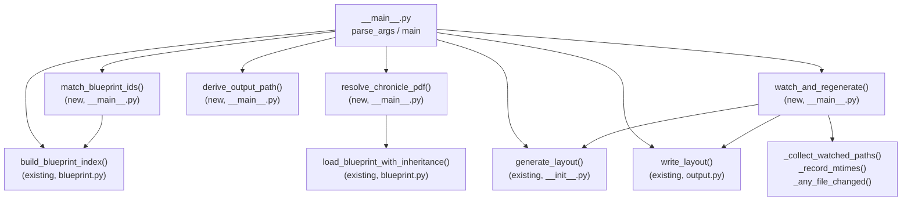

# Design Document: Blueprint Batch & Watch

## Overview

This feature replaces the blueprint2layout CLI's positional-argument interface with a named-argument, batch-oriented interface mirroring layout_visualizer's pattern. The new CLI accepts `--blueprints-dir`, `--blueprint-id` (with wildcard support), `--output-dir`, and `--watch`, enabling multi-blueprint processing and continuous regeneration on file changes.

The core pipeline (`generate_layout`) remains unchanged. This feature wraps it with new CLI orchestration: blueprint index scanning, wildcard id matching, automatic chronicle PDF resolution from `defaultChronicleLocation` (walking the inheritance chain), output path derivation with mirrored subdirectory structure, and a polling-based watch mode.

### Design Rationale

The layout_visualizer CLI already implements this exact pattern (named args, wildcard matching, chronicle resolution, watch mode). Rather than inventing a new approach, we mirror that architecture closely, adapting it for blueprint2layout's pipeline. This gives users a consistent experience across both tools and enables a two-process workflow: blueprint2layout watches Blueprints, layout_visualizer watches layouts.

Key differences from layout_visualizer:
- Output is JSON (not PNG), so the filename derivation differs: strip the Blueprint id prefix up to the first dot, append `.json`
- Output preserves the subdirectory structure relative to `--blueprints-dir` (layout_visualizer writes flat to `--output-dir`)
- Chronicle PDF resolution walks the Blueprint inheritance chain (not layout chain), using `load_blueprint_with_inheritance` data

## Architecture

All new functions live in `blueprint2layout/__main__.py`. The existing `blueprint2layout/__init__.py` (generate_layout), `blueprint2layout/blueprint.py` (build_blueprint_index, load_blueprint_with_inheritance), and `blueprint2layout/output.py` (write_layout) are reused without modification.

### Module Responsibilities

| Module | Responsibility |
|--------|---------------|
| `blueprint2layout/__main__.py` | CLI argument parsing, wildcard matching, chronicle resolution, output path derivation, batch orchestration, watch mode |
| `blueprint2layout/__init__.py` | Pipeline entry point (`generate_layout`) — unchanged |
| `blueprint2layout/blueprint.py` | Blueprint parsing, index building, inheritance loading — unchanged |
| `blueprint2layout/output.py` | Layout assembly and JSON writing — unchanged |
| `shared/layout_index.py` | Shared JSON index and inheritance chain utilities — unchanged |

## Components and Interfaces

### New Functions in `blueprint2layout/__main__.py`

#### `parse_args(argv: list[str] | None = None) -> argparse.Namespace`

Replaces the existing positional-argument parser. Returns a namespace with:
- `blueprints_dir: Path` (required)
- `blueprint_id: str` (required)
- `output_dir: Path` (default: `Path(".")`)
- `watch: bool` (default: `False`)

#### `match_blueprint_ids(pattern: str, blueprint_index: dict[str, Path]) -> list[str]`

Mirrors `layout_visualizer.__main__.match_layout_ids`. If the pattern contains wildcard characters (`*`, `?`, `[`), uses `fnmatch.fnmatch` against all index keys. Otherwise treats it as a literal id. Returns sorted matches. Raises `ValueError` if no matches found.

#### `resolve_chronicle_pdf(blueprint_id: str, blueprint_index: dict[str, Path]) -> Path`

Loads the blueprint via `load_blueprint_with_inheritance`, then walks the inheritance chain (child-first) looking for a non-None `default_chronicle_location`. Returns the resolved `Path`. Raises `ValueError` if not found anywhere in the chain, `FileNotFoundError` if the resolved path doesn't exist on disk.

Implementation detail: `load_blueprint_with_inheritance` already loads the full chain. The target Blueprint's `default_chronicle_location` is checked first. If None, we re-read the chain data to find the first ancestor with the field. To avoid re-loading, we add a lightweight helper `resolve_default_chronicle_location(blueprint_path, blueprint_index)` that uses `shared.layout_index.collect_inheritance_chain` to walk the chain and find the field — exactly mirroring `layout_visualizer.layout_loader.resolve_default_chronicle_location`.

#### `derive_output_path(blueprint_id: str, blueprint_path: Path, blueprints_dir: Path, output_dir: Path) -> Path`

Computes the output file path:
1. Filename: strip everything up to and including the first `.` in the blueprint id, append `.json` (e.g., `pfs2.bounty-layout-b13` → `bounty-layout-b13.json`)
2. Subdirectory: the relative path of the blueprint file's parent directory from `blueprints_dir`
3. Full path: `output_dir / subdirectory / filename`

#### `run_single_layout(blueprints_dir: Path, blueprint_id: str, output_path: Path) -> None`

Orchestrates a single layout generation:
1. Build blueprint index from `blueprints_dir`
2. Resolve chronicle PDF
3. Call `generate_layout(blueprint_path, pdf_path, blueprints_dir)`
4. Create output directory if needed
5. Call `write_layout(layout, output_path)`
6. Print status message to stdout

#### `watch_and_regenerate(blueprints_dir: Path, targets: list[tuple[str, Path]]) -> None`

Mirrors `layout_visualizer.__main__.watch_and_regenerate`:
1. Generate all layouts once
2. Collect all blueprint file paths in the inheritance chains of all targets
3. Record modification times
4. Poll every 1 second for changes
5. On change: print message, regenerate all targets, re-collect watched paths, re-record mtimes
6. On error during regeneration: print to stderr, continue watching
7. On `KeyboardInterrupt`: print "Stopped.", return

#### Helper functions (private)

- `_collect_watched_paths(blueprints_dir, blueprint_ids) -> list[Path]`: Builds deduplicated list of all blueprint files across all inheritance chains
- `_record_mtimes(paths) -> dict[Path, float]`: Records `os.path.getmtime` for each path
- `_any_file_changed(paths, previous_mtimes) -> bool`: Checks if any file's mtime differs

#### `resolve_default_chronicle_location(blueprint_path: Path, blueprint_index: dict[str, Path]) -> str | None`

Uses `shared.layout_index.collect_inheritance_chain` to walk the parent chain. Returns the `defaultChronicleLocation` from the leaf blueprint first, walking up to root if not found. Returns `None` if no blueprint in the chain defines it.

#### `main(argv: list[str] | None = None) -> int`

Entry point. Validates `--blueprints-dir` is a directory, builds index, matches ids, resolves chronicle PDFs, derives output paths, then either enters watch mode or runs batch generation. Returns 0 on success, 1 on error. All errors printed to stderr.

## Data Models

No new data models are introduced. The feature reuses existing models:

| Model | Module | Usage |
|-------|--------|-------|
| `Blueprint` | `blueprint2layout.models` | Parsed blueprint data, including `default_chronicle_location` |
| `CanvasEntry` | `blueprint2layout.models` | Canvas entries from blueprints |
| `FieldEntry` | `blueprint2layout.models` | Field entries from blueprints |

### Key Data Flows

**Blueprint Index** (`dict[str, Path]`): Built by `build_blueprint_index()`, maps blueprint id strings to file paths. Used for wildcard matching, inheritance resolution, and chronicle PDF lookup.

**Targets** (`list[tuple[str, Path]]`): List of `(blueprint_id, output_path)` pairs computed before generation begins. Used by both batch mode and watch mode.

**Watched Paths** (`list[Path]`): Deduplicated list of all blueprint file paths across all inheritance chains of all targets. Used by watch mode for polling.

## Correctness Properties

*A property is a characteristic or behavior that should hold true across all valid executions of a system — essentially, a formal statement about what the system should do. Properties serve as the bridge between human-readable specifications and machine-verifiable correctness guarantees.*

### Property 1: Wildcard matching returns the correct sorted set

*For any* blueprint index (mapping ids to paths) and any pattern string, `match_blueprint_ids(pattern, index)` should return exactly the sorted list of ids from the index that `fnmatch.fnmatch` would match against the pattern. When the pattern has no wildcard characters, it is treated as a literal id lookup. When no ids match, a `ValueError` is raised.

**Validates: Requirements 2.1, 2.2, 2.3, 2.4**

### Property 2: Chronicle resolution returns the leaf-most defaultChronicleLocation

*For any* blueprint inheritance chain (a sequence of blueprint JSON files connected by `parent` references), `resolve_default_chronicle_location` should return the `defaultChronicleLocation` value from the leaf-most blueprint in the chain that defines it. If the leaf defines it, that value is returned. If not, the function walks toward the root and returns the first one found. If none in the chain defines it, `None` is returned.

**Validates: Requirements 3.1, 3.2, 3.3**

### Property 3: Output path derivation preserves directory structure and strips id prefix

*For any* blueprint id containing at least one dot, any blueprint file path under a blueprints directory, and any output directory, `derive_output_path` should produce a path equal to `output_dir / relative_subdir / filename` where `relative_subdir` is the blueprint file's parent directory relative to `blueprints_dir`, and `filename` is the portion of the blueprint id after the first dot with `.json` appended.

**Validates: Requirements 4.1, 4.2, 4.3**

### Property 4: Watched paths cover all files in all inheritance chains

*For any* set of target blueprint ids and a blueprints directory, `_collect_watched_paths` should return a list containing every file path that appears in the inheritance chain of any target blueprint. The list should be deduplicated (no path appears twice).

**Validates: Requirements 6.3**

## Error Handling

All errors are printed to stderr and cause a non-zero exit code (in non-watch mode). The error handling strategy mirrors layout_visualizer's approach:

| Error Condition | Handler | Behavior |
|----------------|---------|----------|
| `--blueprints-dir` not a directory | `main()` | Print error to stderr, return 1 |
| No blueprint ids match pattern | `match_blueprint_ids()` raises `ValueError` | Caught in `main()`, print to stderr, return 1 |
| No `defaultChronicleLocation` in chain | `resolve_chronicle_pdf()` raises `ValueError` | Caught in `main()`, print to stderr, return 1 |
| Resolved chronicle PDF not on disk | `resolve_chronicle_pdf()` raises `FileNotFoundError` | Caught in `main()`, print to stderr, return 1 |
| Invalid JSON in blueprint file | `load_blueprint_with_inheritance()` raises `ValueError` | Caught in `main()`, print to stderr, return 1 |
| Unknown parent id in blueprint | `load_blueprint_with_inheritance()` raises `ValueError` | Caught in `main()`, print to stderr, return 1 |
| Pipeline error during generation | `generate_layout()` raises exception | Caught in `main()`, print to stderr, return 1 |
| Error during watch regeneration | Any exception in regeneration loop | Print to stderr, continue watching |
| `KeyboardInterrupt` in watch mode | `watch_and_regenerate()` | Print "Stopped.", return 0 |

Error messages include the blueprint id and/or file path for diagnosis. The `main()` function catches `ValueError`, `FileNotFoundError`, and `OSError` at the top level, matching layout_visualizer's pattern.

## Testing Strategy

### Property-Based Tests (Hypothesis)

The project already uses Hypothesis (`.hypothesis/` directory present). Each correctness property maps to a single property-based test with a minimum of 100 iterations.

| Property | Test | Strategy |
|----------|------|----------|
| Property 1: Wildcard matching | Generate random id-to-path indexes and random patterns (with/without wildcards). Verify result matches `fnmatch` filtering and is sorted. | `@given(st.dictionaries(blueprint_ids(), st.builds(Path, st.text())), pattern_strategy())` |
| Property 2: Chronicle resolution | Generate random inheritance chains (list of dicts with optional `defaultChronicleLocation`). Write to temp files, build index, verify resolution returns leaf-most value. | `@given(chain_with_chronicle_locations())` |
| Property 3: Output path derivation | Generate random blueprint ids (with dots), random relative subdirectory paths, random output dirs. Verify the derived path has correct structure. | `@given(blueprint_id_with_dot(), relative_subdir(), output_dir())` |
| Property 4: Watched paths coverage | Generate random blueprint indexes with inheritance chains. Verify collected paths is a superset of all chain files, with no duplicates. | `@given(index_with_chains())` |

Each test is tagged with: `# Feature: blueprint-batch-watch, Property {N}: {title}`

### Unit Tests (pytest)

Unit tests cover specific examples, edge cases, and error conditions:

- `parse_args`: verify required args, defaults, flag behavior
- `match_blueprint_ids`: empty index, no-match pattern, literal not found
- `resolve_chronicle_pdf`: missing file on disk, no location in chain
- `derive_output_path`: blueprint in root dir (no subdirectory), deeply nested subdirectory
- `main()`: invalid blueprints-dir, successful batch run (mocked pipeline), watch mode entry (mocked)
- Error message format: verify errors go to stderr with blueprint id included

### Integration Tests

- End-to-end test with real blueprint files from `Blueprints/` directory (if chronicle PDFs are available)
- Verify `generate_all_layouts.sh` behavior can be replicated with the new CLI

### Test Configuration

- Property tests: `@settings(max_examples=100)`
- Test location: `tests/blueprint2layout/test_batch_watch.py`
- Property-based testing library: Hypothesis (already a project dependency)
