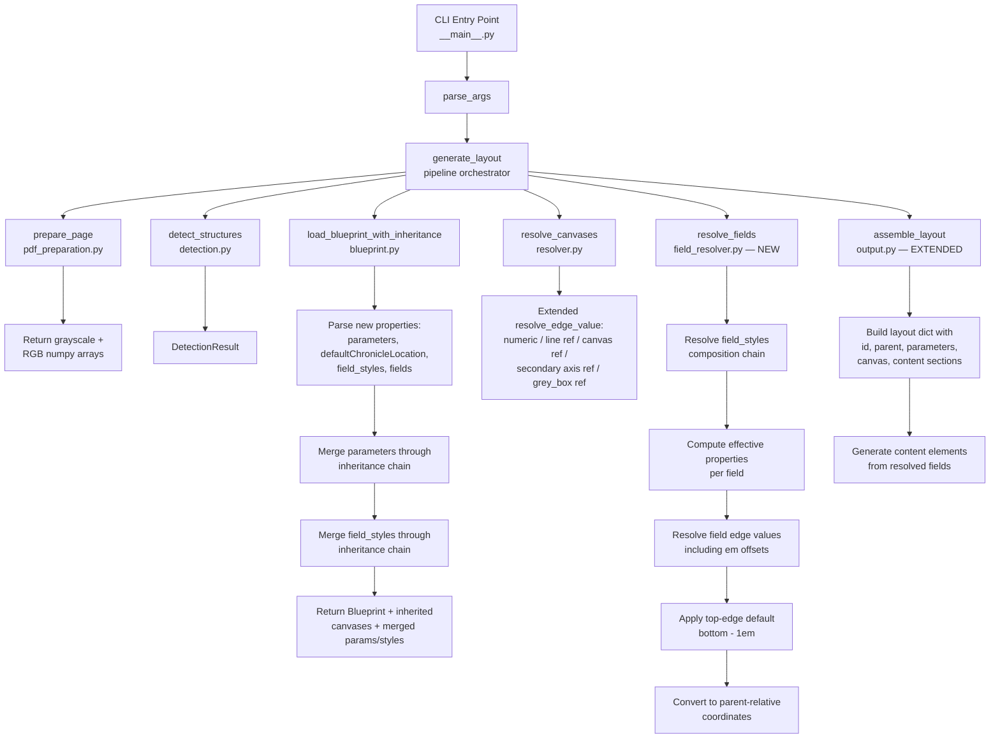
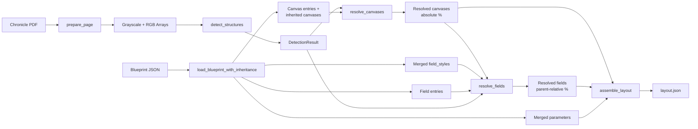

# Design Document: Blueprint Fields

## Overview

This feature extends the `blueprint2layout` tool to support parameters, field styles, fields, and content generation — transforming Blueprints from canvas-only declarations into complete layout generators. Currently, a Blueprint produces output with `id`, `parent`, `description`, `flags`, `aspectratio`, and a `canvas` section. Parameters and content must be hand-authored in separate layout JSON files.

After this feature, a single Blueprint file can declare:
- `parameters` — user-fillable field definitions (pass-through to output)
- `defaultChronicleLocation` — Foundry VTT module path (pass-through to output)
- `field_styles` — reusable bundles of styling/positioning properties
- `fields` — an ordered array binding parameters to positioned regions on the PDF

The tool will emit a complete layout file including `parameters` and `content` sections, eliminating hand-authoring for season and game-level base layouts.

Additionally, the edge value syntax is extended with:
- **Secondary axis references** on detected lines (`h_thin[3].left`, `v_bar[0].top`) and grey boxes (`grey_box[0].left`)
- **Em offset expressions** (`"h_thin[3] - 1.2em"`) for typographically meaningful spacing on field edges

### Key Design Decisions

1. **No presets in output** — All field properties are inlined directly on content elements. This keeps the output self-contained and avoids the complexity of preset naming/composition in generated output.
2. **Field styles are Blueprint-side composition** — `field_styles` provide the reusable property bundles that presets provide in hand-authored layouts, but they resolve at generation time rather than at render time.
3. **Em offsets are field-only** — Canvas edges don't have font context, so em expressions are restricted to field edges where a fontsize is available after style resolution.
4. **Top edge defaults to `bottom - 1em`** — Single-line text fields typically need only a bottom edge and font size. The tool computes the top edge automatically, matching the common pattern in existing hand-authored layouts.
5. **Parameters are pass-through with inheritance merging** — Parameters use the exact same schema as LAYOUT_FORMAT.md. Child Blueprints merge with parent parameters (child overrides parent at the individual parameter level within groups).
6. **Output scoping matches canvas scoping** — Only the target Blueprint's own fields produce content elements, matching the existing rule that only the target's canvases appear in output.
7. **Field styles inherit from parent Blueprints** — A child can reference styles defined in a parent, enabling shared style definitions across a Blueprint family.
8. **Valid field types are `text`, `multiline`, `line`, `rectangle`** — These match the non-scenario content element types in LAYOUT_FORMAT.md. Choice, checkbox, and strikeout types are scenario-level concerns handled by existing tooling.

## Architecture



### Data Flow



### Module Layout (Changes)

```
blueprint2layout/
├── __init__.py            # Extended: passes parameters/fields through pipeline
├── __main__.py            # No changes needed
├── pdf_preparation.py     # No changes
├── detection.py           # No changes
├── blueprint.py           # Extended: parse new properties, merge params/styles
├── resolver.py            # Extended: secondary axis refs, grey_box refs
├── field_resolver.py      # NEW: style resolution, field edge resolution, em offsets
├── converter.py           # No changes (reused for field coordinate conversion)
├── output.py              # Extended: emit parameters, content sections
├── models.py              # Extended: new dataclasses for fields/styles
```

Test additions:
```
tests/blueprint2layout/
├── test_field_resolver.py         # Unit tests for field_resolver.py
├── test_field_resolver_pbt.py     # Property tests for field_resolver.py
├── test_blueprint_fields.py       # Unit tests for extended blueprint.py parsing
├── test_blueprint_fields_pbt.py   # Property tests for parameter/style merging
├── test_resolver_extended.py      # Unit tests for secondary axis + grey_box refs
├── test_resolver_extended_pbt.py  # Property tests for extended resolver
├── test_output_fields.py          # Unit tests for extended output assembly
├── test_output_fields_pbt.py      # Property tests for output with fields
```


## Components and Interfaces

### `models.py` — Extended Data Models

New dataclasses added alongside existing ones:

```python
@dataclass(frozen=True)
class FieldEntry:
    """A single field entry from a Blueprint file.

    Binds a parameter (or static value) to a positioned region
    within a canvas. Edge values may include em offset expressions.

    Attributes:
        name: Unique field name within the Blueprint.
        canvas: Canvas name this field renders in (after style resolution).
        type: Element type: text, multiline, line, rectangle (after style resolution).
        param: Parameter name this field renders (mutually exclusive with value).
        value: Static text value (mutually exclusive with param).
        left: Left edge value (numeric, line ref, canvas ref, or em offset).
        right: Right edge value.
        top: Top edge value (may be None for auto-default).
        bottom: Bottom edge value.
        font: Font family.
        fontsize: Font size in points.
        fontweight: Font weight (e.g., "bold").
        align: Alignment code (e.g., "CM", "LB").
        color: Color for line/rectangle elements.
        linewidth: Line width for line elements.
        size: Size for checkbox-like elements.
        lines: Number of lines for multiline elements.
        styles: List of field style names to inherit from.
        trigger: Optional trigger parameter for conditional rendering.
    """
    name: str
    canvas: str | None = None
    type: str | None = None
    param: str | None = None
    value: str | None = None
    left: int | float | str | None = None
    right: int | float | str | None = None
    top: int | float | str | None = None
    bottom: int | float | str | None = None
    font: str | None = None
    fontsize: int | float | None = None
    fontweight: str | None = None
    align: str | None = None
    color: str | None = None
    linewidth: int | float | None = None
    size: int | float | None = None
    lines: int | None = None
    styles: list[str] = field(default_factory=list)
    trigger: str | None = None
```

```python
@dataclass(frozen=True)
class ResolvedField:
    """A field with all edges resolved to parent-relative percentages.

    Contains the fully resolved properties ready for content element
    generation. All edge values are parent-relative percentages within
    the field's canvas.

    Attributes:
        name: Field name.
        canvas: Canvas name.
        type: Element type.
        param: Parameter name (or None).
        value: Static text (or None).
        x: Left edge as parent-relative percentage.
        y: Top edge as parent-relative percentage.
        x2: Right edge as parent-relative percentage.
        y2: Bottom edge as parent-relative percentage.
        font: Font family (or None).
        fontsize: Font size (or None).
        fontweight: Font weight (or None).
        align: Alignment code (or None).
        color: Color (or None).
        linewidth: Line width (or None).
        size: Size (or None).
        lines: Line count (or None).
        trigger: Trigger parameter (or None).
    """
    name: str
    canvas: str
    type: str
    param: str | None = None
    value: str | None = None
    x: float | None = None
    y: float | None = None
    x2: float | None = None
    y2: float | None = None
    font: str | None = None
    fontsize: int | float | None = None
    fontweight: str | None = None
    align: str | None = None
    color: str | None = None
    linewidth: int | float | None = None
    size: int | float | None = None
    lines: int | None = None
    trigger: str | None = None
```

The `Blueprint` dataclass is extended with new optional fields:

```python
@dataclass(frozen=True)
class Blueprint:
    """A parsed Blueprint with id, optional parent id, and canvas entries.

    Attributes:
        id: Unique identifier.
        canvases: Ordered list of canvas entries.
        parent: Optional parent Blueprint id for inheritance.
        description: Optional human-readable description.
        flags: Optional metadata flags.
        aspectratio: Optional aspect ratio string.
        parameters: Optional parameter groups dict.
        default_chronicle_location: Optional Foundry VTT path.
        field_styles: Optional dict of style name to style properties.
        fields: Optional ordered list of field entries.
    """
    id: str
    canvases: list[CanvasEntry]
    parent: str | None = None
    description: str | None = None
    flags: list[str] = field(default_factory=list)
    aspectratio: str | None = None
    parameters: dict | None = None
    default_chronicle_location: str | None = None
    field_styles: dict[str, dict] | None = None
    fields: list[FieldEntry] | None = None
```

### `blueprint.py` — Extended Parsing and Inheritance

New/modified functions:

```python
def _parse_field_entry(entry: dict) -> FieldEntry:
    """Convert a raw field entry dict into a FieldEntry dataclass.

    Validates required field 'name' and valid property types.
    Does not validate that canvas/type are present (they may come
    from styles).

    Args:
        entry: A dictionary from the Blueprint's fields array.

    Returns:
        A FieldEntry instance.

    Raises:
        ValueError: If required fields are missing or types invalid.

    Requirements: blueprint-fields 7.2, 7.5, 7.6, 7.7, 7.8, 13.4, 13.5
    """


def _validate_parameters(parameters: object) -> dict:
    """Validate that parameters is a dict of dicts.

    Args:
        parameters: The raw parameters value from JSON.

    Returns:
        The validated parameters dict.

    Raises:
        ValueError: If structure is not dict-of-dicts.

    Requirements: blueprint-fields 1.4
    """


def _merge_parameters(parent_params: dict | None, child_params: dict | None) -> dict | None:
    """Merge parent and child parameter dictionaries.

    Groups present only in parent are included. Groups present only
    in child are added. Groups in both have their individual parameters
    merged, with child overriding parent.

    Args:
        parent_params: Parent Blueprint's parameters (or None).
        child_params: Child Blueprint's parameters (or None).

    Returns:
        Merged parameters dict, or None if both are None.

    Requirements: blueprint-fields 2.1, 2.2, 2.3, 2.4
    """


def _merge_field_styles(parent_styles: dict | None, child_styles: dict | None) -> dict | None:
    """Merge parent and child field_styles dictionaries.

    Child definitions override parent definitions for the same name.

    Args:
        parent_styles: Parent Blueprint's field_styles (or None).
        child_styles: Child Blueprint's field_styles (or None).

    Returns:
        Merged field_styles dict, or None if both are None.

    Requirements: blueprint-fields 6.8
    """
```

The `parse_blueprint` function is extended to parse `parameters`, `defaultChronicleLocation`, `field_styles`, and `fields`. The `load_blueprint_with_inheritance` function is extended to merge parameters and field_styles through the inheritance chain, and to validate field name uniqueness across the chain.

### `resolver.py` — Extended Edge Value Resolution

The `resolve_edge_value` function is extended with new regex patterns and resolution logic:

```python
# Extended patterns
LINE_REFERENCE_PATTERN = r"^(h_thin|h_bar|h_rule|v_thin|v_bar|grey_box)\[(\d+)\]$"
SECONDARY_AXIS_PATTERN = r"^(h_thin|h_bar|h_rule|v_thin|v_bar|grey_box)\[(\d+)\]\.(left|right|top|bottom)$"
CANVAS_REFERENCE_PATTERN = r"^(\w+)\.(left|right|top|bottom)$"

# Valid secondary edges per category
_HORIZONTAL_SECONDARY_EDGES = {"left", "right"}
_VERTICAL_SECONDARY_EDGES = {"top", "bottom"}
_GREY_BOX_SECONDARY_EDGES = {"left", "right", "top", "bottom"}


def resolve_edge_value(
    edge_value: int | float | str,
    detection: DetectionResult,
    resolved_canvases: dict[str, ResolvedCanvas],
) -> float:
    """Resolve a single edge value to an absolute page percentage.

    Extended to handle:
    - Secondary axis references (e.g., "h_thin[3].left")
    - Grey box edge references (e.g., "grey_box[0].top")

    Existing behavior for numeric literals, plain line references,
    and canvas references is unchanged.

    Requirements: blueprint-fields 4.1, 4.2, 4.3, 4.4, 4.5, 4.6, 12.1, 12.2, 12.3, 12.4, 12.5
    """
```

Note: The secondary axis pattern must be checked before the canvas reference pattern, since `grey_box[0].left` would otherwise match the canvas reference pattern (with canvas name `grey_box[0]`). The resolution order is: numeric → secondary axis → plain line reference → canvas reference → error.

### `field_resolver.py` — NEW: Field Resolution

This new module handles the complete field resolution pipeline:

```python
from blueprint2layout.models import (
    Blueprint,
    DetectionResult,
    FieldEntry,
    ResolvedCanvas,
    ResolvedField,
)

# Em offset expression pattern
EM_OFFSET_PATTERN = r"^(.+?)\s*([+-])\s*(\d+(?:\.\d+)?)em$"

VALID_FIELD_TYPES = {"text", "multiline", "line", "rectangle"}

# Properties that can be inherited from field styles
STYLE_PROPERTIES = (
    "canvas", "type", "font", "fontsize", "fontweight", "align",
    "color", "linewidth", "size", "lines", "left", "right", "top", "bottom",
)


def resolve_field_styles(
    field_entry: FieldEntry,
    field_styles: dict[str, dict],
) -> dict:
    """Resolve the effective properties for a field after style composition.

    Applies styles in order: base styles first (recursively), then
    the field's own styles, then the field's direct properties.
    Later values override earlier ones.

    Args:
        field_entry: The field entry to resolve.
        field_styles: All available field style definitions.

    Returns:
        Dictionary of effective property values.

    Raises:
        ValueError: If a referenced style is undefined or circular.

    Requirements: blueprint-fields 6.3, 6.4, 6.5, 6.6, 6.7, 6.9
    """


def resolve_field_edge(
    edge_value: int | float | str,
    edge_name: str,
    fontsize: float | None,
    aspectratio: str,
    detection: DetectionResult,
    resolved_canvases: dict[str, ResolvedCanvas],
) -> float:
    """Resolve a field edge value, including em offset expressions.

    Handles all edge value types plus em offsets. For em offsets,
    computes: offset_pct = em_count * fontsize / page_dimension * 100
    where page_dimension is height for top/bottom, width for left/right.

    Args:
        edge_value: The raw edge value.
        edge_name: Which edge (left/right/top/bottom) for axis selection.
        fontsize: Effective font size for em computation.
        aspectratio: Blueprint aspect ratio string (e.g., "603:783").
        detection: Detection result for line reference lookups.
        resolved_canvases: Resolved canvases for canvas ref lookups.

    Returns:
        The resolved absolute page percentage.

    Raises:
        ValueError: If em offset used without fontsize, or invalid expression.

    Requirements: blueprint-fields 5.1, 5.2, 5.3, 5.4, 5.5, 5.8, 5.9
    """


def compute_top_default(
    bottom_abs: float,
    fontsize: float,
    aspectratio: str,
) -> float:
    """Compute the default top edge as bottom - 1em.

    Args:
        bottom_abs: Resolved bottom edge in absolute page percentage.
        fontsize: Effective font size in points.
        aspectratio: Blueprint aspect ratio string.

    Returns:
        The computed top edge in absolute page percentage.

    Requirements: blueprint-fields 8.1, 8.3
    """


def resolve_fields(
    fields: list[FieldEntry],
    field_styles: dict[str, dict],
    resolved_canvases: dict[str, ResolvedCanvas],
    detection: DetectionResult,
    aspectratio: str,
) -> list[ResolvedField]:
    """Resolve all fields to parent-relative coordinates.

    For each field:
    1. Resolve styles to get effective properties
    2. Validate required properties (canvas, type)
    3. Resolve edge values (including em offsets)
    4. Apply top-edge default if needed
    5. Convert to parent-relative coordinates

    Args:
        fields: Ordered list of field entries.
        field_styles: Merged field style definitions.
        resolved_canvases: All resolved canvases.
        detection: Detection result for edge resolution.
        aspectratio: Blueprint aspect ratio for em computation.

    Returns:
        Ordered list of resolved fields with parent-relative coordinates.

    Raises:
        ValueError: If fields have missing required properties,
            invalid references, or resolution errors.

    Requirements: blueprint-fields 7.3, 7.4, 7.10, 7.11, 7.12, 8.1, 8.2, 9.6
    """
```

### `output.py` — Extended Layout Assembly

```python
def assemble_layout(
    blueprint: Blueprint,
    resolved_canvases: dict[str, ResolvedCanvas],
    all_canvases: dict[str, ResolvedCanvas],
    resolved_fields: list[ResolvedField] | None = None,
    merged_parameters: dict | None = None,
) -> dict:
    """Assemble the final layout dictionary.

    Extended to include parameters, defaultChronicleLocation, and
    content sections. Output section order:
    id, parent, description, flags, aspectratio,
    defaultChronicleLocation, parameters, canvas, content.

    Args:
        blueprint: The target Blueprint.
        resolved_canvases: All resolved canvases (inherited + target).
        all_canvases: Same as resolved_canvases (for parent lookups).
        resolved_fields: Resolved fields for content generation (or None).
        merged_parameters: Merged parameter dict (or None).

    Returns:
        A dictionary ready for JSON serialization.

    Requirements: blueprint-fields 9.1-9.9, 11.1-11.5
    """


def _generate_content_element(resolved_field: ResolvedField) -> dict:
    """Generate a single content element dict from a resolved field.

    Inlines all properties directly on the element. Wraps in a
    trigger element if the field has a trigger property.

    Args:
        resolved_field: A fully resolved field.

    Returns:
        Content element dict (or trigger wrapper dict).

    Requirements: blueprint-fields 9.1, 9.2, 9.3, 9.4, 9.5, 9.7, 9.9
    """
```

### `__init__.py` — Extended Pipeline

```python
def generate_layout(
    blueprint_path: str | Path,
    pdf_path: str | Path,
    blueprints_dir: str | Path | None = None,
) -> dict:
    """Generate a layout dictionary from a Blueprint and chronicle PDF.

    Extended to handle parameters, field_styles, fields, and
    defaultChronicleLocation. The pipeline now includes field
    resolution and content generation when fields are present.

    Requirements: blueprint-fields 11.1-11.5
    """
```


## Data Models

### New Dataclasses

| Dataclass | Fields | Description |
|-----------|--------|-------------|
| `FieldEntry` | `name: str`, `canvas: str\|None`, `type: str\|None`, `param: str\|None`, `value: str\|None`, `left/right/top/bottom: int\|float\|str\|None`, `font: str\|None`, `fontsize: int\|float\|None`, `fontweight: str\|None`, `align: str\|None`, `color: str\|None`, `linewidth: int\|float\|None`, `size: int\|float\|None`, `lines: int\|None`, `styles: list[str]`, `trigger: str\|None` | A field entry from the Blueprint's `fields` array |
| `ResolvedField` | `name: str`, `canvas: str`, `type: str`, `param: str\|None`, `value: str\|None`, `x/y/x2/y2: float\|None`, styling properties, `trigger: str\|None` | A field with all edges resolved to parent-relative percentages |

### Extended Dataclasses

| Dataclass | New Fields | Description |
|-----------|-----------|-------------|
| `Blueprint` | `parameters: dict\|None`, `default_chronicle_location: str\|None`, `field_styles: dict[str, dict]\|None`, `fields: list[FieldEntry]\|None` | Extended with optional parameters, chronicle location, styles, and fields |

### Blueprint JSON Format (Extended)

A Blueprint with fields looks like:

```json
{
  "id": "pfs2.season5",
  "parent": "pfs2",
  "description": "PFS2 Chronicle Sheet for Season 5 adventures",
  "flags": ["hidden"],
  "aspectratio": "603:783",
  "defaultChronicleLocation": "modules/pfs2e-chronicles/chronicles/s5/",
  "parameters": {
    "Event Info": {
      "event": { "type": "text", "description": "Event name", "example": "PaizoCon" },
      "date": { "type": "text", "description": "Session date", "example": "27.06.2020" }
    },
    "Player Info": {
      "char": { "type": "text", "description": "Character name", "example": "Stormageddon" }
    }
  },
  "field_styles": {
    "defaultfont": {
      "font": "Helvetica",
      "fontsize": 14
    },
    "player_infoline": {
      "styles": ["defaultfont"],
      "canvas": "main",
      "top": "main.top",
      "bottom": "h_thin[1]",
      "align": "CM"
    },
    "rightbar_field": {
      "styles": ["defaultfont"],
      "canvas": "rightbar",
      "left": "rightbar.left",
      "right": "rightbar.right",
      "align": "CM"
    }
  },
  "canvases": [
    { "name": "main", "parent": "page", "left": "v_bar[0]", "right": "v_thin[2]", "top": "h_thin[2]", "bottom": "h_thin[8]" },
    { "name": "rightbar", "parent": "main", "left": "v_thin[1]", "right": "main.right", "top": "h_bar[0]", "bottom": "h_bar[3]" }
  ],
  "fields": [
    {
      "name": "char",
      "styles": ["player_infoline"],
      "param": "char",
      "type": "text",
      "fontweight": "bold",
      "align": "LB",
      "left": "main.left",
      "right": "v_thin[0]"
    },
    {
      "name": "starting_xp",
      "styles": ["rightbar_field"],
      "param": "starting_xp",
      "type": "text",
      "top": "h_rule[0]",
      "bottom": "h_rule[1]"
    },
    {
      "name": "gp_total_line",
      "type": "line",
      "canvas": "rightbar",
      "color": "black",
      "linewidth": 0.5,
      "left": "rightbar.left",
      "right": "rightbar.right",
      "top": "h_rule[5]",
      "bottom": "h_rule[5]"
    },
    {
      "name": "reputation",
      "type": "multiline",
      "param": "reputation",
      "canvas": "reputation",
      "styles": ["defaultfont"],
      "align": "LM",
      "lines": 3,
      "left": "reputation.left",
      "right": "reputation.right",
      "top": "reputation.top",
      "bottom": "reputation.bottom"
    }
  ]
}
```

### Edge Value Resolution (Extended)

The resolver now handles five edge value forms:

| Form | Pattern | Example | Resolves To |
|------|---------|---------|-------------|
| Numeric literal | `int\|float` | `0`, `5.9` | Value directly as absolute % |
| Plain line reference | `category[index]` | `h_bar[0]` | Primary axis: y for horizontal, x for vertical |
| Secondary axis reference | `category[index].edge` | `h_thin[3].left` | Secondary axis: x/x2 for horizontal, y/y2 for vertical |
| Grey box reference | `grey_box[index].edge` | `grey_box[0].top` | Corresponding edge of the grey box |
| Canvas reference | `canvas_name.edge` | `summary.bottom` | Named canvas's resolved edge value |
| Em offset expression | `<base_ref> ± <N>em` | `h_thin[3] - 1.2em` | Base value ± (N × fontsize / page_dim × 100) |

Secondary axis valid edges:
- Horizontal lines (`h_thin`, `h_bar`, `h_rule`): `.left` → x, `.right` → x2
- Vertical lines (`v_thin`, `v_bar`): `.top` → y, `.bottom` → y2
- Grey boxes (`grey_box`): `.left` → x, `.right` → x2, `.top` → y, `.bottom` → y2

### Em Offset Computation

For an em offset expression like `"h_thin[3] - 1.2em"`:

1. Resolve the base reference (`h_thin[3]`) to an absolute percentage
2. Parse the operator (`-`) and em count (`1.2`)
3. Determine the page dimension from the aspectratio:
   - For `"603:783"`: width = 603 points, height = 783 points (at 72 DPI)
   - For top/bottom edges: use height
   - For left/right edges: use width
4. Compute: `offset_pct = 1.2 * fontsize / 783 * 100`
5. Apply: `result = base_value - offset_pct`

### Field Style Resolution

Style composition follows a depth-first, left-to-right order:

```
field.styles = ["rightbar_field"]
rightbar_field.styles = ["defaultfont"]

Resolution order:
1. defaultfont properties (base)
2. rightbar_field properties (override defaultfont)
3. field direct properties (override everything)
```

Circular references are detected by tracking visited style names during recursive resolution.

### Parameter Merging

Parameters merge at two levels — groups and individual parameters:

```
Parent:                          Child:
  "Event Info":                    "Event Info":
    "event": {...}                   "event": {override}
    "date": {...}                  "Rewards":
  "Player Info":                     "xp": {...}
    "char": {...}

Merged result:
  "Event Info":
    "event": {override}    ← child wins
    "date": {...}           ← from parent
  "Player Info":
    "char": {...}           ← from parent
  "Rewards":
    "xp": {...}             ← from child
```

### Content Element Generation

Each resolved field produces a content element dict:

```python
# For a field with param="char", type="text", canvas="main"
{
    "value": "param:char",
    "type": "text",
    "canvas": "main",
    "x": 1.5,
    "y": 1.0,
    "x2": 63.5,
    "y2": 4.0,
    "font": "Helvetica",
    "fontsize": 14,
    "fontweight": "bold",
    "align": "LB"
}
```

For fields with a `trigger` property:

```python
{
    "type": "trigger",
    "trigger": "param:societyid",
    "content": [
        {
            "value": "param:societyid.player",
            "type": "text",
            "canvas": "main",
            ...
        }
    ]
}
```

Only non-None styling properties are included in the output element.


## Correctness Properties

*A property is a characteristic or behavior that should hold true across all valid executions of a system — essentially, a formal statement about what the system should do. Properties serve as the bridge between human-readable specifications and machine-verifiable correctness guarantees.*

### Property 1: Pass-through properties round-trip

*For any* valid Blueprint with a `parameters` dict and/or a `defaultChronicleLocation` string, the assembled output layout SHALL contain those values exactly as declared — `output["parameters"] == blueprint.parameters` and `output["defaultChronicleLocation"] == blueprint.default_chronicle_location`.

**Validates: Requirements 1.2, 3.2**

### Property 2: Parameter merging preserves all definitions with child-wins override

*For any* parent parameter dict and child parameter dict, the merged result SHALL contain every group from both dicts, and within each shared group, every parameter from both dicts, with the child's definition winning when a parameter name appears in both parent and child.

**Validates: Requirements 2.1, 2.2, 2.3, 2.4**

### Property 3: Secondary axis resolution matches element attributes

*For any* DetectionResult and any valid secondary axis reference (`category[index].edge`), the resolved value SHALL equal the corresponding attribute of the detected element: `.left` → x, `.right` → x2 for horizontal lines; `.top` → y, `.bottom` → y2 for vertical lines; and `.left` → x, `.right` → x2, `.top` → y, `.bottom` → y2 for grey boxes.

**Validates: Requirements 4.1, 4.2, 4.5, 12.1, 12.3**

### Property 4: Invalid secondary edge names raise errors

*For any* secondary axis reference that uses an edge name invalid for its category (e.g., `.top` on a horizontal line, `.left` on a vertical line), the resolver SHALL raise a ValueError.

**Validates: Requirements 4.4**

### Property 5: Em offset computation is correct

*For any* valid base reference (line ref, secondary axis ref, or canvas ref), operator (`+` or `-`), positive em count, fontsize, and aspectratio, the resolved em offset expression SHALL equal `base_value ± (em_count * fontsize / page_dimension * 100)` where page_dimension is height (from aspectratio) for top/bottom edges and width for left/right edges.

**Validates: Requirements 5.1, 5.2, 5.3, 5.4, 5.5, 5.8, 5.9, 12.2**

### Property 6: Style override ordering follows last-writer-wins

*For any* field with a `styles` array and direct properties, the effective value of each property SHALL be determined by: field direct properties override style properties, later styles in the array override earlier styles, and style chains resolve recursively with the same ordering rule.

**Validates: Requirements 6.4, 6.5**

### Property 7: Field style merging is child-overrides-parent

*For any* parent field_styles dict and child field_styles dict, the merged result SHALL contain all style names from both dicts, with the child's definition winning when a style name appears in both.

**Validates: Requirements 6.8**

### Property 8: Top edge defaults to bottom minus one em

*For any* field that omits the `top` edge and has both a resolved `bottom` edge (absolute percentage) and an effective `fontsize`, the computed top SHALL equal `bottom - (fontsize / page_height * 100)` where page_height is derived from the aspectratio.

**Validates: Requirements 8.1**

### Property 9: Content element generation preserves field properties

*For any* list of resolved fields, the generated content array SHALL have the same length and order, and each content element SHALL contain: the correct `value` (prefixed with `"param:"` for param fields, or the static text for value fields), the field's `type`, `canvas`, parent-relative coordinates (`x`, `y`, `x2`, `y2`), and all non-None styling properties.

**Validates: Requirements 9.1, 9.2, 9.3, 9.4, 9.5, 9.6, 9.8**

### Property 10: Trigger fields produce wrapper elements

*For any* resolved field with a `trigger` property, the generated output SHALL be a trigger wrapper element with `type` set to `"trigger"`, `trigger` set to `"param:<trigger_value>"`, and `content` containing the field's content element.

**Validates: Requirements 9.7**

### Property 11: Output contains only child Blueprint's fields

*For any* child Blueprint with a parent that defines fields, the output `content` array SHALL contain content elements only from the child's own fields, not from inherited parent fields.

**Validates: Requirements 10.2**

### Property 12: Canvas-only Blueprints produce backward-compatible output

*For any* Blueprint that contains only `canvases` (no parameters, fields, field_styles, or defaultChronicleLocation), the assembled output SHALL contain exactly the same keys and values as the current (pre-feature) output — no `parameters`, `content`, or `defaultChronicleLocation` keys.

**Validates: Requirements 11.4, 13.6**

### Property 13: Output JSON round-trip stability

*For any* valid output layout dict (with or without parameters and content), `json.loads(json.dumps(output)) == output` SHALL hold, and all values in the dict tree SHALL be instances of Python built-in types (`dict`, `list`, `float`, `int`, `str`, `bool`).

**Validates: Requirements 14.1, 14.2, 14.3**

### Property 14: Invalid root property types raise errors

*For any* Blueprint where `parameters` is not a dict-of-dicts (when present) or `defaultChronicleLocation` is not a string (when present), the parser SHALL raise a ValueError with a descriptive message.

**Validates: Requirements 1.4, 3.4**

### Property 15: Missing required field properties after resolution raise errors

*For any* field that lacks an effective `canvas` or `type` after style resolution, or that omits `top` without having both `bottom` and `fontsize`, the field resolver SHALL raise a ValueError.

**Validates: Requirements 7.10, 8.2**

### Property 16: Unrecognized edge value strings raise errors

*For any* edge value string that does not match a numeric literal, line reference, secondary axis reference, canvas reference, or em offset expression pattern, the resolver SHALL raise a ValueError.

**Validates: Requirements 12.5**

### Property 17: Output section ordering

*For any* output layout dict, the keys SHALL appear in the order: `id`, `parent`, `description`, `flags`, `aspectratio`, `defaultChronicleLocation`, `parameters`, `canvas`, `content` — with optional keys omitted when not applicable.

**Validates: Requirements 11.1**

## Error Handling

All errors are raised as `ValueError` with descriptive messages, consistent with the existing codebase. The error message includes the context (what was being processed) and the specific problem.

| Error Condition | Raised By | Message Pattern |
|----------------|-----------|-----------------|
| `parameters` is not dict-of-dicts | `blueprint.py` | `"Blueprint 'parameters' must be a dict of dicts, got ..."` |
| `defaultChronicleLocation` is not a string | `blueprint.py` | `"Blueprint 'defaultChronicleLocation' must be a string, got ..."` |
| `field_styles` is not a dict | `blueprint.py` | `"Blueprint 'field_styles' must be a dict, got ..."` |
| `fields` is not a list | `blueprint.py` | `"Blueprint 'fields' must be a list, got ..."` |
| Field entry missing `name` | `blueprint.py` | `"Field entry missing required field 'name'"` |
| Duplicate field name | `blueprint.py` | `"Duplicate field name '<name>'"` |
| Invalid secondary edge for category | `resolver.py` | `"Invalid secondary edge '<edge>' for '<category>'; valid edges are ..."` |
| Em offset on canvas edge | `resolver.py` | `"Em offset expressions are only valid on field edges, not canvas edges"` |
| Unrecognized edge value | `resolver.py` | `"Edge value '<value>' is not a recognized pattern"` |
| Undefined style reference | `field_resolver.py` | `"Field '<name>' references undefined style '<style>'"` |
| Circular style reference | `field_resolver.py` | `"Circular style reference detected: '<style>' already visited"` |
| Missing canvas after resolution | `field_resolver.py` | `"Field '<name>' has no effective 'canvas' after style resolution"` |
| Missing type after resolution | `field_resolver.py` | `"Field '<name>' has no effective 'type' after style resolution"` |
| Invalid field type | `field_resolver.py` | `"Field '<name>' has invalid type '<type>'; valid types are ..."` |
| Missing top prerequisites | `field_resolver.py` | `"Field '<name>' omits 'top' but lacks 'bottom' or 'fontsize'"` |
| Field references undefined canvas | `field_resolver.py` | `"Field '<name>' references undefined canvas '<canvas>'"` |

Errors propagate up to the CLI entry point, which prints them to stderr and exits with code 1. No changes to the CLI error handling are needed.

## Testing Strategy

### Testing Framework

- **pytest** for test execution
- **hypothesis** for property-based testing (already used in the project)
- Minimum 100 iterations per property test via `@settings(max_examples=100)`

### Dual Testing Approach

**Unit tests** cover:
- Specific examples of each new feature (parsing a Blueprint with parameters, resolving a secondary axis reference)
- Edge cases (empty parameters, empty fields array, omitted optional properties)
- Error conditions (all error cases from the Error Handling table above)
- Integration points (full pipeline with fields producing complete output)

**Property tests** cover:
- All 17 correctness properties defined above
- Each property test is tagged with a comment: `# Feature: blueprint-fields, Property N: <title>`
- Each property test runs minimum 100 iterations

### Test File Organization

| File | Contents |
|------|----------|
| `test_blueprint_fields.py` | Unit tests for extended `blueprint.py` parsing (parameters, defaultChronicleLocation, field_styles, fields) |
| `test_blueprint_fields_pbt.py` | Property tests for parameter merging (P2), field style merging (P7), pass-through round-trip (P1), invalid root properties (P14) |
| `test_resolver_extended.py` | Unit tests for secondary axis refs, grey box refs, em offset rejection on canvas edges |
| `test_resolver_extended_pbt.py` | Property tests for secondary axis resolution (P3), invalid secondary edges (P4), unrecognized edge values (P16) |
| `test_field_resolver.py` | Unit tests for style resolution, em offsets, top-edge default, field edge resolution, content generation |
| `test_field_resolver_pbt.py` | Property tests for em offset computation (P5), style override ordering (P6), top-edge default (P8), missing required properties (P15) |
| `test_output_fields.py` | Unit tests for extended output assembly with parameters and content |
| `test_output_fields_pbt.py` | Property tests for content generation (P9), trigger wrapping (P10), output scoping (P11), backward compatibility (P12), JSON round-trip (P13), section ordering (P17) |

### Hypothesis Strategies

New strategies needed in `conftest.py`:

- `parameter_groups()` — generates valid parameter group dicts (dict of dicts with type/description/example keys)
- `field_style_dicts()` — generates valid field_styles dicts (style name → property dict, no circular refs)
- `field_entries()` — generates valid FieldEntry instances with consistent canvas/type/edge values
- `detection_results_with_elements()` — generates DetectionResult instances with at least one element per category (extends existing strategies)
- `aspectratio_strings()` — generates valid aspectratio strings like "603:783"
- `em_offset_expressions()` — generates valid em offset expression strings with known base refs

### Property-Based Testing Library

**hypothesis** (already a project dependency) — no new libraries needed. Each property test uses `@given(...)` with the appropriate strategies and `@settings(max_examples=100)`.
