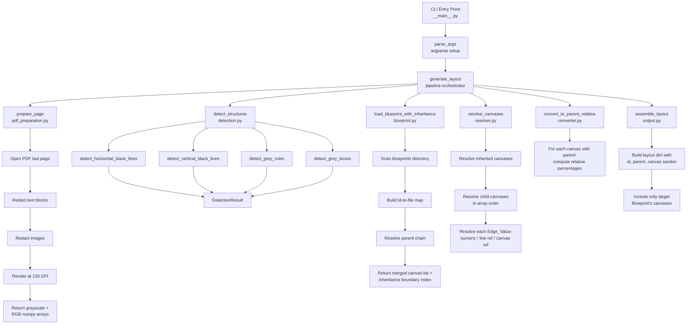
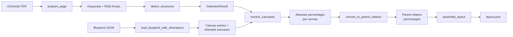

# Design Document: Chronicle Blueprints (blueprint2layout)

## Overview

The `blueprint2layout` package is a Python CLI tool and library that converts a declarative Blueprint JSON file into a layout.json file conforming to LAYOUT_FORMAT.md. It takes two inputs — a Blueprint and a chronicle PDF — and produces parent-relative percentage coordinates for canvas regions by:

1. Stripping text/images from the PDF and rendering to a 150 DPI raster image
2. Detecting six categories of structural elements (h_thin, h_bar, h_rule, v_thin, v_bar, grey_box) via pixel analysis
3. Parsing the Blueprint's canvas entries, resolving line references and canvas references to absolute page percentages
4. Supporting Blueprint inheritance (parent Blueprints by id) so common canvases are defined once
5. Converting absolute percentages to parent-relative percentages
6. Writing the final layout.json with only the target Blueprint's own canvases

This replaces the `season_layout_generator` package, which used a different approach (text detection, region merging, consensus). The Blueprint approach is deterministic — the author declares exactly which detected lines define each canvas edge, rather than relying on heuristic region detection.

### Key Design Decisions

1. **Six detection categories** — Black lines split into thin/bar by a 5px threshold. Grey horizontal rules are a separate category for field-level lines. Grey boxes capture filled rectangles. This gives Blueprint authors a precise vocabulary for referencing structural elements.
2. **Array-order resolution with backward references only** — Canvases resolve in declared order. Forward references are forbidden, making resolution deterministic and cycle-free without a dependency graph.
3. **Inheritance by id** — Mirrors LAYOUT_FORMAT.md's own `id`/`parent` pattern. A child Blueprint inherits resolved canvases from its parent, and the output layout.json links to the parent layout via the same id.
4. **Output scoping** — Only canvases defined in the target Blueprint appear in the output. Parent canvases are resolved for reference but not emitted, since the parent Blueprint produces its own layout file.
5. **numpy for pixel analysis** — The detection logic operates on numpy arrays for efficient row/column scanning and grey pixel classification. PIL handles image loading, numpy handles the math.
6. **Pure functions for testable logic** — Detection, parsing, resolution, and conversion are implemented as pure functions (or functions with minimal I/O) to enable thorough property-based testing.

## Architecture



### Data Flow



### Module Layout

```
blueprint2layout/
├── __init__.py            # Public API: exports generate_layout
├── __main__.py            # CLI entry point: parse_args + main
├── pdf_preparation.py     # prepare_page: PDF → numpy arrays
├── detection.py           # detect_structures + per-category helpers
├── blueprint.py           # load_blueprint_with_inheritance, parsing, validation
├── resolver.py            # resolve_canvases, resolve_edge_value
├── converter.py           # convert_to_parent_relative
├── output.py              # assemble_layout, write_layout
├── models.py              # Dataclasses: DetectionResult, CanvasEntry, ResolvedCanvas, etc.
```

Test directory:
```
tests/blueprint2layout/
├── conftest.py                    # Shared fixtures and hypothesis strategies
├── test_detection.py              # Unit tests for detection.py
├── test_detection_pbt.py          # Property tests for detection.py
├── test_blueprint.py              # Unit tests for blueprint.py
├── test_blueprint_pbt.py          # Property tests for blueprint.py
├── test_resolver.py               # Unit tests for resolver.py
├── test_resolver_pbt.py           # Property tests for resolver.py
├── test_converter.py              # Unit tests for converter.py
├── test_converter_pbt.py          # Property tests for converter.py
├── test_output_pbt.py             # Property tests for output.py (round-trip)
├── test_cli.py                    # CLI integration tests
```


## Components and Interfaces

### `models.py` — Data Models

```python
from dataclasses import dataclass, field


@dataclass(frozen=True)
class HorizontalLine:
    """A detected horizontal line with absolute page percentages.

    Attributes:
        y: Top-edge y position as absolute page percentage.
        x: Left-edge x position as absolute page percentage.
        x2: Right-edge x position as absolute page percentage.
        thickness_px: Thickness in pixels at 150 DPI.
    """
    y: float
    x: float
    x2: float
    thickness_px: int


@dataclass(frozen=True)
class VerticalLine:
    """A detected vertical line with absolute page percentages.

    Attributes:
        x: Left-edge x position as absolute page percentage.
        y: Top-edge y position as absolute page percentage.
        y2: Bottom-edge y position as absolute page percentage.
        thickness_px: Thickness in pixels at 150 DPI.
    """
    x: float
    y: float
    y2: float
    thickness_px: int


@dataclass(frozen=True)
class GreyBox:
    """A detected grey filled rectangle with absolute page percentages.

    Attributes:
        x: Left-edge x position as absolute page percentage.
        y: Top-edge y position as absolute page percentage.
        x2: Right-edge x position as absolute page percentage.
        y2: Bottom-edge y position as absolute page percentage.
    """
    x: float
    y: float
    x2: float
    y2: float


@dataclass(frozen=True)
class DetectionResult:
    """Complete detection output with six keyed arrays.

    Each array is sorted by its primary axis and uses zero-based indexing.

    Attributes:
        h_thin: Horizontal thin lines (thickness <= 5px), sorted by y.
        h_bar: Horizontal thick bars (thickness > 5px), sorted by y.
        h_rule: Grey horizontal rules, sorted by y.
        v_thin: Vertical thin lines (thickness <= 5px), sorted by x.
        v_bar: Vertical thick bars (thickness > 5px), sorted by x.
        grey_box: Grey filled rectangles, sorted by y then x.
    """
    h_thin: list[HorizontalLine] = field(default_factory=list)
    h_bar: list[HorizontalLine] = field(default_factory=list)
    h_rule: list[HorizontalLine] = field(default_factory=list)
    v_thin: list[VerticalLine] = field(default_factory=list)
    v_bar: list[VerticalLine] = field(default_factory=list)
    grey_box: list[GreyBox] = field(default_factory=list)


@dataclass(frozen=True)
class CanvasEntry:
    """A single canvas entry from a Blueprint file.

    Edge values are stored as-is from JSON: either a numeric literal
    (int/float) or a string (line reference or canvas reference).

    Attributes:
        name: Unique canvas name (e.g., "main", "summary").
        left: Left edge value (numeric, line ref, or canvas ref).
        right: Right edge value.
        top: Top edge value.
        bottom: Bottom edge value.
        parent: Optional parent canvas name for coordinate conversion.
    """
    name: str
    left: int | float | str
    right: int | float | str
    top: int | float | str
    bottom: int | float | str
    parent: str | None = None


@dataclass(frozen=True)
class ResolvedCanvas:
    """A canvas with all edges resolved to absolute page percentages.

    Attributes:
        name: Canvas name.
        left: Left edge as absolute page percentage.
        right: Right edge as absolute page percentage.
        top: Top edge as absolute page percentage.
        bottom: Bottom edge as absolute page percentage.
        parent: Optional parent canvas name.
    """
    name: str
    left: float
    right: float
    top: float
    bottom: float
    parent: str | None = None


@dataclass(frozen=True)
class Blueprint:
    """A parsed Blueprint with id, optional parent id, and canvas entries.

    Attributes:
        id: Unique identifier (e.g., "pfs2.season5.blueprint").
        canvases: Ordered list of canvas entries.
        parent: Optional parent Blueprint id for inheritance.
    """
    id: str
    canvases: list[CanvasEntry]
    parent: str | None = None
```

### `pdf_preparation.py` — PDF Page Preparation

```python
import numpy as np


def prepare_page(pdf_path: str) -> tuple[np.ndarray, np.ndarray]:
    """Open a chronicle PDF, strip text and images, render to arrays.

    Opens the last page of the PDF, redacts all text blocks and
    embedded images, renders at 150 DPI, and returns grayscale
    and RGB numpy arrays.

    Args:
        pdf_path: Path to the chronicle PDF file.

    Returns:
        A tuple of (grayscale_array, rgb_array) where grayscale_array
        has shape (height, width) and rgb_array has shape (height, width, 3).

    Raises:
        FileNotFoundError: If pdf_path does not exist.
        ValueError: If the file is not a valid PDF.

    Requirements: chronicle-blueprints 1.1, 1.2, 1.3, 1.4, 1.5
    """
```

### `detection.py` — Structural Element Detection

```python
import numpy as np
from blueprint2layout.models import (
    DetectionResult,
    HorizontalLine,
    VerticalLine,
    GreyBox,
)

# Detection thresholds as named constants
BLACK_PIXEL_THRESHOLD = 50
THIN_LINE_MAX_THICKNESS = 5
HORIZONTAL_MIN_WIDTH_RATIO = 0.05
VERTICAL_MIN_HEIGHT_RATIO = 0.03
LINE_GROUPING_TOLERANCE = 5
GREY_RULE_GROUPING_TOLERANCE = 3
GREY_RULE_MIN_VALUE = 50
GREY_RULE_MAX_VALUE = 200
GREY_BOX_MIN_CHANNEL = 220
GREY_BOX_MAX_CHANNEL = 240
GREY_BOX_CHANNEL_DIFF_LIMIT = 8
GREY_BOX_BLOCK_SIZE = 10
GREY_BOX_BLOCK_FILL_THRESHOLD = 0.5
GREY_BOX_MIN_BLOCKS = 3
GREY_BOX_MIN_AREA = 500
GREY_RULE_DEDUP_TOLERANCE = 0.5


def detect_horizontal_black_lines(
    grayscale: np.ndarray,
) -> tuple[list[HorizontalLine], list[HorizontalLine]]:
    """Detect horizontal black lines and classify as thin or bar.

    Scans each row for runs of black pixels (grayscale < 50) spanning
    more than 5% of pa
and classify as thin or bar.

    Scans each column for runs of black pixels spanning more than 3%
    of page height. Groups consecutive qualifying columns within 5px
    tolerance. Classifies by thickness: <= 5px is thin, > 5px is bar.

    Args:
        grayscale: Grayscale image array, shape (height, width).

    Returns:
        A tuple of (v_thin, v_bar) lists, each sorted by x ascending.

    Requirements: chronicle-blueprints 3.1, 3.2, 3.3, 3.4, 3.5, 3.6
    """


def detect_grey_rules(
    grayscale: np.ndarray,
    h_thin: list[HorizontalLine],
    h_bar: list[HorizontalLine],
) -> list[HorizontalLine]:
    """Detect grey horizontal rule lines, deduplicating against black lines.

    Scans each row for runs of medium-grey pixels (grayscale 50-200)
    spanning more than 5% of page width. Groups within 3px tolerance.
    Discards any grey line whose y is within 0.5 percentage points
    of an existing h_thin or h_bar entry.

    Args:
        grayscale: Grayscale image array, shape (height, width).
        h_thin: Already-detected horizontal thin lines.
        h_bar: Already-detected horizontal thick bars.

    Returns:
        List of grey horizontal rules sorted by y ascending.

    Requirements: chronicle-blueprints 4.1, 4.2, 4.3, 4.4, 4.5
    """


def detect_grey_boxes(rgb: np.ndarray) -> list[GreyBox]:
    """Detect grey filled rectangles via grid-based flood fill.

    Identifies structural grey pixels (RGB channels each 220-240,
    channel differences < 8). Divides into 10x10 blocks, flood-fills
    connected grey blocks, refines bounding boxes at pixel level,
    and filters by minimum area.

    Args:
        rgb: RGB image array, shape (height, width, 3).

    Returns:
        List of grey boxes sorted by y ascending then x ascending.

    Requirements: chronicle-blueprints 5.1, 5.2, 5.3, 5.4, 5.5, 5.6, 5.7
    """


def detect_structures(
    grayscale: np.ndarray,
    rgb: np.ndarray,
) -> DetectionResult:
    """Run all detection passes and assemble the complete result.

    Orchestrates horizontal black lines, vertical black lines,
    grey rules (with deduplication), and grey boxes.

    Args:
        grayscale: Grayscale image array, shape (height, width).
        rgb: RGB image array, shape (height, width, 3).

    Returns:
        A DetectionResult with all six arrays populated.

    Requirements: chronicle-blueprints 6.1, 6.2, 6.3, 6.4, 6.5, 6.6
    """
```

### `blueprint.py` — Blueprint Parsing and Inheritance

```python
from pathlib import Path
from blueprint2layout.models import Blueprint, CanvasEntry


def parse_blueprint(data: dict) -> Blueprint:
    """Parse a raw JSON dictionary into a Blueprint.

    Validates required fields (id, canvases) and converts each
    canvas entry dict into a CanvasEntry dataclass.

    Args:
        data: Parsed JSON dictionary from a Blueprint file.

    Returns:
        A Blueprint instance.

    Raises:
        ValueError: If required fields are missing or malformed.

    Requirements: chronicle-blueprints 7.1, 7.2, 7.3
    """


def build_blueprint_index(blueprints_dir: Path) -> dict[str, Path]:
    """Scan a directory for Blueprint JSON files and build an id-to-path map.

    Reads each .json file in the directory (recursively), parses the
    "id" field, and maps it to the file path.

    Args:
        blueprints_dir: Directory containing Blueprint JSON files.

    Returns:
        Dictionary mapping Blueprint id strings to file paths.

    Requirements: chronicle-blueprints 8.3
    """


def load_blueprint_with_inheritance(
    blueprint_path: Path,
    blueprint_index: dict[str, Path],
) -> tuple[Blueprint, list[CanvasEntry]]:
    """Load a Blueprint and resolve its full inheritance chain.

    Recursively loads parent Blueprints, validates no circular
    references, validates no duplicate canvas names across the
    chain, and returns the target Blueprint plus the ordered list
    of inherited canvases from all ancestors.

    Args:
        blueprint_path: Path to the target Blueprint JSON file.
        blueprint_index: Map of Blueprint ids to file paths.

    Returns:
        A tuple of (target_blueprint, inherited_canvases) where
        inherited_canvases is the ordered list of canvas entries
        from all ancestor Blueprints (root-first order).

    Raises:
        FileNotFoundError: If the Blueprint file does not exist.
        ValueError: If JSON is invalid, parent id is unknown,
            circular reference detected, or duplicate canvas names.

    Requirements: chronicle-blueprints 7.4, 7.5, 7.6, 8.1, 8.2,
        8.4, 8.5, 8.6, 8.7, 8.8, 8.9
    """
```

### `resolver.py` — Edge Value Resolution

```python
from blueprint2layout.models import (
    CanvasEntry,
    DetectionResult,
    ResolvedCanvas,
)

# Regex pattern for line references: category[index]
LINE_REFERENCE_PATTERN = r"^(h_thin|h_bar|h_rule|v_thin|v_bar|grey_box)\[(\d+)\]$"

# Regex pattern for canvas references: canvas_name.edge
CANVAS_REFERENCE_PATTERN = r"^(\w+)\.(left|right|top|bottom)$"


def resolve_edge_value(
    edge_value: int | float | str,
    detection: DetectionResult,
    resolved_canvases: dict[str, ResolvedCanvas],
) -> float:
    """Resolve a single edge value to an absolute page percentage.

    Handles three cases:
    - Numeric literal: returned directly as float.
    - Line reference (e.g., "h_bar[0]"): looks up the detected line's
      primary-axis value (y for horizontal, x for vertical).
    - Canvas reference (e.g., "summary.bottom"): looks up the named
      canvas's resolved edge value.

    Args:
        edge_value: The raw edge value from the Blueprint.
        detection: The detection result for line reference lookups.
        resolved_canvases: Already-resolved canvases for canvas ref lookups.

    Returns:
        The resolved absolute page percentage.

    Raises:
        ValueError: If the reference is malformed, category unknown,
            index out of bounds, or canvas not yet resolved.

    Requirements: chronicle-blueprints 9.1, 9.2, 9.3, 9.4, 9.5, 9.6
    """


def resolve_canvases(
    inherited_canvases: list[CanvasEntry],
    target_canvases: list[CanvasEntry],
    detection: DetectionResult,
) -> dict[str, ResolvedCanvas]:
    """Resolve all canvases in order: inherited first, then target.

    Processes canvases sequentially. Each canvas's four edges are
    resolved via resolve_edge_value. Only backward canvas references
    are permitted.

    Args:
        inherited_canvases: Canvas entries from parent Blueprints.
        target_canvases: Canvas entries from the target Blueprint.
        detection: Detection result for line reference resolution.

    Returns:
        Dictionary mapping canvas names to ResolvedCanvas instances,
        containing both inherited and target canvases.

    Raises:
        ValueError: If a forward canvas reference is encountered.

    Requirements: chronicle-blueprints 10.1, 10.2, 10.3, 10.4
    """
```

### `converter.py` — Parent-Relative Coordinate Conversion

```python
from blueprint2layout.models import ResolvedCanvas


def convert_to_parent_relative(
    canvas: ResolvedCanvas,
    all_canvases: dict[str, ResolvedCanvas],
) -> dict[str, float | str]:
    """Convert a resolved canvas to parent-relative percentages.

    If the canvas has a parent, computes x, y, x2, y2 relative to
    the parent's bounds. If no parent, uses absolute percentages
    directly. All values rounded to one decimal place.

    Args:
        canvas: The resolved canvas to convert.
        all_canvases: All resolved canvases (for parent lookup).

    Returns:
        Dictionary with keys: x, y, x2, y2 (floats), and optionally
        "parent" (string) if the canvas has a parent.

    Raises:
        ValueError: If the parent canvas name is not found.

    Requirements: chronicle-blueprints 11.1, 11.2, 11.3, 11.4,
        11.5, 11.6, 11.7, 11.8
    """
```

### `output.py` — Layout Assembly and Writing

```python
from pathlib import Path
from blueprint2layout.models import Blueprint, ResolvedCanvas


def assemble_layout(
    blueprint: Blueprint,
    resolved_canvases: dict[str, ResolvedCanvas],
    all_canvases: dict[str, ResolvedCanvas],
) -> dict:
    """Assemble the final layout dictionary.

    Builds the layout.json structure with id, optional parent,
    and canvas section containing only the target Blueprint's
    own canvases (not inherited ones), converted to parent-relative
    percentages.

    Args:
        blueprint: The target Blueprint.
        resolved_canvases: All resolved canvases (inherited + target).
        all_canvases: Same as resolved_canvases (for parent lookups).

    Returns:
        A dictionary ready for JSON serialization.

    Requirements: chronicle-blueprints 12.1, 12.2, 12.3, 12.4, 12.5
    """


def write_layout(layout: dict, output_path: Path) -> None:
    """Write a layout dictionary to a JSON file with 2-space indent.

    Args:
        layout: The assembled layout dictionary.
        output_path: Path to write the JSON file.

    Requirements: chronicle-blueprints 12.6, 12.7, 12.8
    """
```

### `__main__.py` — CLI Entry Point

```python
def parse_args(argv: list[str] | None = None) -> argparse.Namespace:
    """Parse command-line arguments for blueprint2layout.

    Accepts three positional arguments: blueprint path, chronicle PDF
    path, and output JSON path. Optional --blueprints-dir flag.

    Args:
        argv: Argument list (defaults to sys.argv[1:]).

    Returns:
        Parsed namespace with blueprint, pdf, output as Paths,
        and blueprints_dir as Path or None.

    Requirements: chronicle-blueprints 13.1, 13.2
    """


def main(argv: list[str] | None = None) -> int:
    """Entry point for the blueprint2layout CLI.

    Parses arguments, runs the full pipeline via generate_layout,
    and writes the output. Prints errors to stderr.

    Args:
        argv: Argument list (defaults to sys.argv[1:]).

    Returns:
        Exit code: 0 for success, 1 for errors.

    Requirements: chronicle-blueprints 13.3, 13.4, 13.5
    """
```

### `__init__.py` — Public API

```python
from blueprint2layout.pdf_preparation import prepare_page
from blueprint2layout.detection import detect_structures
from blueprint2layout.blueprint import (
    build_blueprint_index,
    load_blueprint_with_inheritance,
)
from blueprint2layout.resolver import resolve_canvases
from blueprint2layout.converter import convert_to_parent_relative
from blueprint2layout.output import assemble_layout, write_layout


def generate_layout(
    blueprint_path: str | Path,
    pdf_path: str | Path,
    blueprints_dir: str | Path | None = None,
) -> dict:
    """Generate a layout dictionary from a Blueprint and chronicle PDF.

    Runs the complete pipeline: PDF preparation, structural detection,
    Blueprint loading with inheritance, canvas resolution, parent-relative
    conversion, and layout assembly.

    Args:
        blueprint_path: Path to the target Blueprint JSON file.
        pdf_path: Path to the chronicle PDF file.
        blueprints_dir: Directory to scan for Blueprint files when
            resolving parent references. Defaults to the directory
            containing blueprint_path.

    Returns:
        The layout dictionary ready for JSON serialization.

    Raises:
        FileNotFoundError: If blueprint_path or pdf_path does not exist.
        ValueError: If the PDF is invalid or Blueprint has errors.

    Requirements: chronicle-blueprints 15.1, 15.2, 15.3, 15.4, 15.5
    """
```


## Data Models

### Detection Models

| Dataclass | Fields | Description |
|-----------|--------|-------------|
| `HorizontalLine` | `y: float`, `x: float`, `x2: float`, `thickness_px: int` | A detected horizontal line (thin, bar, or grey rule) with absolute page percentages |
| `VerticalLine` | `x: float`, `y: float`, `y2: float`, `thickness_px: int` | A detected vertical line (thin or bar) with absolute page percentages |
| `GreyBox` | `x: float`, `y: float`, `x2: float`, `y2: float` | A detected grey filled rectangle with absolute page percentages |
| `DetectionResult` | `h_thin`, `h_bar`, `h_rule`, `v_thin`, `v_bar`, `grey_box` | Complete detection output with six sorted arrays |

All detection models are frozen dataclasses. `DetectionResult` uses `field(default_factory=list)` for its arrays so an empty result is valid.

### Blueprint Models

| Dataclass | Fields | Description |
|-----------|--------|-------------|
| `CanvasEntry` | `name: str`, `left`, `right`, `top`, `bottom` (each `int\|float\|str`), `parent: str\|None` | A single canvas from a Blueprint, with raw edge values |
| `Blueprint` | `id: str`, `canvases: list[CanvasEntry]`, `parent: str\|None` | A parsed Blueprint with its id, canvas entries, and optional parent id |
| `ResolvedCanvas` | `name: str`, `left: float`, `right: float`, `top: float`, `bottom: float`, `parent: str\|None` | A canvas with all edges resolved to absolute page percentages |

All Blueprint models are frozen dataclasses. `CanvasEntry` edge values preserve the original JSON type — numeric for literals, string for references.

### Detection Constants

| Constant | Value | Description |
|----------|-------|-------------|
| `BLACK_PIXEL_THRESHOLD` | 50 | Grayscale value below which a pixel is "black" |
| `THIN_LINE_MAX_THICKNESS` | 5 | Maximum thickness (px) for thin line classification |
| `HORIZONTAL_MIN_WIDTH_RATIO` | 0.05 | Minimum run length as fraction of page width |
| `VERTICAL_MIN_HEIGHT_RATIO` | 0.03 | Minimum run length as fraction of page height |
| `LINE_GROUPING_TOLERANCE` | 5 | Max gap (px) between rows/columns in a line group |
| `GREY_RULE_GROUPING_TOLERANCE` | 3 | Max gap (px) between rows in a grey rule group |
| `GREY_RULE_MIN_VALUE` | 50 | Minimum grayscale for grey rule pixels |
| `GREY_RULE_MAX_VALUE` | 200 | Maximum grayscale for grey rule pixels |
| `GREY_RULE_DEDUP_TOLERANCE` | 0.5 | Max y-distance (%) to deduplicate grey vs black lines |
| `GREY_BOX_MIN_CHANNEL` | 220 | Minimum RGB channel value for structural grey |
| `GREY_BOX_MAX_CHANNEL` | 240 | Maximum RGB channel value for structural grey |
| `GREY_BOX_CHANNEL_DIFF_LIMIT` | 8 | Max absolute difference between any two RGB channels |
| `GREY_BOX_BLOCK_SIZE` | 10 | Grid block size in pixels |
| `GREY_BOX_BLOCK_FILL_THRESHOLD` | 0.5 | Fraction of grey pixels for a block to qualify |
| `GREY_BOX_MIN_BLOCKS` | 3 | Minimum connected blocks for a grey box candidate |
| `GREY_BOX_MIN_AREA` | 500 | Minimum bounding box area (px²) after refinement |

### How the Six Detection Categories Work

**h_thin / h_bar (Horizontal Black Lines):**
Scan each row for runs of black pixels (grayscale < 50) longer than 5% of page width. Group consecutive qualifying rows within a 5px gap tolerance into line groups. Compute the bounding box of each group. If the group's thickness (y_max - y_min + 1) is ≤ 5px, it's `h_thin`; otherwise `h_bar`. Both arrays are sorted by y ascending.

**v_thin / v_bar (Vertical Black Lines):**
Same approach but scanning columns. Runs must span > 3% of page height. Group consecutive qualifying columns within 5px tolerance. Thickness ≤ 5px → `v_thin`, otherwise `v_bar`. Sorted by x ascending.

**h_rule (Grey Horizontal Rules):**
Scan each row for runs of medium-grey pixels (grayscale 50–200) longer than 5% of page width. Group within 3px tolerance. After grouping, discard any grey line whose y position is within 0.5 percentage points of any `h_thin` or `h_bar` entry — this prevents double-counting lines that appear in both black and grey detection passes. Sorted by y ascending.

**grey_box (Grey Filled Rectangles):**
Identify structural grey pixels where all RGB channels are 220–240 and channel differences < 8. Divide the image into a 10×10 pixel grid. Mark blocks where > 50% of pixels are structural grey. Flood-fill connected grey blocks. Discard components with < 3 blocks. Refine each component's bounding box at pixel level. Discard boxes with area < 500px². Sorted by y then x ascending.

### Blueprint JSON Format

A Blueprint file looks like:

```json
{
  "id": "pfs2.season5.blueprint",
  "parent": "pfs2.blueprint",
  "canvases": [
    {"name": "summary", "parent": "main",
     "left": "main.left", "right": "main.right",
     "top": "h_bar[0]", "bottom": "h_bar[1]"},
    {"name": "items", "parent": "main",
     "left": "main.left", "right": "v_thin[1]",
     "top": "h_bar[2]", "bottom": "h_bar[4]"}
  ]
}
```

Edge values can be:
- **Numeric literal**: `0`, `100`, `5.9` — used directly as absolute percentage
- **Line reference**: `"h_bar[0]"`, `"v_thin[2]"` — resolves to the detected line's primary-axis value
- **Canvas reference**: `"main.left"`, `"summary.bottom"` — resolves to an already-resolved canvas edge

### Edge Value Resolution

Line references resolve to the primary axis of the detected element:
- `h_thin[i]`, `h_bar[i]`, `h_rule[i]` → the line's `y` value
- `v_thin[i]`, `v_bar[i]` → the line's `x` value
- `grey_box[i]` → not used as a line reference (grey boxes are referenced via canvas definitions that use their edges directly, or via numeric literals derived from detection output)

Canvas references resolve to the named canvas's absolute edge value:
- `canvas_name.left` → the canvas's resolved left (absolute %)
- `canvas_name.right` → the canvas's resolved right (absolute %)
- `canvas_name.top` → the canvas's resolved top (absolute %)
- `canvas_name.bottom` → the canvas's resolved bottom (absolute %)

### Parent-Relative Conversion

Given a canvas with absolute edges and a parent canvas with absolute edges:

```
x  = (canvas.left   - parent.left) / (parent.right  - parent.left) * 100
y  = (canvas.top    - parent.top)  / (parent.bottom - parent.top)  * 100
x2 = (canvas.right  - parent.left) / (parent.right  - parent.left) * 100
y2 = (canvas.bottom - parent.top)  / (parent.bottom - parent.top)  * 100
```

All values rounded to 1 decimal place. Canvases without a parent use their absolute percentages directly.

