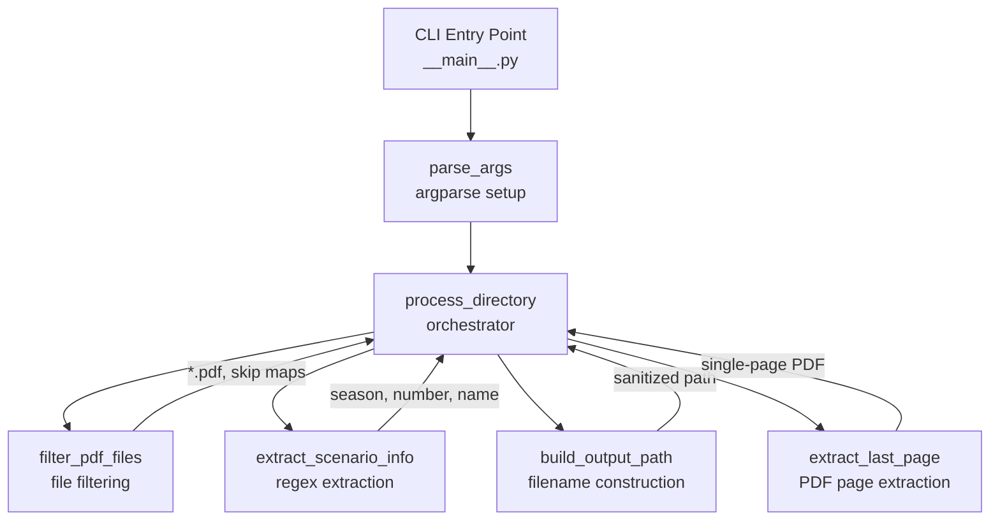

# Design Document: Chronicle Extractor

## Overview

The Chronicle Extractor is a Python CLI utility that automates extraction of chronicle sheet pages from Pathfinder Society (PFS) scenario PDFs. It reads each PDF's first page to identify the scenario number and name via regex, then extracts the last page (the chronicle sheet) into a new single-page PDF. Output files are organized into season-based subdirectories with sanitized filenames.

The utility is the first in a planned collection of PFS-related tools. The project structure places each utility in its own top-level Python package directory, with shared project-level files (README, requirements.txt) at the root.

### Key Design Decisions

1. **PyMuPDF (fitz) for PDF operations** — fast C-based library, supports text extraction and page-level PDF manipulation without external dependencies like Poppler.
2. **argparse for CLI** — stdlib, no extra dependency, sufficient for two required arguments.
3. **Flat module structure** — the utility is small enough that a single package with a few modules keeps things simple. No need for nested sub-packages.
4. **Pure functions for testable logic** — filename sanitization, scenario number extraction, and file filtering are implemented as pure functions to enable thorough property-based testing without PDF fixtures.

## Architecture



### Data Flow

1. User invokes CLI with `--input-dir` and `--output-dir`.
2. `parse_args` validates `--input-dir` exists; creates `--output-dir` if missing.
3. `process_directory` iterates over immediate children of `--input-dir`.
4. For each entry, `filter_pdf_files` checks: is it a file? has `.pdf` extension? stem doesn't end with "Map"/"Maps"?
5. For each passing PDF, `extract_scenario_info` reads first-page text and applies the `#X-YY` regex.
6. `build_output_path` constructs the sanitized filename and season subdirectory path.
7. `extract_last_page` uses PyMuPDF to copy the last page into a new PDF and saves it.
8. Success/skip/error messages are printed to stdout/stderr as appropriate.

### Module Layout

```
chronicle_extractor/
├── __init__.py          # Package marker (empty)
├── __main__.py          # CLI entry point: parse_args + main orchestration
├── extractor.py         # Core logic: process_directory, extract_last_page
├── parser.py            # extract_scenario_info (regex-based)
├── filename.py          # sanitize_name, build_output_path
├── filters.py           # is_scenario_pdf (file filtering predicates)
```

Project root files:
```
README.md                # Top-level README linking to utility READMEs
requirements.txt         # PyMuPDF, pytest, hypothesis
chronicle_extractor/
  README.md              # Utility-specific README
```

## Components and Interfaces

### `filters.py` — File Filtering

```python
def is_pdf_file(entry: os.DirEntry) -> bool:
    """Check if a directory entry is a regular file with a .pdf extension.

    Args:
        entry: A directory entry from os.scandir().

    Returns:
        True if the entry is a file with a .pdf extension (case-insensitive).

    Requirements: chronicle-extractor 2.1, 2.3
    """

def is_map_pdf(stem: str) -> bool:
    """Check if a filename stem indicates a map PDF.

    Args:
        stem: The filename without extension.

    Returns:
        True if the stem ends with 'Map' or 'Maps' (case-insensitive).

    Requirements: chronicle-extractor 2.2
    """

def is_scenario_pdf(entry: os.DirEntry) -> bool:
    """Check if a directory entry is a processable scenario PDF.

    Combines is_pdf_file and is_map_pdf checks.

    Args:
        entry: A directory entry from os.scandir().

    Returns:
        True if the entry is a PDF file that is not a map PDF.

    Requirements: chronicle-extractor 2.1, 2.2, 2.3
    """
```

### `parser.py` — Scenario Info Extraction

```python
import re
from dataclasses import dataclass

@dataclass(frozen=True)
class ScenarioInfo:
    """Parsed scenario metadata from a PDF's first page.

    Attributes:
        season: The season number (e.g., 1, 2).
        scenario: The zero-padded scenario number string (e.g., '07', '12').
        name: The scenario name as extracted from the PDF text.
    """
    season: int
    scenario: str
    name: str

# Regex pattern: matches #X-YY followed by the scenario name
# Captures: season number, scenario number, and trailing scenario name text
SCENARIO_PATTERN: re.Pattern = re.compile(
    r"#(\d+)-(\d+)\s*[:\s]*(.+)"
)

def extract_scenario_info(first_page_text: str) -> ScenarioInfo | None:
    """Extract PFS scenario number and name from first-page text.

    Searches for the pattern #X-YY followed by the scenario name.
    The name is taken from the remainder of the matched line, stripped
    of leading/trailing whitespace.

    Args:
        first_page_text: The full text content of the PDF's first page.

    Returns:
        A ScenarioInfo if the pattern is found, or None if no match.

    Requirements: chronicle-extractor 3.1, 3.2, 3.3
    """
```

### `filename.py` — Filename Construction

```python
# Characters to strip from scenario names for filesystem safety
UNSAFE_CHARACTERS: str = "':;?/\\*<>|\""

def sanitize_name(name: str) -> str:
    """Remove spaces and unsafe characters from a scenario name.

    Preserves original letter casing. Strips characters defined in
    UNSAFE_CHARACTERS and removes all spaces.

    Args:
        name: The raw scenario name from the PDF.

    Returns:
        The sanitized name suitable for use in filenames.

    Requirements: chronicle-extractor 5.2, 5.3, 5.4
    """

def build_output_path(
    output_dir: Path,
    info: ScenarioInfo,
) -> Path:
    """Construct the full output path for a chronicle PDF.

    Builds: output_dir/Season {season}/{season}-{scenario}-{sanitized}Chronicle.pdf

    Args:
        output_dir: The base output directory.
        info: The parsed scenario metadata.

    Returns:
        The full Path where the chronicle PDF should be saved.

    Requirements: chronicle-extractor 4.2, 5.1
    """
```

### `extractor.py` — Core PDF Processing

```python
def extract_last_page(input_path: Path, output_path: Path) -> None:
    """Extract the last page of a PDF and save it as a new PDF.

    Uses PyMuPDF to open the source PDF, copy its last page into
    a new document, and save to output_path. Creates parent
    directories if they don't exist.

    Args:
        input_path: Path to the source scenario PDF.
        output_path: Path where the single-page chronicle PDF is saved.

    Raises:
        RuntimeError: If PyMuPDF fails to open or write the PDF.

    Requirements: chronicle-extractor 4.1, 4.3
    """

def process_directory(input_dir: Path, output_dir: Path) -> None:
    """Process all scenario PDFs in a directory.

    Iterates over immediate children of input_dir, filters for
    scenario PDFs, extracts scenario info, builds output paths,
    and extracts chronicle pages. Prints feedback to stdout/stderr.

    Args:
        input_dir: Directory containing scenario PDFs.
        output_dir: Base directory for output chronicle PDFs.

    Requirements: chronicle-extractor 6.1, 6.2, 6.3, 6.4, 7.1
    """
```

### `__main__.py` — CLI Entry Point

```python
def parse_args(argv: list[str] | None = None) -> argparse.Namespace:
    """Parse and validate command-line arguments.

    Args:
        argv: Argument list (defaults to sys.argv[1:]).

    Returns:
        Parsed namespace with input_dir and output_dir as Path objects.

    Requirements: chronicle-extractor 1.1, 1.2
    """

def main(argv: list[str] | None = None) -> int:
    """Entry point for the chronicle extractor CLI.

    Parses arguments, validates input directory, creates output
    directory, and delegates to process_directory.

    Args:
        argv: Argument list (defaults to sys.argv[1:]).

    Returns:
        Exit code: 0 for success, 1 for errors.

    Requirements: chronicle-extractor 1.3, 1.4
    """
```

## Data Models

### `ScenarioInfo` (dataclass)

| Field      | Type   | Description                                      |
|------------|--------|--------------------------------------------------|
| `season`   | `int`  | Season number extracted from `#X-YY` pattern     |
| `scenario` | `str`  | Zero-padded scenario number (e.g., `"07"`)       |
| `name`     | `str`  | Raw scenario name as extracted from PDF text      |

This is the only data model. It's a frozen dataclass — immutable after creation, which makes it safe to pass around and easy to test.

### Constants

| Constant            | Module       | Type          | Value / Description                                    |
|---------------------|-------------|---------------|--------------------------------------------------------|
| `SCENARIO_PATTERN`  | `parser.py`  | `re.Pattern`  | Compiled regex for `#X-YY` followed by scenario name   |
| `UNSAFE_CHARACTERS` | `filename.py`| `str`         | `"':;?/\\*<>\|\"` — characters stripped from filenames |


## Correctness Properties

*A property is a characteristic or behavior that should hold true across all valid executions of a system — essentially, a formal statement about what the system should do. Properties serve as the bridge between human-readable specifications and machine-verifiable correctness guarantees.*

### Property 1: PDF extension filtering

*For any* filename string, `is_pdf_file` should return `True` if and only if the filename ends with `.pdf` (case-insensitive), and `False` for all other extensions.

**Validates: Requirements 2.1**

### Property 2: Map PDF detection

*For any* filename stem, `is_map_pdf` should return `True` if and only if the stem ends with "Map" or "Maps" (case-insensitive), and `False` otherwise.

**Validates: Requirements 2.2**

### Property 3: Scenario info extraction round trip

*For any* valid season number (positive integer), scenario number (zero-padded two-digit string), and scenario name (non-empty string without newlines), embedding them as `#X-YY Name` in a text string and calling `extract_scenario_info` should return a `ScenarioInfo` with the original season, scenario, and name.

**Validates: Requirements 3.2, 3.3**

### Property 4: No-match returns None

*For any* text string that does not contain the `#X-YY` pattern, `extract_scenario_info` should return `None`.

**Validates: Requirements 3.4**

### Property 5: Sanitized name contains no unsafe characters or spaces

*For any* input string, the output of `sanitize_name` should contain no spaces and none of the characters in `UNSAFE_CHARACTERS` (`'`, `:`, `;`, `?`, `/`, `\`, `*`, `<`, `>`, `|`, `"`).

**Validates: Requirements 5.2, 5.3**

### Property 6: Sanitized name preserves letter casing

*For any* input string, every alphabetic character in the output of `sanitize_name` should appear in the input with the same casing, and in the same relative order (i.e., the output letters are a subsequence of the input letters).

**Validates: Requirements 5.4**

### Property 7: Output filename format

*For any* valid `ScenarioInfo`, `build_output_path` should produce a path whose filename matches the pattern `{season}-{scenario}-{sanitized}Chronicle.pdf` and whose parent directory is `Season {season}` under the output directory.

**Validates: Requirements 4.2, 5.1**

## Error Handling

| Scenario | Behavior | Output | Exit |
|---|---|---|---|
| `--input-dir` does not exist | Exit immediately | Error message to stderr | Code 1 |
| `--output-dir` does not exist | Create it (including parents) | None | Continues |
| Non-PDF file in input dir | Skip | Skip message to stderr | Continues |
| Map PDF in input dir | Skip | Skip message to stderr | Continues |
| Directory/symlink in input dir | Skip | Skip message to stderr | Continues |
| No `#X-YY` pattern on first page | Skip file | Warning to stderr | Continues |
| PyMuPDF read/write failure | Skip file | Error message to stderr | Continues |
| Season subdirectory missing | Create it | None | Continues |

Key principle: the utility is resilient. Only a missing input directory is fatal. All per-file errors are logged and processing continues with remaining files. This ensures a single corrupt PDF doesn't block extraction of the rest.

Error messages include the filename that caused the issue so the user can investigate.

## Testing Strategy

### Testing Framework

- **pytest** — test runner and assertion framework
- **hypothesis** — property-based testing library for Python

### Dual Testing Approach

**Property-based tests** (hypothesis) verify universal properties across randomly generated inputs:
- Each correctness property above maps to exactly one `@given` test function
- Minimum 100 examples per property (hypothesis default is 100, which satisfies this)
- Each test is tagged with a comment: `# Feature: chronicle-extractor, Property N: {title}`

**Unit tests** (pytest) verify specific examples, edge cases, and integration points:
- Concrete examples with known PDFs or mock text
- Edge cases: empty strings, strings with only unsafe characters, single-page PDFs
- Integration tests: end-to-end CLI invocation with temp directories and fixture PDFs
- Error conditions: corrupt PDFs, permission errors, missing directories

### Test File Organization

```
tests/
├── conftest.py                              # Shared fixtures (temp dirs, sample PDFs)
├── test_filters.py                          # Unit tests for filters.py
├── test_filters_pbt.py                      # Property tests for filters.py
├── test_parser.py                           # Unit tests for parser.py
├── test_parser_pbt.py                       # Property tests for parser.py
├── test_filename.py                         # Unit tests for filename.py
├── test_filename_pbt.py                     # Property tests for filename.py
├── test_extractor.py                        # Unit + integration tests for extractor.py
├── test_cli.py                              # CLI integration tests for __main__.py
```

### Property Test to Design Property Mapping

| Test File | Test Function | Design Property |
|---|---|---|
| `test_filters_pbt.py` | `test_pdf_extension_filtering` | Property 1 |
| `test_filters_pbt.py` | `test_map_pdf_detection` | Property 2 |
| `test_parser_pbt.py` | `test_scenario_info_round_trip` | Property 3 |
| `test_parser_pbt.py` | `test_no_match_returns_none` | Property 4 |
| `test_filename_pbt.py` | `test_sanitized_no_unsafe_chars` | Property 5 |
| `test_filename_pbt.py` | `test_sanitized_preserves_casing` | Property 6 |
| `test_filename_pbt.py` | `test_output_filename_format` | Property 7 |

### Property-Based Testing Configuration

- Library: `hypothesis` (Python)
- Each property test uses `@given(...)` decorator with appropriate strategies
- Minimum iterations: 100 (hypothesis default `max_examples=100`)
- Tag format in each test: `# Feature: chronicle-extractor, Property N: {title}`
- Each correctness property is implemented by a single `@given` test function
- Custom strategies will generate valid `ScenarioInfo` instances, filenames with mixed extensions, and text with/without `#X-YY` patterns
