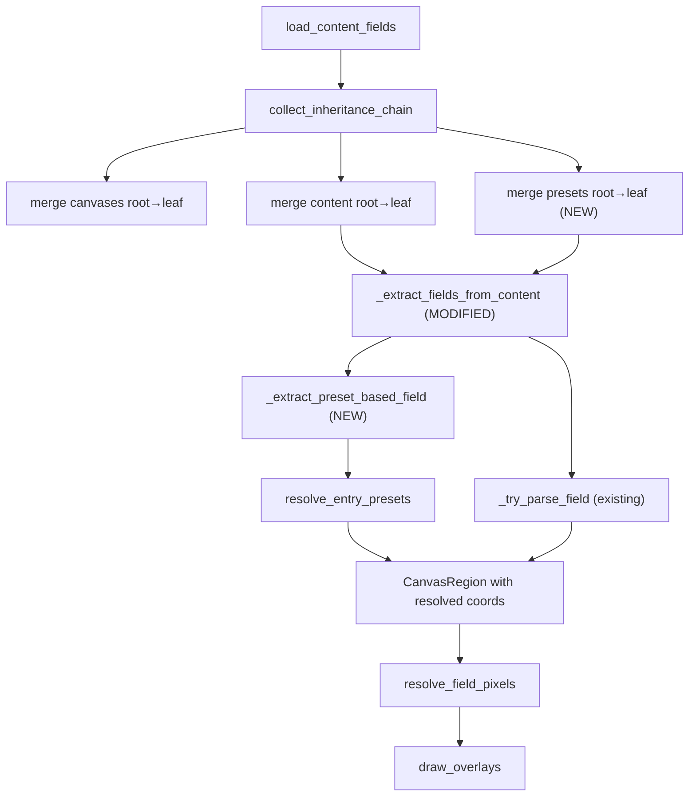

# Design Document: Items Field Visualization

## Overview

This feature extends the Layout Visualizer's `--mode fields` to display strikeout entries and checkbox entries that currently rely on presets for their coordinates. Today, `_extract_fields_from_content` only collects entries with inline `canvas`/`x`/`y`/`x2`/`y2` properties and explicitly skips `strikeout` and `checkbox` types via `_SKIP_TYPES`. The change introduces preset resolution into the field extraction pipeline so that preset-based entries become visible as colored rectangles with labels, consistent with existing field visualization.

The existing `resolve_entry_presets` and `merge_presets` functions (built for data mode) already handle the core preset resolution logic. The primary work is wiring preset resolution into the field extraction path and handling the choice content map traversal with proper labeling.

## Architecture

The change is localized to `layout_loader.py` with no new modules required. The data flow for `--mode fields` becomes:



Key architectural decisions:

1. Reuse `merge_presets` and `resolve_entry_presets` from the data-mode pipeline — no duplication.
2. The field extraction function receives the merged presets dict and passes it through during recursion.
3. Choice content traversal iterates all keys in the `content` map (not a `branches` field), using each key as the label for extracted entries.
4. Entries that fail preset resolution or lack required coordinates after resolution are silently skipped.

## Components and Interfaces

### Modified: `load_content_fields`

Current signature returns `(fields, canvases, file_paths)`. The function will additionally call `merge_presets(chain)` and pass the merged presets into `_extract_fields_from_content`.

```python
def load_content_fields(
    layout_path: Path,
    layout_index: dict[str, Path],
) -> tuple[list[CanvasRegion], dict[str, CanvasRegion], list[Path]]:
```

No signature change — the return type stays the same. Internally, it now merges presets and passes them to the extraction function.

### Modified: `_extract_fields_from_content`

Gains a `presets` parameter and a `label` parameter for choice-key propagation:

```python
def _extract_fields_from_content(
    content: list[dict],
    fields: list[CanvasRegion],
    counter: list[int],
    presets: dict[str, dict],
    label: str | None = None,
) -> None:
```

For each entry:
- If `type` is `"choice"`: iterate all keys in `entry["content"]` map, recurse into each key's content array with `label=key`.
- If `type` is `"trigger"`: recurse into `entry["content"]` with current label.
- If `type` is `"strikeout"` or `"checkbox"`: call `_extract_preset_based_field` to resolve presets and create a `CanvasRegion`.
- Otherwise: call existing `_try_parse_field` for inline-coordinate entries.

### New: `_extract_preset_based_field`

```python
def _extract_preset_based_field(
    entry: dict,
    presets: dict[str, dict],
    label: str | None,
    counter: list[int],
) -> CanvasRegion | None:
```

1. Calls `resolve_entry_presets(entry, presets)` to merge preset properties.
2. Checks that the resolved dict has `canvas`, `x`, `y`, `x2`, `y2`.
3. Uses `label` if provided, otherwise falls back to `f"field_{counter[0]}"`.
4. Returns a `CanvasRegion` or `None` if coordinates are incomplete.

### Modified: `_get_nested_content`

This function is replaced by inline logic in `_extract_fields_from_content` because choice traversal now needs per-key labeling, which `_get_nested_content` cannot provide (it flattens all keys into one list, losing the key text).

### Unchanged

- `CanvasRegion`, `PixelRect` models — no changes needed.
- `coordinate_resolver.py` — `resolve_field_pixels` already handles any `CanvasRegion` list.
- `overlay_renderer.py` — `draw_overlays` already draws any `PixelRect` dict.
- `__main__.py` — `run_visualizer` already calls `load_content_fields` → `resolve_field_pixels` → `draw_overlays` for fields mode. No changes needed.
- `colors.py` — palette cycling already handles arbitrary field counts.

### Removed from `_SKIP_TYPES`

`"strikeout"` and `"checkbox"` are removed from `_SKIP_TYPES` (or `_SKIP_TYPES` is no longer consulted in the field extraction path, since the field extraction function handles these types explicitly).

## Data Models

No new data models are needed. The existing `CanvasRegion` dataclass is sufficient to represent resolved strikeout and checkbox field positions:

```python
@dataclass(frozen=True)
class CanvasRegion:
    name: str      # Label text (choice key or fallback)
    x: float       # Left edge % of parent canvas
    y: float       # Top edge % of parent canvas
    x2: float      # Right edge % of parent canvas
    y2: float      # Bottom edge % of parent canvas
    parent: str | None = None  # Canvas name
```

### Preset data structure (existing in layout JSON)

Strikeout preset pattern:
```json
{
  "strikeout_item": { "canvas": "items", "color": "black", "x": 0.5, "x2": 95 },
  "item.line.some_item_key": { "y": 55.4, "y2": 58.9 }
}
```

Checkbox preset pattern:
```json
{
  "checkbox": { "canvas": "summary", "color": "black", "size": 1 },
  "checkbox.some_key": { "x": 69.71, "y": 46.228, "x2": 71.41, "y2": 59.449 }
}
```

Both follow the same resolution: base preset provides some coordinates, per-entry preset provides the rest. `resolve_entry_presets` merges them left-to-right, then inline properties override.

