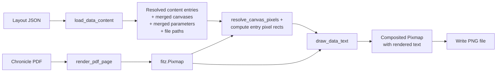

# Design Document: Layout Data Mode

## Overview

The Layout Data Mode adds a `--mode data` option to the existing `layout_visualizer` CLI. Instead of drawing colored overlay rectangles (as `canvases` and `fields` modes do), this mode renders the actual example data from the layout's `parameters` section as text on the chronicle PDF, using each content entry's font, fontsize, fontweight, and alignment properties.

The pipeline reuses the existing layout loading, PDF rendering, and coordinate resolution infrastructure. A new `data_renderer.py` module handles text rendering via PyMuPDF's text insertion API. New functions in `layout_loader.py` handle parameter merging, preset merging, and preset resolution onto content entries.

### Key Design Decisions

1. **New `data_renderer.py` module** — Text rendering logic is isolated from the existing overlay renderer. The overlay renderer draws colored shapes; the data renderer inserts styled text. These are fundamentally different operations, so separate modules keep responsibilities clean.

2. **PyMuPDF `insert_text` for text rendering** — PyMuPDF's `Shape.insert_text` supports font selection, font size, and bold weight. Alignment is computed manually by measuring text width via `fitz.get_text_length` and positioning the insertion point within the bounding box. This avoids adding any new dependencies.

3. **Preset resolution as a pure function** — Preset properties are merged onto content entries before rendering. The resolution function walks the preset chain (including nested preset references), collects properties in order, then lets inline content entry values override. This is a pure dict-merge operation, easily testable without PDF rendering.

4. **Parameter lookup flattens groups** — Parameters are organized by groups in the layout JSON, but content entries reference them by name only (`param:param_name`). The loader flattens all groups into a single `name → parameter` dict for O(1) lookup.

5. **Content walking reuses the existing recursive pattern** — The existing `_extract_fields_from_content` / `_get_nested_content` pattern for walking trigger/choice nesting is reused. The data mode variant extracts full content entry dicts (not just CanvasRegion positions) so that font/size/weight/align/presets/type/lines are preserved.

6. **Non-text types are skipped silently** — `checkbox`, `strikeout`, `line`, and `rectangle` entries are filtered out during content walking. `trigger` and `choice` entries are recursed into for their nested content arrays.

## Architecture

```mermaid
graph TD
    A[CLI Entry 
  G4 --> G5[Return resolved entries +<br/>canvases + file paths]

    F --> H[render_pdf_page<br/>pdf_renderer.py]
    H --> H1[Render page 0 at 150 DPI]

    F --> I[resolve_canvas_pixels<br/>coordinate_resolver.py]

    F --> J[draw_data_text<br/>data_renderer.py]
    J --> J1[For each resolved entry:<br/>look up example value]
    J1 --> J2[Compute pixel position<br/>from canvas-relative %]
    J2 --> J3[Apply alignment within<br/>bounding box]
    J3 --> J4[Insert text with font,<br/>size, weight]

    F --> K[Write PNG output]
```

### Data Flow



### Module Structure

```
layout_visualizer/
├── __main__.py              # CLI — add "data" to --mode choices, new branch
├── layout_loader.py         # Add: load_data_content, merge_parameters,
│                            #       merge_presets, resolve_entry_presets
├── data_renderer.py         # NEW: draw_data_text, alignment computation
├── models.py                # Add: DataContentEntry dataclass
├── coordinate_resolver.py   # Reused as-is
├── overlay_renderer.py      # Unchanged
├── pdf_renderer.py          # Unchanged
└── colors.py                # Unchanged
```

## Components and Interfaces

### `models.py` — New Data Model

```python
@dataclass(frozen=True)
class DataContentEntry:
    """A fully resolved content entry ready for text rendering.

    All preset properties have been merged. The entry has a known
    canvas, coordinates, and styling. The `example_value` is the
    resolved text to render (already converted to string).

    Attributes:
        param_name: The parameter name (from "param:xxx").
        example_value: The example text to render (string).
        entry_type: Content type ("text" or "multiline").
        canvas: Canvas region name.
        x: Left edge as percentage of canvas (0-100).
        y: Top edge as percentage of canvas (0-100).
        x2: Right edge as percentage of canvas (0-100).
        y2: Bottom edge as percentage of canvas (0-100).
        font: Font family name.
        fontsize: Font size in points.
        fontweight: Font weight ("bold" or None).
        align: Two-character alignment code (e.g. "LB", "CM").
        lines: Number of lines (for multiline entries).
    """
    param_name: str
    example_value: str
    entry_type: str
    canvas: str
    x: float
    y: float
    x2: float
    y2: float
    font: str
    fontsize: float
    fontweight: str | None
    align: str
    lines: int
```

### `layout_loader.py` — New Functions

```python
def merge_parameters(
    chain: list[tuple[Path, dict]],
) -> dict[str, dict]:
    """Merge parameters from the inheritance chain into a flat lookup.

    Walks root-to-leaf. For each layout, iterates parameter groups
    and collects parameters by name. Child definitions override
    parent definitions for the same parameter name.

    Args:
        chain: Inheritance chain from collect_inheritance_chain
               (root-first order).

    Returns:
        Flat dict mapping parameter name to its definition dict
        (containing type, description, example, etc.).

    Requirements: layout-data-mode 2.1
    """


def merge_presets(
    chain: list[tuple[Path, dict]],
) -> dict[str, dict]:
    """Merge presets from the inheritance chain.

    Walks root-to-leaf. Child preset definitions override parent
    definitions for the same preset name.

    Args:
        chain: Inheritance chain (root-first order).

    Returns:
        Dict mapping preset name to its property dict.

    Requirements: layout-data-mode 3.3
    """


def resolve_entry_presets(
    entry: dict,
    presets: dict[str, dict],
) -> dict:
    """Apply preset properties to a content entry as defaults.

    Walks the entry's presets array (if any), resolving nested
    preset references recursively. Collects properties from
    presets in order, then overlays the entry's inline properties.
    Inline values always win over preset values.

    Args:
        entry: Raw content entry dict from the layout JSON.
        presets: Merged preset definitions.

    Returns:
        A new dict with all properties resolved (presets merged
        as defaults, inline values as overrides).

    Requirements: layout-data-mode 3.1, 3.2
    """


def load_data_content(
    layout_path: Path,
    layout_index: dict[str, Path],
) -> tuple[list[DataContentEntry], dict[str, CanvasRegion], list[Path]]:
    """Load content entries for data mode rendering.

    Walks the inheritance chain, merges canvases, parameters,
    presets, and content. Extracts text/multiline entries,
    resolves presets, looks up example values, and returns
    fully resolved DataContentEntry instances.

    Skips non-text types (checkbox, strikeout, line, rectangle).
    Recurses into trigger and choice nested content.
    Warns and skips entries with missing parameters or examples.

    Args:
        layout_path: Path to the target layout JSON file.
        layout_index: Map of layout ids to file paths.

    Returns:
        Tuple of (entries, merged_canvases, layout_file_paths).

    Requirements: layout-data-mode 2.1-2.5, 3.1-3.3, 7.1-7.6
    """
```

### `data_renderer.py` — New Module

```python
import fitz
from layout_visualizer.models import DataContentEntry, PixelRect


def compute_text_position(
    text: str,
    fontsize: float,
    font: str,
    is_bold: bool,
    align: str,
    bbox: PixelRect,
) -> fitz.Point:
    """Compute the insertion point for text within a bounding box.

    Uses the alignment code to position text horizontally and
    vertically within the box. Measures text width via
    fitz.get_text_length for horizontal alignment.

    Horizontal: L=left edge, C=centered, R=right edge.
    Vertical: B=bottom, M=middle, T=top.

    Args:
        text: The text string to render.
        fontsize: Font size in points.
        font: Font family name.
        is_bold: Whether the text is bold.
        align: Two-character alignment code.
        bbox: The bounding box in pixel coordinates.

    Returns:
        A fitz.Point for the text insertion position.

    Requirements: layout-data-mode 5.1-5.8
    """


def draw_data_text(
    pixmap: fitz.Pixmap,
    entries: list[DataContentEntry],
    canvas_pixels: dict[str, PixelRect],
) -> fitz.Pixmap:
    """Render example text onto the PDF page pixmap.

    Creates a temporary PDF page, inserts the background pixmap,
    then for each DataContentEntry:
    1. Resolves the entry's percentage coordinates to pixels
       relative to its canvas's pixel rect.
    2. Computes the text insertion point using alignment.
    3. Inserts the text with the specified font, size, and weight.

    For multiline entries, divides the bounding box height by the
    lines count and renders the example value in the first line slot.

    Args:
        pixmap: The background PDF page pixmap (RGB).
        entries: Resolved DataContentEntry instances.
        canvas_pixels: Map of canvas name to resolved PixelRect.

    Returns:
        A new RGB pixmap with text rendered on the background.

    Requirements: layout-data-mode 4.1-4.5, 5.1-5.8, 6.1-6.3
    """
```

### `__main__.py` — Changes

The `parse_args` function adds `"data"` to the `--mode` choices. The `run_visualizer` function gets a new branch:

```python
# In run_visualizer, after the existing mode branches:
elif mode == "data":
    entries, canvases, _chain = load_data_content(layout_path, layout_index)
    canvas_pixels = resolve_canvas_pixels(canvases, pixmap.width, pixmap.height)
    composited = draw_data_text(pixmap, entries, canvas_pixels)
```

No changes to `watch_and_regenerate` — it already passes `mode` through to `run_visualizer`, so `--mode data --watch` works automatically.

## Data Models

### New: `DataContentEntry`

| Field | Type | Description |
|-------|------|-------------|
| `param_name` | `str` | Parameter name from `"param:xxx"` |
| `example_value` | `str` | Example text to render (stringified) |
| `entry_type` | `str` | `"text"` or `"multiline"` |
| `canvas` | `str` | Canvas region name |
| `x`, `y`, `x2`, `y2` | `float` | Position as percentage of canvas |
| `font` | `str` | Font family (e.g. `"Helvetica"`) |
| `fontsize` | `float` | Font size in points |
| `fontweight` | `str \| None` | `"bold"` or `None` |
| `align` | `str` | Two-character alignment code |
| `lines` | `int` | Line count (1 for text, N for multiline) |

### Existing Models (unchanged)

| Dataclass | Usage in Data Mode |
|-----------|-------------------|
| `CanvasRegion` | Canvas regions from layout JSON, used for coordinate resolution |
| `PixelRect` | Resolved pixel positions for canvases, used as parent rects for entry positioning |

### Parameter Merging

Parameters are organized by groups in the layout JSON:
```json
{
  "parameters": {
    "Group A": { "param1": {...}, "param2": {...} },
    "Group B": { "param3": {...} }
  }
}
```

The `merge_parameters` function flattens all groups into a single dict:
```python
{"param1": {...}, "param2": {...}, "param3": {...}}
```

When the same parameter name appears in both parent and child layouts, the child's definition wins (regardless of which group it's in).

### Preset Resolution Order

For a content entry with `"presets": ["a", "b"]` where preset `"a"` itself has `"presets": ["c"]`:

1. Resolve preset `"c"` properties (base)
2. Overlay preset `"a"` properties (overrides `"c"`)
3. Overlay preset `"b"` properties (overrides `"a"` and `"c"`)
4. Overlay inline entry properties (final override)

This is a depth-first left-to-right merge where later values win.

### Alignment Computation

The alignment code is two characters: horizontal + vertical.

| Code | Horizontal Position | Vertical Position |
|------|-------------------|------------------|
| `L_` | `x = bbox.x` | — |
| `C_` | `x = bbox.x + (width - text_width) / 2` | — |
| `R_` | `x = bbox.x2 - text_width` | — |
| `_B` | `y = bbox.y2` (baseline at bottom) | — |
| `_M` | `y = bbox.y + (height + fontsize) / 2` | — |
| `_T` | `y = bbox.y + fontsize` (baseline near top) | — |

PyMuPDF's `insert_text` takes a point representing the baseline-left of the text. The vertical position is the text baseline, not the top of the glyph.

### Multiline Layout

For a multiline entry with `lines: N`:
- Total height = `bbox.y2 - bbox.y`
- Line slot height = total height / N
- Each line's bounding box: same x/x2, y = `bbox.y + i * slot_height`, y2 = `y + slot_height`
- The example value is rendered in the first line slot only (per Requirement 6.2)

### Content Entry Type Filtering

| Type | Action |
|------|--------|
| `text` | Render example value |
| `multiline` | Render example value in first line slot |
| `trigger` | Recurse into nested `content` array |
| `choice` | Recurse into all nested content arrays in `content` map |
| `checkbox` | Skip |
| `strikeout` | Skip |
| `line` | Skip |
| `rectangle` | Skip |


## Correctness Properties

*A property is a characteristic or behavior that should hold true across all valid executions of a system — essentially, a formal statement about what the system should do. Properties serve as the bridge between human-readable specifications and machine-verifiable correctness guarantees.*

### Property 1: Inheritance merge with child override

*For any* chain of layout dicts (length 1–5) where each dict has a `parameters` section (with arbitrarily named groups and parameters) and a `presets` section, merging from root to leaf shall produce a result containing every parameter/preset name from every layout in the chain, and when the same name appears in both a parent and a child, the child's definition shall be the one present in the merged result.

**Validates: Requirements 2.1, 2.2, 3.3**

### Property 2: Preset resolution with inline override

*For any* content entry dict with a `presets` array referencing a chain of preset definitions (including nested preset references up to depth 3), and for any subset of properties specified both inline on the entry and in a preset, the resolved entry shall contain all properties from the preset chain as defaults, and every inline property shall override the corresponding preset value.

**Validates: Requirements 3.1, 3.2**

### Property 3: Example value stringification

*For any* parameter definition with an `example` field whose value is an int, float, or string, the resolved example text shall equal `str(example)` — preserving the string representation of numeric values.

**Validates: Requirements 2.3, 4.5**

### Property 4: Alignment position computation

*For any* bounding box (with positive width and height), any font size, any text string, and any valid two-character alignment code (horizontal ∈ {L, C, R}, vertical ∈ {B, M, T}), the computed text insertion point shall satisfy: (a) for `L`, x equals the left edge of the box; (b) for `C`, x equals the left edge plus half the difference between box width and text width; (c) for `R`, x equals the right edge minus text width; (d) for `B`, y equals the bottom edge of the box; (e) for `M`, y equals the vertical midpoint adjusted for font size; (f) for `T`, y equals the top edge plus font size.

**Validates: Requirements 5.1, 5.2, 5.3, 5.4, 5.5, 5.6, 5.7, 5.8**

### Property 5: Multiline line slot division

*For any* bounding box height and any positive integer line count, the computed line slot height shall equal the total bounding box height divided by the line count, and the first line slot's vertical bounds shall span from the top of the bounding box to top + slot height.

**Validates: Requirements 6.1, 6.2, 6.3**

### Property 6: Non-text type filtering

*For any* content array containing entries of types `checkbox`, `strikeout`, `line`, and `rectangle` intermixed with `text` and `multiline` entries, the extracted data content entries shall contain only the `text` and `multiline` entries, with all non-text types excluded.

**Validates: Requirements 7.1, 7.2, 7.3, 7.4**

### Property 7: Nested content extraction from trigger and choice

*For any* content array containing `trigger` entries (with nested content arrays) and `choice` entries (with nested content maps), the extracted data content entries shall include all `text` and `multiline` entries found at any nesting depth within those structures.

**Validates: Requirements 7.5, 7.6**

## Error Handling

All errors follow the existing `layout_visualizer` error handling patterns. Errors are reported to stderr. The tool exits with status code 1 on failure, 0 on success.

| Error Condition | Behavior | Exit Code |
|----------------|----------|-----------|
| Missing parameter reference (`param:xxx` not in merged parameters) | Warning to stderr, skip entry, continue rendering | 0 |
| Parameter exists but no `example` field | Warning to stderr, skip entry, continue rendering | 0 |
| Content entry references nonexistent canvas | Skip entry, continue rendering | 0 |
| No `content` array in merged layout | Produce PNG with PDF background only (no text) | 0 |
| No `parameters` section in merged layout | Produce PNG with PDF background only (no text) | 0 |
| Layout file not found | Error message to stderr | 1 |
| Invalid JSON in layout | Error message to stderr | 1 |
| Parent layout id not found | Error message to stderr | 1 |
| Chronicle PDF not found | Error message to stderr | 1 |

The data mode is intentionally lenient — missing parameters and invalid canvas references produce warnings but don't abort rendering. This lets layout authors see partial results while iterating on their layouts.

## Testing Strategy

### Unit Tests

Unit tests cover specific examples, edge cases, and error conditions:

- **CLI argument parsing**: Verify `--mode data` is accepted, combined with `--watch`
- **Parameter merging**: Single layout, two-layout chain with override, parameter in different groups
- **Preset merging**: Single layout, chain with override
- **Preset resolution**: Entry with no presets, entry with one preset, nested presets, inline override
- **Example value loading**: String example, integer example, float example, missing parameter (warning), missing example field (warning)
- **Content extraction**: Text entry, multiline entry, skip checkbox/strikeout/line/rectangle, trigger nesting, choice nesting
- **Alignment computation**: All 9 combinations (L/C/R × B/M/T) with known values
- **Multiline slot computation**: Known height and line count
- **Edge cases**: Empty content array, empty parameters, entry referencing nonexistent canvas

### Property-Based Tests

Property-based tests use **Hypothesis** to verify universal properties across randomized inputs. Each property test runs a minimum of 100 iterations.

Each test is tagged with a comment referencing the design property:
```python
# Feature: layout-data-mode, Property 1: Inheritance merge with child override
```

| Property | Test Module | Strategy |
|----------|-------------|----------|
| Property 1: Inheritance merge | `test_layout_loader_data_pbt.py` | Generate random chains of layout dicts (1-5 deep) with random parameter groups/names and preset names. Verify child-wins semantics and completeness. |
| Property 2: Preset resolution | `test_layout_loader_data_pbt.py` | Generate random preset chains (depth 1-3) and content entries with random inline overrides. Verify inline wins and all preset properties present. |
| Property 3: Example stringification | `test_layout_loader_data_pbt.py` | Generate random ints, floats, and strings as example values. Verify resolved text equals `str(value)`. |
| Property 4: Alignment computation | `test_data_renderer_pbt.py` | Generate random bounding boxes (positive width/height), font sizes, text strings, and alignment codes. Verify position formulas. |
| Property 5: Multiline slot division | `test_data_renderer_pbt.py` | Generate random bounding box heights and line counts (1-20). Verify slot height = total / lines. |
| Property 6: Non-text filtering | `test_layout_loader_data_pbt.py` | Generate random content arrays mixing text, multiline, checkbox, strikeout, line, rectangle entries. Verify only text/multiline survive. |
| Property 7: Nested content extraction | `test_layout_loader_data_pbt.py` | Generate random content arrays with trigger and choice wrappers around text/multiline entries. Verify all nested text entries are extracted. |

Each correctness property is implemented by a single property-based test. Property tests complement unit tests — unit tests catch concrete bugs with specific examples, property tests verify general correctness across the input space.

Test directory additions:
```
tests/layout_visualizer/
├── test_layout_loader_data.py       # Unit tests for data mode loading
├── test_layout_loader_data_pbt.py   # Property tests for data mode loading
├── test_data_renderer.py            # Unit tests for data rendering
├── test_data_renderer_pbt.py        # Property tests for data rendering
```
