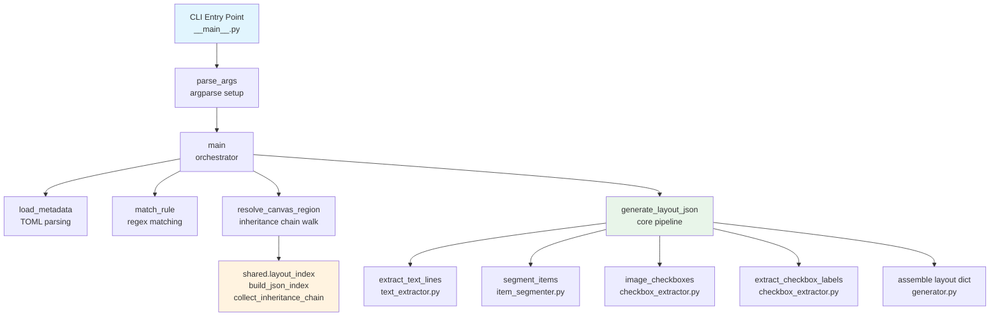

# Design Document: Layout Generator

## Overview

The Layout Generator is a Python CLI tool (`python -m layout_generator`) that generates leaf layout JSON files from chronicle PDFs and a TOML metadata file. It migrates and refactors the existing `src/` scripts (`layout_generator.py`, `item_segmenter.py`, `checkbox_extractor.py`, `chronicle2layout.py`) into a proper package following the same patterns as `chronicle_extractor/`, `layout_visualizer/`, `blueprint2layout/`, and `scenario_renamer/`.

The tool reads a TOML metadata file containing regex-based rules that match chronicle PDF paths to layout metadata (id, parent, description, defaultChronicleLocation). For each matched PDF, it resolves canvas regions from the parent layout's inheritance chain, extracts item text and checkbox positions from the PDF, and assembles a leaf layout JSON file conforming to `LAYOUT_FORMAT.md`.

### Key Design Decisions

1. **TOML metadata with regex rules** — A single metadata file maps many chronicle PDFs to their layout metadata via regex patterns with capture group substitution. This avoids per-file configuration and handles mid-season parent layout changes.
2. **Canvas resolution via `shared.layout_index`** — Reuses the existing `build_json_index` and `collect_inheritance_chain` infrastructure to walk the parent layout chain and resolve canvas coordinates to absolute page percentages. This replaces the old `shared_utils.transform_canvas_coordinates` with the rewrite's standard approach.
3. **PyMuPDF text-based extraction** — Checkbox detection uses Unicode character scanning in the PDF text layer (not image analysis), matching the approach already proven in `src/checkbox_extractor.py`.
4. **Parenthesis-depth heuristic for item segmentation** — Items are split by tracking parenthesis groups across lines, handling multi-line items that span PDF line breaks. This is the same algorithm from `src/item_segmenter.py`.
5. **Batch-first design** — The CLI processes directories recursively by default, with single-file mode as a special case. Errors on individual files are logged and processing continues.
6. **Public `generate_layout_json` function** — The core pipeline is exposed as a testable function independent of the CLI, accepting pre-resolved coordinates and metadata rather than file paths to layout directories.

## Architecture



### Data Flow

1. User invokes CLI with a `pdf_path` (file or directory) and optional flags.
2. `parse_args` validates arguments; `main` loads the TOML metadata file.
3. For directory mode, all `.pdf` files are found recursively.
4. For each PDF, `match_rule` tests TOML rules in order, using the first matching regex.
5. Regex capture groups are substituted into the rule's `id`, `parent`, `description`, and `default_chronicle_location` templates.
6. `resolve_canvas_region` builds a layout index from the layouts directory, walks the parent inheritance chain, merges canvas definitions, and converts the target canvas's relative percentages to absolute page percentages.
7. `generate_layout_json` runs the extraction pipeline: text extraction → item segmentation → checkbox detection → checkbox labeling → layout assembly.
8. The assembled layout dict is serialized to JSON and written to the output directory.

### Module Layout

```
layout_generator/
├── __init__.py              # Package marker (empty)
├── __main__.py              # CLI entry point: parse_args + main orchestration
├── generator.py             # Core layout assembly: generate_layout_json, build helpers
├── item_segmenter.py        # Item text segmentation by parenthesis depth
├── checkbox_extractor.py    # Checkbox Unicode detection and label extraction
├── text_extractor.py        # PDF text line extraction via PyMuPDF
├── metadata.py              # TOML metadata file parsing and regex rule matching
```

## Components and Interfaces

### `metadata.py` — TOML Parsing and Rule Matching

```python
import tomllib
from dataclasses import dataclass
from pathlib import Path


@dataclass(frozen=True)
class MetadataRule:
    """A single rule entry from the TOML metadata file.

    Attributes:
        pattern: Regex pattern to match against PDF relative paths.
        id: Template for the generated layout id (may contain $1, $2, etc.).
        parent: Template for the parent layout id.
        description: Optional template for the layout description.
        default_chronicle_location: Optional template for defaultChronicleLocation.
    """
    pattern: str
    id: str
    parent: str
    description: str | None = None
    default_chronicle_location: str | None = None


@dataclass(frozen=True)
class MetadataConfig:
    """Parsed contents of the TOML metadata file.

    Attributes:
        layouts_dir: Optional global layouts directory path from the TOML.
        rules: Ordered list of MetadataRule entries.
    """
    layouts_dir: str | None
    rules: list[MetadataRule]


@dataclass(frozen=True)
class MatchedMetadata:
    """Result of matching a PDF path against a MetadataRule.

    All template substitutions have been applied. Fields are None
    when the rule did not define them.

    Attributes:
        id: Resolved layout id.
        parent: Resolved parent layout id.
        description: Resolved description, or None.
        default_chronicle_location: Resolved defaultChronicleLocation, or None.
    """
    id: str
    parent: str
    description: str | None = None
    default_chronicle_location: str | None = None


def load_metadata(metadata_path: Path) -> MetadataConfig:
    """Parse a TOML metadata file into a MetadataConfig.

    Args:
        metadata_path: Path to the TOML file.

    Returns:
        Parsed MetadataConfig with layouts_dir and rules.

    Raises:
        FileNotFoundError: If the file does not exist.
        ValueError: If the TOML is malformed or missing required fields.

    Requirements: layout-generator 2.1, 2.2, 2.3, 2.4, 2.5, 2.6
    """


def apply_substitutions(template: str, match: re.Match) -> str:
    """Replace $0, $1, $2, etc. in a template with regex match groups.

    Args:
        template: String containing substitution references.
        match: The regex match object providing group values.

    Returns:
        Template with all valid references replaced.

    Requirements: layout-generator 15.1, 15.2, 15.3
    """


def match_rule(
    relative_path: str,
    config: MetadataConfig,
) -> MatchedMetadata | None:
    """Test rules in order and return metadata for the first match.

    Args:
        relative_path: PDF path relative to the pdf_path directory
            (or filename for single-file mode).
        config: Parsed TOML metadata configuration.

    Returns:
        MatchedMetadata with substitutions applied, or None if no
        rule matches.

    Requirements: layout-generator 2.7, 15.1, 15.2, 15.4
    """
```

### `text_extractor.py` — PDF Text Line Extraction

```python
import fitz

Y_COORDINATE_GROUPING_TOLERANCE: float = 2.0
"""Maximum vertical distance (PDF points) for grouping words into the same line."""


def extract_text_lines(
    pdf_path: str | Path,
    region_pct: list[float],
) -> list[dict]:
    """Extract text lines from a rectangular region of the last PDF page.

    Opens the PDF, filters words to the region, groups by y-coordinate,
    and returns lines with percentage-based bounding boxes relative to
    the region.

    Args:
        pdf_path: Path to the PDF file.
        region_pct: [x0, y0, x1, y1] as absolute page percentages.

    Returns:
        List of dicts with 'text', 'top_left_pct' [x, y],
        'bottom_right_pct' [x, y], sorted top-to-bottom.
        Returns empty list for zero-page PDFs.

    Requirements: layout-generator 4.1, 4.2, 4.3, 4.4, 4.5, 4.6, 4.7, 4.8
    """
```

### `item_segmenter.py` — Item Text Segmentation

```python
MAX_PAREN_GROUPS_PER_ITEM: int = 2
"""Maximum closed parenthesis groups before forcing a split."""


def clean_text(text: str) -> str:
    """Clean extracted text by removing OCR artifacts and invisible characters.

    Strips trailing uppercase-U artifacts after lowercase letters,
    removes hair-space characters (U+200A), and strips whitespace.

    Args:
        text: Raw text from PDF extraction.

    Returns:
        Cleaned text string.

    Requirements: layout-generator 5.5
    """


def segment_items(lines: list[dict]) -> list[dict]:
    """Segment text lines into individual item entries.

    Streams tokens across lines, tracking parenthesis depth.
    Finalizes items when two parenthesis groups close with balanced
    parens, or at end-of-line with balanced parens.

    Args:
        lines: Text line dicts from extract_text_lines.

    Returns:
        List of item dicts with 'text', 'y', 'y2' keys.

    Requirements: layout-generator 5.1, 5.2, 5.3, 5.4, 5.5, 5.6, 5.7
    """
```

### `checkbox_extractor.py` — Checkbox Detection and Labeling

```python
import fitz

CHECKBOX_CHARS: list[str] = ['□', '☐', '☑', '☒']
"""Unicode characters recognized as checkboxes."""


def detect_checkboxes(
    pdf_path: str | Path,
    region_pct: list[float] | None = None,
) -> list[dict]:
    """Detect checkbox Unicode characters in the PDF text layer.

    Scans the last page for checkbox characters, filters to the
    region, and returns bounding boxes as region-relative percentages.

    Args:
        pdf_path: Path to the PDF file.
        region_pct: Optional [x0, y0, x1, y1] as absolute page
            percentages. When None, coordinates are page-relative.

    Returns:
        List of dicts with 'x', 'y', 'x2', 'y2' keys.

    Requirements: layout-generator 6.1, 6.2, 6.3, 6.4, 6.5
    """


def extract_checkbox_labels(
    pdf_path: str | Path,
    checkboxes: list[dict],
    region_pct: list[float],
) -> list[dict]:
    """Extract text labels for detected checkboxes.

    Scans words following each checkbox character until a delimiter
    (another checkbox, "or", trailing punctuation).

    Args:
        pdf_path: Path to the PDF file.
        checkboxes: Checkbox dicts from detect_checkboxes.
        region_pct: [x0, y0, x1, y1] as absolute page percentages.

    Returns:
        List of dicts with 'checkbox' and 'label' keys.

    Requirements: layout-generator 7.1, 7.2, 7.3, 7.4, 7.5, 7.6
    """
```

### `generator.py` — Core Layout Assembly

```python
STRIKEOUT_X_START: float = 0.5
"""Left x-coordinate (percentage) for item strikeout lines."""

STRIKEOUT_X_END: int = 95
"""Right x-coordinate (percentage) for item strikeout lines."""


def make_safe_label(text: str) -> str:
    """Create a preset-safe label from arbitrary text.

    Replaces spaces with underscores, strips commas, periods,
    parentheses, and quotes, then truncates to 50 characters.

    Args:
        text: Raw label or item text.

    Returns:
        Sanitized string for use as a preset name suffix.

    Requirements: layout-generator 11.1, 11.2, 11.3, 11.4
    """


def generate_layout_json(
    pdf_path: str | Path,
    item_region_pct: list[float] | None = None,
    checkbox_region_pct: list[float] | None = None,
    item_canvas_name: str = "items",
    checkbox_canvas_name: str = "summary",
    scenario_id: str | None = None,
    parent: str | None = None,
    description: str | None = None,
    default_chronicle_location: str | None = None,
) -> dict:
    """Generate a leaf layout JSON dict from a chronicle PDF.

    Orchestrates the full pipeline: text extraction, item segmentation,
    checkbox detection, label extraction, and layout assembly.

    Args:
        pdf_path: Path to the chronicle PDF.
        item_region_pct: [x0, y0, x1, y1] absolute page percentages
            for the items canvas. None skips item extraction.
        checkbox_region_pct: [x0, y0, x1, y1] absolute page percentages
            for the summary canvas. None skips checkbox detection.
        item_canvas_name: Canvas name for items (default "items").
        checkbox_canvas_name: Canvas name for checkboxes (default "summary").
        scenario_id: Layout id for the output.
        parent: Parent layout id.
        description: Layout description.
        default_chronicle_location: defaultChronicleLocation value.

    Returns:
        Layout dict conforming to LAYOUT_FORMAT.md.

    Raises:
        FileNotFoundError: If pdf_path does not exist.

    Requirements: layout-generator 8.1–8.12, 14.1, 14.2, 14.3
    """
```

### `__main__.py` — CLI Entry Point

```python
def resolve_canvas_region(
    canvas_name: str,
    parent_id: str,
    layout_index: dict[str, Path],
) -> list[float] | None:
    """Resolve a canvas to absolute page percentages via inheritance chain.

    Walks the parent layout chain, merges canvas definitions, then
    converts the target canvas's relative percentages to absolute
    page percentages by walking the canvas parent chain.

    Args:
        canvas_name: Name of the canvas to resolve (e.g. "items").
        parent_id: Parent layout id to start from.
        layout_index: Map of layout ids to file paths.

    Returns:
        [x0, y0, x1, y1] as absolute page percentages, or None
        if the canvas is not found.

    Requirements: layout-generator 3.1, 3.2, 3.3
    """


def parse_args(argv: list[str] | None = None) -> argparse.Namespace:
    """Parse command-line arguments.

    Args:
        argv: Argument list (defaults to sys.argv[1:]).

    Returns:
        Parsed namespace.

    Requirements: layout-generator 1.1–1.9
    """


def main(argv: list[str] | None = None) -> int:
    """Entry point for the layout generator CLI.

    Loads metadata, builds layout index, resolves canvases,
    processes PDFs, and writes output files.

    Args:
        argv: Argument list (defaults to sys.argv[1:]).

    Returns:
        Exit code: 0 when at least one layout generated, 1 otherwise.

    Requirements: layout-generator 1.9, 9.1–9.5, 10.1–10.6, 13.1–13.4
    """
```

## Data Models

### `MetadataRule` (frozen dataclass)

| Field | Type | Description |
|---|---|---|
| `pattern` | `str` | Regex pattern matched against PDF relative paths |
| `id` | `str` | Template for generated layout id (supports `$0`, `$1`, `$2`…) |
| `parent` | `str` | Template for parent layout id |
| `description` | `str \| None` | Optional template for layout description |
| `default_chronicle_location` | `str \| None` | Optional template for defaultChronicleLocation |

### `MetadataConfig` (frozen dataclass)

| Field | Type | Description |
|---|---|---|
| `layouts_dir` | `str \| None` | Optional global layouts directory from TOML |
| `rules` | `list[MetadataRule]` | Ordered list of rule entries |

### `MatchedMetadata` (frozen dataclass)

| Field | Type | Description |
|---|---|---|
| `id` | `str` | Resolved layout id after substitution |
| `parent` | `str` | Resolved parent layout id after substitution |
| `description` | `str \| None` | Resolved description, or None |
| `default_chronicle_location` | `str \| None` | Resolved defaultChronicleLocation, or None |

### Text Line Dict (convention)

| Key | Type | Description |
|---|---|---|
| `text` | `str` | Joined text of all words on the line |
| `top_left_pct` | `list[float]` | `[x, y]` as percentages of the extraction region |
| `bottom_right_pct` | `list[float]` | `[x, y]` as percentages of the extraction region |

### Item Entry Dict (convention)

| Key | Type | Description |
|---|---|---|
| `text` | `str` | Cleaned item description text |
| `y` | `float` | Top y-coordinate as percentage of items region |
| `y2` | `float` | Bottom y-coordinate as percentage of items region |

### Checkbox Label Dict (convention)

| Key | Type | Description |
|---|---|---|
| `checkbox` | `dict` | Bounding box dict with `x`, `y`, `x2`, `y2` |
| `label` | `str` | Extracted text label for the checkbox |

### Constants

| Constant | Module | Type | Value / Description |
|---|---|---|---|
| `Y_COORDINATE_GROUPING_TOLERANCE` | `text_extractor.py` | `float` | `2.0` — max PDF points for same-line grouping |
| `MAX_PAREN_GROUPS_PER_ITEM` | `item_segmenter.py` | `int` | `2` — parenthesis groups before forced split |
| `STRIKEOUT_X_START` | `generator.py` | `float` | `0.5` — left x% for strikeout lines |
| `STRIKEOUT_X_END` | `generator.py` | `int` | `95` — right x% for strikeout lines |
| `CHECKBOX_CHARS` | `checkbox_extractor.py` | `list[str]` | `['□', '☐', '☑', '☒']` |

## Correctness Properties

*A property is a characteristic or behavior that should hold true across all valid executions of a system — essentially, a formal statement about what the system should do. Properties serve as the bridge between human-readable specifications and machine-verifiable correctness guarantees.*

### Property 1: First-match rule semantics

*For any* ordered list of metadata rules and any PDF relative path, `match_rule` should return the metadata produced by the first rule whose pattern matches the path, ignoring all subsequent rules even if they also match.

**Validates: Requirements 2.7**

### Property 2: Canvas coordinate resolution composes correctly

*For any* chain of nested canvas regions where each child's coordinates are percentages of its parent, resolving to absolute page percentages should equal the composition of all relative transformations. Specifically, for a canvas with coordinates `(x, y, x2, y2)` relative to a parent whose absolute bounds are `(px, py, px2, py2)`, the absolute coordinates should be `(px + x/100 * pw, py + y/100 * ph, px + x2/100 * pw, py + y2/100 * ph)` where `pw = px2 - px` and `ph = py2 - py`.

**Validates: Requirements 3.2, 3.3**

### Property 3: Text extraction produces region-relative sorted lines

*For any* set of PDF words and any rectangular region, `extract_text_lines` should return only words within the region, with bounding boxes expressed as percentages of the region dimensions, sorted by vertical position (top to bottom). Specifically, for each returned line, `0 <= top_left_pct[1] <= bottom_right_pct[1] <= 100`, and for consecutive lines `i` and `i+1`, `lines[i]['top_left_pct'][1] <= lines[i+1]['top_left_pct'][1]`.

**Validates: Requirements 4.3, 4.5, 4.6**

### Property 4: Y-coordinate line grouping within tolerance

*For any* set of words, two words whose y-coordinates differ by at most `Y_COORDINATE_GROUPING_TOLERANCE` (2.0 PDF points) should be grouped into the same text line, and two words whose y-coordinates differ by more than the tolerance should be in different lines.

**Validates: Requirements 4.4**

### Property 5: Item segmentation preserves all non-header tokens

*For any* list of text lines (excluding bare "items" headers and empty lines), the concatenation of all tokens from the segmented items should equal the concatenation of all cleaned tokens from the input lines. No text is lost or invented during segmentation.

**Validates: Requirements 5.1, 5.2, 5.3, 5.4**

### Property 6: Text cleaning removes artifacts and hair spaces

*For any* input string, `clean_text` should produce output that contains no hair-space characters (U+200A) and no trailing uppercase-U artifacts after lowercase letters. The output should also have no leading or trailing whitespace.

**Validates: Requirements 5.5**

### Property 7: Checkbox detection produces region-relative positions

*For any* set of checkbox character positions on a PDF page and any rectangular region, `detect_checkboxes` should return only checkboxes within the region, with bounding boxes as percentages of the region dimensions. Each coordinate should satisfy `0 <= value <= 100`.

**Validates: Requirements 6.2, 6.3**

### Property 8: Trailing punctuation stripping preserves ellipsis and decimals

*For any* label string ending in a comma or period, the cleaned label should have the trailing punctuation removed, unless the label ends with "..." (ellipsis) or the character before the period is a digit (decimal number), in which case the punctuation is preserved.

**Validates: Requirements 7.5**

### Property 9: Safe label sanitization

*For any* input text string, `make_safe_label` should produce output that: (a) contains no spaces, commas, periods, parentheses, single quotes, or double quotes; (b) has length at most 50 characters; (c) is deterministic (same input always produces same output); and (d) has all original spaces replaced with underscores.

**Validates: Requirements 11.1, 11.2, 11.3, 11.4**

### Property 10: Layout JSON round-trip

*For any* valid layout dict produced by `generate_layout_json`, serializing with `json.dumps` and deserializing with `json.loads` should produce a dictionary equal to the original. This implies the layout contains only JSON-serializable built-in types (`dict`, `list`, `float`, `int`, `str`).

**Validates: Requirements 12.1, 12.2**

### Property 11: Regex substitution replaces all valid group references

*For any* regex pattern with N capture groups and any template string containing `$0` through `$N` references, `apply_substitutions` should replace each `$k` with the corresponding match group value (or the full match for `$0`). References to non-existent groups (`$k` where `k > N`) should be left as literal strings.

**Validates: Requirements 15.1, 15.2**

### Property 12: Item layout assembly produces correct structure

*For any* non-empty list of item entries (each with `text`, `y`, `y2`), the assembled layout should contain: (a) an `Items` parameter group with a `strikeout_item_lines` choice whose choices list matches the item texts; (b) a `strikeout_item` base preset with the correct canvas name; (c) an `item.line.<safe_label>` preset for each item with `y` and `y2` rounded to one decimal place; and (d) a choice content entry mapping each item text to a strikeout element.

**Validates: Requirements 8.2, 8.3, 8.4, 8.5**

### Property 13: Checkbox layout assembly produces correct structure

*For any* non-empty list of checkbox labels (each with non-empty `label` and `checkbox` bounding box), the assembled layout should contain: (a) a `Checkboxes` parameter group with a `summary_checkbox` choice whose choices list matches the label strings; (b) a `checkbox` base preset with the correct canvas name; (c) a `checkbox.<safe_label>` preset for each label with the checkbox coordinates; and (d) a choice content entry mapping each label to a checkbox element.

**Validates: Requirements 8.6, 8.7, 8.8, 8.9**

## Error Handling

| Scenario | Behavior | Output | Exit |
|---|---|---|---|
| `pdf_path` does not exist | Exit immediately | Error to stderr | Code 1 |
| `--metadata-file` does not exist | Exit immediately | Error to stderr | Code 1 |
| `--layouts-dir` not provided and not in TOML | Exit immediately | Error to stderr | Code 1 |
| Layouts directory does not exist | Exit immediately | Error to stderr | Code 1 |
| Parent layout id not in layout index | Skip entry | Error to stderr with layout id | Continues |
| Items canvas not found in resolved canvases | Skip item extraction | Warning to stderr | Continues |
| Summary canvas not found in resolved canvases | Skip checkbox detection | Warning to stderr | Continues |
| No TOML rule matches a PDF | Skip file | Warning to stderr | Continues |
| PDF cannot be opened by PyMuPDF | Skip entry | Error to stderr with file path | Continues |
| PDF has zero pages | Return empty extractions | None | Continues |
| Output directory does not exist | Create it (including parents) | None | Continues |
| Error writing output file | Skip file | Error to stderr | Continues |
| No layouts generated at all | Exit | Summary to stdout | Code 1 |
| `generate_layout_json` given non-existent PDF | Raise `FileNotFoundError` | Exception message | N/A (API) |
| Template references non-existent capture group | Leave as literal | Warning to stderr | Continues |

Key principle: only missing input paths and configuration errors are fatal. All per-file errors are logged with identifying context (layout id or PDF path) and processing continues. This ensures a single problematic PDF doesn't block batch generation.

## Testing Strategy

### Testing Framework

- **pytest** — test runner and assertion framework
- **hypothesis** — property-based testing library for Python

### Dual Testing Approach

**Property-based tests** (hypothesis) verify universal properties across randomly generated inputs:
- Each correctness property above maps to exactly one `@given` test function
- Minimum 100 examples per property (hypothesis default `max_examples=100`)
- Each test is tagged with a comment: `# Feature: layout-generator, Property N: {title}`

**Unit tests** (pytest) verify specific examples, edge cases, and integration points:
- Concrete examples with known TOML configs and mock PDF data
- Edge cases: empty PDFs, empty item lists, empty checkbox labels, whitespace-only text
- Integration tests: end-to-end CLI invocation with temp directories and fixture files
- Error conditions: missing files, invalid TOML, unmatched PDFs, corrupt PDFs

### Test File Organization

```
tests/layout_generator/
├── __init__.py
├── conftest.py                          # Shared fixtures (temp dirs, sample TOML, mock PDFs)
├── test_metadata.py                     # Unit tests for metadata.py
├── test_metadata_pbt.py                 # Property tests for metadata.py
├── test_text_extractor.py               # Unit tests for text_extractor.py
├── test_text_extractor_pbt.py           # Property tests for text_extractor.py
├── test_item_segmenter.py               # Unit tests for item_segmenter.py
├── test_item_segmenter_pbt.py           # Property tests for item_segmenter.py
├── test_checkbox_extractor.py           # Unit tests for checkbox_extractor.py
├── test_checkbox_extractor_pbt.py       # Property tests for checkbox_extractor.py
├── test_generator.py                    # Unit tests for generator.py
├── test_generator_pbt.py               # Property tests for generator.py
├── test_cli.py                          # CLI integration tests for __main__.py
```

### Property Test to Design Property Mapping

| Test File | Test Function | Design Property |
|---|---|---|
| `test_metadata_pbt.py` | `test_first_match_rule_semantics` | Property 1 |
| `test_cli_pbt.py` or `test_generator_pbt.py` | `test_canvas_coordinate_resolution` | Property 2 |
| `test_text_extractor_pbt.py` | `test_region_relative_sorted_lines` | Property 3 |
| `test_text_extractor_pbt.py` | `test_y_coordinate_grouping` | Property 4 |
| `test_item_segmenter_pbt.py` | `test_segmentation_preserves_tokens` | Property 5 |
| `test_item_segmenter_pbt.py` | `test_clean_text_removes_artifacts` | Property 6 |
| `test_checkbox_extractor_pbt.py` | `test_checkbox_region_relative_positions` | Property 7 |
| `test_checkbox_extractor_pbt.py` | `test_trailing_punctuation_stripping` | Property 8 |
| `test_generator_pbt.py` | `test_safe_label_sanitization` | Property 9 |
| `test_generator_pbt.py` | `test_layout_json_round_trip` | Property 10 |
| `test_metadata_pbt.py` | `test_regex_substitution` | Property 11 |
| `test_generator_pbt.py` | `test_item_layout_assembly` | Property 12 |
| `test_generator_pbt.py` | `test_checkbox_layout_assembly` | Property 13 |

### Property-Based Testing Configuration

- Library: `hypothesis` (Python)
- Each property test uses `@given(...)` decorator with appropriate strategies
- Minimum iterations: 100 (hypothesis default `max_examples=100`)
- Tag format in each test: `# Feature: layout-generator, Property N: {title}`
- Each correctness property is implemented by a single `@given` test function
- Custom strategies will generate:
  - `MetadataRule` instances with valid regex patterns and templates
  - Word tuples simulating PyMuPDF `page.get_text("words")` output
  - Text lines with varying parenthesis structures for segmentation
  - Checkbox label strings with various trailing punctuation
  - Arbitrary strings for safe label testing
  - Nested canvas hierarchies for coordinate resolution
  - Item and checkbox entry dicts for layout assembly

