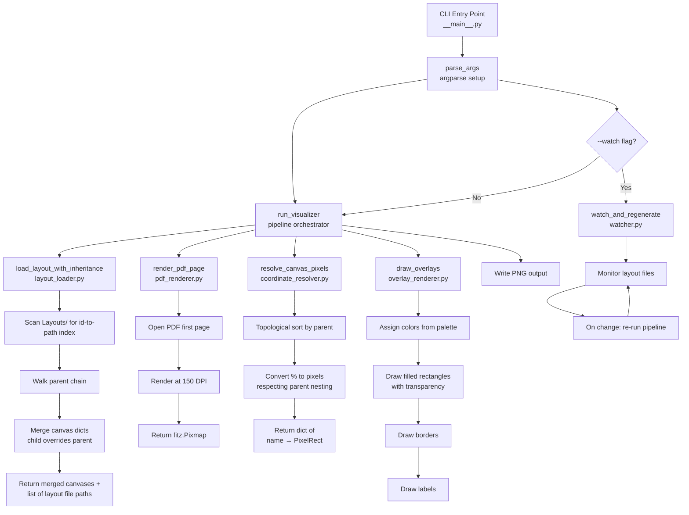
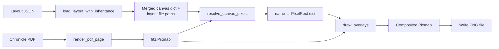

# Design Document: Layout Visualizer

## Overview

The `layout_visualizer` package is a Python CLI tool that renders a visual overlay of canvas regions on top of a chronicle PDF. Given a layout JSON file and a chronicle PDF, it:

1. Loads the layout JSON and resolves the full inheritance chain (parent layouts by `id` in the `Layouts/` directory tree)
2. Merges canvas regions from the inheritance chain (child overrides parent for same-named canvases)
3. Renders the first page of the chronicle PDF as a background image at 150 DPI using PyMuPDF
4. Converts percentage-based canvas coordinates to absolute pixel positions, respecting parent-child nesting
5. Draws semi-transparent colored rectangles with labels for each canvas region
6. Writes the composited image to a PNG file
7. Optionally watches the layout file (and parent files) for changes and auto-regenerates

### Key Design Decisions

1. **PyMuPDF for both PDF rendering and image compositing** — PyMuPDF can render PDF pages to pixmaps and supports drawing rectangles and text directly on pixmaps. This avoids adding PIL/Pillow as a dependency. The rendered pixmap is converted to a PNG via PyMuPDF's built-in `tobytes("png")`.
2. **Recursive layout loading mirrors LAYOUT_FORMAT.md** — The layout inheritance model uses `id`/`parent` fields. The visualizer scans the `Layouts/` directory tree to build an id-to-path index, then walks the parent chain to merge canvases. This is the same pattern used by the existing layout system.
3. **Topological sort for canvas resolution** — Canvas regions reference parents by name. To convert percentages to pixels, parent canvases must be resolved before children. A topological sort on the `parent` field ensures correct processing order.
4. **Predefined color palette with cycling** — A fixed palette of 12 visually distinct colors ensures adjacent regions are distinguishable. When more than 12 canvases exist, the palette cycles. Colors use RGBA with ~40% opacity for the fill and full opacity for the border.
5. **Pure functions for testable logic** — Layout loading, canvas merging, coordinate resolution, and color assignment are implemented as pure functions. Only PDF rendering and file I/O are side-effectful.
6. **watchdog for file monitoring** — The `--watch` mode uses polling-based file stat checks (no external dependency beyond the standard library) with a 1-second interval. This keeps dependencies minimal while providing responsive feedback.

## Architecture



### Data Flow



### Modu
py                # Color palette definition
```

Test directory:
```
tests/layout_visualizer/
├── conftest.py                        # Shared fixtures and hypothesis strategies
├── test_layout_loader.py              # Unit tests for layout loading/inheritance
├── test_layout_loader_pbt.py          # Property tests for layout loading
├── test_coordinate_resolver.py        # Unit tests for coordinate resolution
├── test_coordinate_resolver_pbt.py    # Property tests for coordinate resolution
├── test_overlay_renderer.py           # Unit tests for overlay rendering
├── test_cli.py                        # CLI integration tests
```

## Components and Interfaces

### `models.py` — Data Models

```python
from dataclasses import dataclass


@dataclass(frozen=True)
class CanvasRegion:
    """A canvas region with percentage-based coordinates.

    Attributes:
        name: Unique canvas name (e.g., "main", "summary").
        x: Left edge as percentage of parent (0-100).
        y: Top edge as percentage of parent (0-100).
        x2: Right edge as percentage of parent (0-100).
        y2: Bottom edge as percentage of parent (0-100).
        parent: Name of parent canvas, or None for page-level.
    """
    name: str
    x: float
    y: float
    x2: float
    y2: float
    parent: str | None = None


@dataclass(frozen=True)
class PixelRect:
    """A rectangle in absolute pixel coordinates.

    Attributes:
        name: Canvas region name.
        x: Left edge in pixels.
        y: Top edge in pixels.
        x2: Right edge in pixels.
        y2: Bottom edge in pixels.
        parent: Name of parent canvas, or None.
    """
    name: str
    x: float
    y: float
    x2: float
    y2: float
    parent: str | None = None
```

### `layout_loader.py` — Layout Loading and Inheritance

```python
from pathlib import Path
from layout_visualizer.models import CanvasRegion


def build_layout_index(layouts_dir: Path) -> dict[str, Path]:
    """Scan a directory tree for layout JSON files and build an id-to-path map.

    Reads each .json file recursively, parses the "id" field,
    and maps it to the file path.

    Args:
        layouts_dir: Root directory containing layout JSON files.

    Returns:
        Dictionary mapping layout id strings to file paths.

    Requirements: layout-visualizer 2.2
    """


def load_layout_with_inheritance(
    layout_path: Path,
    layout_index: dict[str, Path],
) -> tuple[dict[str, CanvasRegion], list[Path]]:
    """Load a layout and resolve its full inheritance chain.

    Walks the parent chain via the layout_index, merging canvas
    dicts from root to leaf (child overrides parent for same-named
    canvases). Returns the merged canvases and the list of all
    layout file paths in the chain (for watch mode).

    Args:
        layout_path: Path to the target layout JSON file.
        layout_index: Map of layout ids to file paths.

    Returns:
        A tuple of (merged_canvases, layout_file_paths) where
        merged_canvases maps canvas name to CanvasRegion, and
        layout_file_paths is the ordered list of files in the
        inheritance chain (root first).

    Raises:
        FileNotFoundError: If layout_path does not exist.
        ValueError: If JSON is invalid or parent id not found.

    Requirements: layout-visualizer 2.1, 2.2, 2.3, 2.4, 2.5
    """
```

### `pdf_renderer.py` — PDF Page Rendering

```python
import fitz


def render_pdf_page(pdf_path: Path, dpi: int = 150) -> fitz.Pixmap:
    """Render the first page of a PDF as a pixmap.

    Opens the PDF, renders page 0 at the specified DPI,
    and returns an RGB pixmap.

    Args:
        pdf_path: Path to the chronicle PDF file.
        dpi: Resolution for rendering (default 150).

    Returns:
        An RGB fitz.Pixmap of the rendered page.

    Raises:
        FileNotFoundError: If pdf_path does not exist.
        ValueError: If the file is not a valid PDF.

    Requirements: layout-visualizer 3.1, 3.2, 3.3
    """
```

### `coordinate_resolver.py` — Coordinate Resolution

```python
from layout_visualizer.models import CanvasRegion, PixelRect


def topological_sort_canvases(
    canvases: dict[str, CanvasRegion],
) -> list[str]:
    """Sort canvas names so parents come before children.

    Args:
        canvases: Map of canvas name to CanvasRegion.

    Returns:
        List of canvas names in dependency order.

    Raises:
        ValueError: If a canvas references a parent not in the dict.

    Requirements: layout-visualizer 4.4, 4.5
    """


def resolve_canvas_pixels(
    canvases: dict[str, CanvasRegion],
    page_width: int,
    page_height: int,
) -> dict[str, PixelRect]:
    """Convert percentage-based canvas coordinates to pixel positions.

    Processes canvases in topological order. For each canvas:
    - If it has a parent, computes pixel coords relative to the
      parent's resolved pixel bounds.
    - If no parent, treats the full page as the parent.

    Args:
        canvases: Map of canvas name to CanvasRegion.
        page_width: Page width in pixels.
        page_height: Page height in pixels.

    Returns:
        Map of canvas name to PixelRect with absolute pixel coords.

    Raises:
        ValueError: If a canvas references a nonexistent parent.

    Requirements: layout-visualizer 4.1, 4.2, 4.3, 4.4, 4.5
    """
```

### `overlay_renderer.py` — Overlay Drawing

```python
import fitz
from layout_visualizer.models import PixelRect


def assign_colors(
    canvas_names: list[str],
) -> dict[str, tuple[int, int, int]]:
    """Assign a color from the palette to each canvas name.

    Cycles through the predefined palette when the number of
    canvases exceeds the palette size.

    Args:
        canvas_names: Ordered list of canvas region names.

    Returns:
        Map of canvas name to RGB color tuple.

    Requirements: layout-visualizer 5.1, 5.2, 5.3
    """


def draw_overlays(
    pixmap: fitz.Pixmap,
    pixel_rects: dict[str, PixelRect],
    colors: dict[str, tuple[int, int, int]],
) -> fitz.Pixmap:
    """Draw semi-transparent rectangles and labels on the pixmap.

    For each canvas region, draws a filled rectangle with ~40%
    opacity, a solid border, and a text label with the canvas name.

    Uses PyMuPDF's Shape drawing on a temporary PDF page, then
    composites onto the pixmap.

    Args:
        pixmap: The background PDF page pixmap.
        pixel_rects: Map of canvas name to PixelRect.
        colors: Map of canvas name to RGB color tuple.

    Returns:
        A new pixmap with overlays drawn.

    Requirements: layout-visualizer 6.1, 6.2, 6.3, 7.1, 7.2, 7.3
    """
```

### `colors.py` — Color Palette

```python
PALETTE: list[tuple[int, int, int]] = [
    (230, 25, 75),    # Red
    (60, 180, 75),    # Green
    (255, 225, 25),   # Yellow
    (0, 130, 200),    # Blue
    (245, 130, 48),   # Orange
    (145, 30, 180),   # Purple
    (70, 240, 240),   # Cyan
    (240, 50, 230),   # Magenta
    (210, 245, 60),   # Lime
    (250, 190, 212),  # Pink
    (0, 128, 128),    # Teal
    (170, 110, 40),   # Brown
]
"""Twelve visually distinct colors for canvas region overlays."""
```

### `__main__.py` — CLI Entry Point

```python
import argparse
from pathlib import Path


def parse_args(argv: list[str] | None = None) -> argparse.Namespace:
    """Parse command-line arguments for layout_visualizer.

    Positional: layout_file, pdf_file.
    Optional: output (PNG path), --watch flag.

    Args:
        argv: Argument list (defaults to sys.argv[1:]).

    Returns:
        Parsed namespace with layout, pdf, output as Paths,
        and watch as bool.

    Requirements: layout-visualizer 1.1, 1.2, 1.3, 1.4, 1.6
    """


def run_visualizer(
    layout_path: Path,
    pdf_path: Path,
    output_path: Path,
) -> None:
    """Run the full visualization pipeline once.

    Loads layout with inheritance, renders PDF, resolves coordinates,
    draws overlays, and writes PNG.

    Args:
        layout_path: Path to the layout JSON file.
        pdf_path: Path to the chronicle PDF.
        output_path: Path for the output PNG file.

    Raises:
        FileNotFoundError: If layout or PDF not found.
        ValueError: If layout JSON is invalid or parent not found.
        OSError: If output path is not writable.

    Requirements: layout-visualizer 1.1–1.5, 8.1, 8.2, 8.3
    """


def watch_and_regenerate(
    layout_path: Path,
    pdf_path: Path,
    output_path: Path,
) -> None:
    """Watch layout files for changes and regenerate PNG.

    Polls file modification times every 1 second. Monitors the
    target layout file and all parent layout files in the
    inheritance chain. On change, re-runs the pipeline. Continues
    until SIGINT (Ctrl+C).

    Args:
        layout_path: Path to the layout JSON file.
        pdf_path: Path to the chronicle PDF.
        output_path: Path for the output PNG file.

    Requirements: layout-visualizer 10.1, 10.2, 10.3, 10.4, 10.5, 10.6, 10.7
    """


def main(argv: list[str] | None = None) -> int:
    """Entry point for the layout_visualizer CLI.

    Parses arguments, runs the pipeline (once or in watch mode),
    and handles errors.

    Args:
        argv: Argument list (defaults to sys.argv[1:]).

    Returns:
        Exit code: 0 for success, 1 for errors.

    Requirements: layout-visualizer 1.5, 8.2, 9.1, 9.2, 9.3, 9.4
    """
```

## Data Models

### Core Models

| Dataclass | Fields | Description |
|-----------|--------|-------------|
| `CanvasRegion` | `name: str`, `x: float`, `y: float`, `x2: float`, `y2: float`, `parent: str \| None` | A canvas region with percentage-based coordinates relative to its parent |
| `PixelRect` | `name: str`, `x: float`, `y: float`, `x2: float`, `y2: float`, `parent: str \| None` | A rectangle in absolute pixel coordinates on the rendered page |

Both are frozen dataclasses. `CanvasRegion` is parsed from the layout JSON's `canvas` object. `PixelRect` is the resolved output after coordinate conversion.

### Layout JSON Structure (relevant fields)

The visualizer only needs these fields from layout files:

```json
{
  "id": "pfs2.season7",
  "parent": "pfs2",
  "canvas": {
    "page": { "x": 0.0, "y": 0.0, "x2": 100.0, "y2": 100.0 },
    "main": { "parent": "page", "x": 6.2, "y": 10.5, "x2": 94.0, "y2": 95.4 },
    "items": { "parent": "main", "x": 0.5, "y": 50.8, "x2": 40, "y2": 83 }
  }
}
```

### Coordinate Conversion Formula

For a canvas with parent, converting percentage to pixels:

```
pixel_x  = parent_pixel_x  + (canvas.x  / 100) * parent_pixel_width
pixel_y  = parent_pixel_y  + (canvas.y  / 100) * parent_pixel_height
pixel_x2 = parent_pixel_x  + (canvas.x2 / 100) * parent_pixel_width
pixel_y2 = parent_pixel_y  + (canvas.y2 / 100) * parent_pixel_height
```

Where `parent_pixel_width = parent.x2 - parent.x` and `parent_pixel_height = parent.y2 - parent.y`.

For canvases without a parent (or with no explicit parent field):

```
pixel_x  = (canvas.x  / 100) * page_width
pixel_y  = (canvas.y  / 100) * page_height
pixel_x2 = (canvas.x2 / 100) * page_width
pixel_y2 = (canvas.y2 / 100) * page_height
```

### Color Palette

12 visually distinct colors defined in `colors.py`. Each canvas region is assigned a color by index modulo palette size. Fill opacity is ~40% (alpha ≈ 102/255). Border is full opacity, 2px width.

### Inheritance Merging

Layout inheritance works by walking the parent chain from root to leaf:

1. Start with the root layout's canvases (the layout with no `parent` field)
2. For each child in the chain, merge its `canvas` dict into the accumulated dict
3. Same-named canvases in the child override the parent's definition
4. The final merged dict contains all canvases from the full chain


## Correctness Properties

*A property is a characteristic or behavior that should hold true across all valid executions of a system — essentially, a formal statement about what the system should do. Properties serve as the bridge between human-readable specifications and machine-verifiable correctness guarantees.*

### Property 1: Default output path derivation

*For any* valid file path used as a layout file argument, when no output path is provided, the derived default output path shall be in the same directory as the layout file and have the same base name with a `.png` extension.

**Validates: Requirements 1.4**

### Property 2: Canvas extraction round-trip

*For any* valid layout JSON dictionary containing a `canvas` object with well-formed entries (each having `x`, `y`, `x2`, `y2` as numbers and an optional `parent` string), parsing the dictionary shall produce a `CanvasRegion` for each entry with identical field values.

**Validates: Requirements 2.1**

### Property 3: Inheritance chain merging with child override

*For any* chain of layout files connected by `parent` references (of arbitrary depth), the merged canvas dictionary shall contain all canvases from all layouts in the chain, and when a canvas name appears in both a parent and a child layout, the child's definition shall be the one present in the merged result.

**Validates: Requirements 2.2, 2.3, 2.4**

### Property 4: Percentage-to-pixel coordinate conversion

*For any* canvas region with percentage coordinates and a resolved parent pixel rectangle (or the full page dimensions if no parent), the computed pixel coordinates shall equal `parent_pixel_origin + (percentage / 100) * parent_pixel_extent` for each axis.

**Validates: Requirements 4.1, 4.2, 4.3**

### Property 5: Topological ordering preserves parent-before-child

*For any* set of canvas regions with parent-child relationships forming a forest (no cycles), the topological sort shall produce an ordering where every canvas's parent appears before the canvas itself.

**Validates: Requirements 4.4**

### Property 6: Color assignment with palette cycling

*For any* list of canvas names of arbitrary length, the color assigned to the canvas at index `i` shall equal `PALETTE[i % len(PALETTE)]`.

**Validates: Requirements 5.1, 5.3**

## Error Handling

All errors are reported to stderr with descriptive messages. The tool exits with status code 1 on failure, 0 on success.

| Error Condition | Message Pattern | Exit Code |
|----------------|-----------------|-----------|
| Layout file not found | `Error: Layout file not found: {path}` | 1 |
| PDF file not found | `Error: PDF file not found: {path}` | 1 |
| Invalid JSON in layout | `Error: Invalid JSON in {path}: {details}` | 1 |
| Parent layout id not found | `Error: Parent layout '{id}' not found in Layouts directory` | 1 |
| Orphaned canvas (parent canvas missing) | `Error: Canvas '{name}' references parent '{parent}' which does not exist` | 1 |
| Invalid PDF file | `Error: Cannot open PDF: {path}: {details}` | 1 |
| Output path not writable | `Error: Cannot write to {path}: {details}` | 1 |
| Watch mode regeneration failure | `Error: Regeneration failed: {details}` (continues watching) | N/A |

Error handling strategy:
- `FileNotFoundError` for missing files (layout, PDF)
- `ValueError` for invalid JSON, missing parent ids, orphaned canvases
- `OSError` for unwritable output paths
- In watch mode, regeneration errors are caught, printed to stderr, and the watcher continues polling

## Testing Strategy

### Unit Tests

Unit tests cover specific examples, edge cases, and error conditions:

- **CLI argument parsing**: Verify positional args, optional output, --watch flag, default output path
- **Layout loading**: Parse valid/invalid JSON, single layout (no parent), missing canvas object
- **Inheritance**: Parent-child chain, missing parent id error, root layout (no parent field)
- **PDF rendering**: Valid PDF produces pixmap with expected dimensions, invalid PDF raises error
- **Coordinate resolution**: Known canvas percentages produce expected pixel values, orphaned canvas error
- **Overlay rendering**: Integration test with a real PDF and layout to verify PNG output is produced
- **Watch mode**: Not unit-tested (integration/manual testing only)

### Property-Based Tests

Property-based tests use **Hypothesis** (already a project dependency) to verify universal properties across randomized inputs. Each property test runs a minimum of 100 iterations.

Each test is tagged with a comment referencing the design property:
```python
# Feature: layout-visualizer, Property 1: Default output path derivation
```

Property tests to implement:

| Property | Test Module | Strategy |
|----------|-------------|----------|
| Property 1: Default output path | `test_cli.py` | Generate random Path objects, verify `.png` extension and same directory |
| Property 2: Canvas extraction | `test_layout_loader_pbt.py` | Generate random canvas dicts with valid numeric coords, verify round-trip |
| Property 3: Inheritance merging | `test_layout_loader_pbt.py` | Generate random layout chains (2-5 deep) with overlapping canvas names, verify child wins |
| Property 4: Coordinate conversion | `test_coordinate_resolver_pbt.py` | Generate random CanvasRegion + page dimensions, verify pixel formula |
| Property 5: Topological ordering | `test_coordinate_resolver_pbt.py` | Generate random canvas forests, verify parent-before-child invariant |
| Property 6: Color assignment | `test_coordinate_resolver_pbt.py` | Generate random lists of canvas names, verify palette cycling |

Each correctness property is implemented by a single property-based test. Property tests complement unit tests — unit tests catch concrete bugs with specific examples, property tests verify general correctness across the input space.
