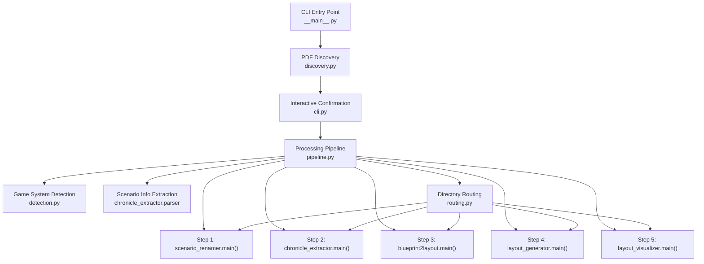

# Design Document: Scenario Download Workflow

## Overview

The Scenario Download Workflow is a new Python CLI package (`scenario_download_workflow`) that orchestrates the end-to-end processing of newly downloaded Pathfinder/Starfinder scenario PDFs. It acts as a thin coordination layer over the five existing PFS Tools utilities, adding PDF discovery, game system detection, interactive confirmation, directory routing, and staging directory management.

The tool scans `~/Downloads` for recently modified PDFs, detects whether each is Pathfinder or Starfinder from the first page text, extracts scenario metadata via the existing `chronicle_extractor.parser` module, then drives each PDF through a five-step pipeline:

1. **scenario_renamer** — rename and file the PDF into `Scenarios/PFS/` or `Scenarios/SFS/`
2. **chronicle_extractor** — extract the chronicle sheet page into the chronicles directory
3. **blueprint2layout** — convert the season-level base blueprint to a layout JSON and print which blueprint the new scenario resolves to (most scenarios inherit from a season base rather than having a dedicated blueprint)
4. **layout_generator** — generate a leaf layout JSON from the chronicle PDF and TOML metadata
5. **layout_visualizer** — render a data-mode preview PNG

Each downstream tool is invoked by calling its `main(argv)` function directly with a constructed argument list, keeping everything in a single Python process. Tools that expect directory-based input receive a temporary staging directory containing only the single PDF being processed.

### Design Rationale

- **Direct `main()` calls over subprocesses**: Avoids shell overhead, keeps error handling in-process, and allows the workflow to inspect return codes directly. All five tools already expose `main(argv) -> int` with the same contract.
- **Staging directories**: The existing tools scan input directories for all PDFs. By copying a single file into a temp directory, we reuse the tools unchanged while processing one file at a time.
- **Fail-forward per PDF**: Each PDF is processed independently. A failure in one PDF's pipeline logs the error and continues to the next PDF, so a batch of downloads isn't blocked by one bad file.
- **Blueprint resolution is informational**: Most scenarios do not have a dedicated blueprint — they inherit from a season-level base blueprint (e.g., `pfs2.season7-layout-s7-00`). The workflow uses `blueprint2layout` to process the season base blueprint if needed, and prints which blueprint the new scenario resolves to. If no matching blueprint exists at all, the workflow prints a warning and continues to layout generation.

## Architecture



The package is structured as a set of focused modules, each with a single responsibility:

| Module | Responsibility |
|--------|---------------|
| `__main__.py` | CLI argument parsing, top-level orchestration, exit code logic |
| `discovery.py` | Scan downloads directory, filter by recency, sort results |
| `detection.py` | Open PDF, read first page text, classify game system |
| `routing.py` | Compute all output directory paths from game system + scenario info |
| `pipeline.py` | Execute the 5-step processing pipeline for a single PDF |
| `duration.py` | Parse human-readable duration strings (`1h`, `30m`, `2d`) |

## Components and Interfaces

### Module: `duration.py`

Parses the `--recent` CLI argument into a `timedelta`.

```python
def parse_duration(value: str) -> timedelta:
    """Parse a human-readable duration string into a timedelta.

    Supported suffixes: 'm' (minutes), 'h' (hours), 'd' (days).
    Raises ValueError if the string cannot be parsed.
    """
```

### Module: `discovery.py`

Scans the downloads directory for recent PDFs.

```python
def discover_recent_pdfs(
    downloads_dir: Path,
    recency_window: timedelta,
) -> list[Path]:
    """Return PDF files in downloads_dir modified within recency_window.

    Scans only the top level (no recursion). Matches .pdf extension
    case-insensitively. Returns results sorted alphabetically by filename.
    """
```

### Module: `detection.py`

Detects the game system from a PDF's first page text.

```python
class GameSystem(Enum):
    PFS = "pfs"
    SFS = "sfs"

def detect_game_system(first_page_text: str) -> GameSystem | None:
    """Classify a PDF as Pathfinder or Starfinder from first page text.

    Returns None if neither 'Pathfinder Society' nor 'Starfinder Society'
    is found (case-insensitive).
    """

def system_prefix(system: GameSystem) -> str:
    """Return 'pfs2' for PFS, 'sfs2' for SFS."""
```

### Module: `routing.py`

Computes all output paths for a given scenario.

```python
@dataclass(frozen=True)
class RoutingPaths:
    """All output directory paths for a single scenario."""
    scenarios_dir: Path       # e.g. Scenarios/PFS/Season 7
    chronicles_dir: Path      # e.g. modules/.../chronicles/pfs2/season7
    layouts_dir: Path         # e.g. modules/.../layouts (root, not system-specific)
    layouts_system_dir: Path  # e.g. modules/.../layouts/pfs2
    blueprints_dir: Path      # e.g. Blueprints
    blueprint_id: str         # e.g. pfs2.s7-01
    layout_id: str            # e.g. pfs2.s7-01
    system_prefix: str        # e.g. pfs2

def compute_routing_paths(
    project_root: Path,
    system: GameSystem,
    info: ScenarioInfo,
) -> RoutingPaths:
    """Compute all output paths for a scenario based on game system and metadata.

    Handles season subdirectories, quest (season=0) routing to quests/,
    and bounty (season=-1) routing to bounties/.
    """
```

### Module: `pipeline.py`

Executes the five-step processing pipeline for a single PDF.

```python
@dataclass
class PipelineResult:
    """Outcome of processing a single PDF."""
    success: bool
    steps_completed: int
    error_message: str | None = None

def process_single_pdf(
    pdf_path: Path,
    project_root: Path,
    system: GameSystem,
    info: ScenarioInfo,
    routes: RoutingPaths,
) -> PipelineResult:
    """Run the 5-step pipeline for a single scenario PDF.

    Creates and cleans up staging directories. Each step prints
    progress to stdout and errors to stderr. Returns a result
    indicating success/failure and how far the pipeline got.
    """
```

### Module: `__main__.py`

CLI entry point and top-level orchestration.

```python
def parse_args(argv: list[str] | None = None) -> argparse.Namespace:
    """Parse CLI arguments: --downloads-dir, --project-dir, --recent, --non-interactive."""

def main(argv: list[str] | None = None) -> int:
    """Entry point: discover PDFs, confirm, detect, extract info, run pipeline."""
```

### Downstream Tool Invocation

Each tool is called via its `main(argv)` function with a constructed argument list:

| Tool | Invocation |
|------|-----------|
| scenario_renamer | `main(['--input-dir', str(staging), '--output-dir', str(scenarios_dir)])` |
| chronicle_extractor | `main(['--input-dir', str(staging), '--output-dir', str(chronicles_dir)])` |
| blueprint2layout | `main(['--blueprints-dir', str(blueprints_dir), '--blueprint-id', season_blueprint_id, '--output-dir', str(layouts_dir)])` — uses the season-level base blueprint id (e.g., `pfs2.season7-layout-s7-00*`), not a scenario-specific id. Prints which blueprint the scenario resolves to. |
| layout_generator | `main([str(chronicle_pdf), '--metadata-file', str(metadata_file), '--layouts-dir', str(layouts_dir)])` |
| layout_visualizer | `main(['--layout-root', str(layouts_root), '--layout-id', layout_id, '--output-dir', str(viz_dir), '--mode', 'data'])` |

Each call returns an `int` exit code. A non-zero return is treated as a step failure.

## Data Models

### `GameSystem` (Enum)

```python
class GameSystem(Enum):
    PFS = "pfs"
    SFS = "sfs"
```

Maps to system prefixes: `PFS → "pfs2"`, `SFS → "sfs2"`.
Maps to scenario directory names: `PFS → "PFS"`, `SFS → "SFS"`.

### `ScenarioInfo` (reused from chronicle_extractor.parser)

```python
@dataclass
class ScenarioInfo:
    season: int       # positive for seasons, 0 for quests, -1 for bounties
    scenario: str     # zero-padded scenario number, e.g. "07"
    name: str         # raw scenario name from PDF
```

### `RoutingPaths` (new dataclass)

```python
@dataclass(frozen=True)
class RoutingPaths:
    scenarios_dir: Path       # Full path to scenario output dir (with season subdir)
    chronicles_dir: Path      # Full path to chronicle output dir (with season subdir)
    layouts_dir: Path         # Root layouts directory (for --layout-root)
    layouts_system_dir: Path  # System-specific layouts dir (pfs2/ or sfs2/)
    blueprints_dir: Path      # Root blueprints directory
    blueprint_id: str         # e.g. "pfs2.s7-01", "pfs2.b13", "pfs2.q14"
    layout_id: str            # Same as blueprint_id
    system_prefix: str        # "pfs2" or "sfs2"
```

### `PipelineResult` (new dataclass)

```python
@dataclass
class PipelineResult:
    success: bool
    steps_completed: int
    error_message: str | None = None
```

### Directory Routing Rules

| Condition | Scenarios Dir | Chronicles Subdir | Blueprint/Layout ID |
|-----------|--------------|-------------------|-------------------|
| Season N > 0 | `Season {N}/` | `season{N}/` | `{prefix}.s{N}-{scenario}` |
| Quest (season=0) | `Quests/` | `quests/` | `{prefix}.q{scenario}` |
| Bounty (season=-1) | `Bounties/` | `bounties/` | `{prefix}.b{scenario}` |

## Correctness Properties

*A property is a characteristic or behavior that should hold true across all valid executions of a system — essentially, a formal statement about what the system should do. Properties serve as the bridge between human-readable specifications and machine-verifiable correctness guarantees.*

### Property 1: Duration parsing round-trip for valid inputs

*For any* positive integer N and any valid suffix in `{'m', 'h', 'd'}`, `parse_duration(f"{N}{suffix}")` SHALL return a `timedelta` equal to N minutes, N hours, or N days respectively. Conversely, *for any* string that does not match the pattern `<positive_integer><m|h|d>`, `parse_duration` SHALL raise `ValueError`.

**Validates: Requirements 1.4, 1.8**

### Property 2: PDF discovery filters by extension and recency, and returns sorted results

*For any* set of filesystem entries (files and directories) with various extensions and modification times, and *for any* positive recency window, `discover_recent_pdfs` SHALL return exactly those entries that are (a) regular files, (b) have a `.pdf` extension (case-insensitive), and (c) have a modification time within the recency window — and the result SHALL be sorted alphabetically by filename.

**Validates: Requirements 2.1, 2.2, 2.3, 2.4**

### Property 3: User response classification is case-insensitive

*For any* case variation of the strings "y", "yes", "n", "no", "q", or "quit", the interactive confirmation logic SHALL classify the response into the correct action (accept, skip, or quit respectively), regardless of letter casing.

**Validates: Requirements 3.2, 3.3, 3.4**

### Property 4: Game system detection is consistent with society string presence

*For any* text string, `detect_game_system` SHALL return `PFS` if the text contains "Pathfinder Society" (case-insensitive), `SFS` if it contains "Starfinder Society" (case-insensitive), and `None` if it contains neither. When both are present, Pathfinder takes precedence (checked first).

**Validates: Requirements 4.2, 4.3, 4.4**

### Property 5: Directory routing uses correct system prefixes and season subdirectories

*For any* game system (PFS or SFS) and *for any* valid ScenarioInfo (positive season, quest season=0, or bounty season=-1), `compute_routing_paths` SHALL produce paths where: the scenarios directory uses the system's display name (`PFS`/`SFS`) with the correct season/quest/bounty subdirectory, the chronicles directory uses the system prefix (`pfs2`/`sfs2`) with the correct `season{N}`/`quests`/`bounties` subdirectory, and the blueprint/layout IDs follow the `{prefix}.s{N}-{scenario}` / `{prefix}.q{scenario}` / `{prefix}.b{scenario}` pattern.

**Validates: Requirements 4.5, 13.1, 13.2, 13.3, 13.4, 13.5, 13.6**

### Property 6: Exit code reflects processing outcomes

*For any* combination of successfully processed, failed, and user-skipped PDF counts, the exit code SHALL be 0 when at least one PDF was processed successfully, and 1 when no PDFs were processed successfully (user-skipped PDFs do not count as failures).

**Validates: Requirements 1.6, 14.5**

## Error Handling

### Strategy

The workflow uses a **fail-forward** approach: each PDF is processed independently, and a failure in one PDF's pipeline does not prevent processing of remaining PDFs. Errors are categorized by severity:

| Severity | Behavior | Example |
|----------|----------|---------|
| Fatal | Print to stderr, exit non-zero | Invalid `--recent` argument |
| PDF-level error | Print to stderr, skip PDF, continue | Cannot open PDF, no scenario info |
| Step-level error | Print to stderr, skip remaining steps for that PDF, continue to next PDF | Tool returns non-zero, expected output missing |
| Warning | Print to stderr, continue pipeline | No blueprint found for scenario |

### Error Flow

1. **CLI argument errors**: `parse_duration` raises `ValueError` → print to stderr, exit code 2 (argparse default for invalid args).
2. **PDF open failure**: `fitz.open()` raises → catch, print filename + error to stderr, skip PDF.
3. **Game system undetectable**: `detect_game_system` returns `None` → print warning to stderr, skip PDF.
4. **Scenario info extraction fails**: `extract_scenario_info` returns `None` → print warning to stderr, skip PDF.
5. **Tool invocation exception**: Any `main()` call raises → catch, print step name + filename + error to stderr, clean up staging dirs, skip remaining steps.
6. **Tool returns non-zero**: Treat as step failure, print error, skip remaining steps.
7. **Expected output missing**: After a tool completes with exit code 0, verify the expected output file exists. If missing, treat as step failure.
8. **No matching blueprint**: No season-level base blueprint found for the scenario's system/season → print informational warning, skip step 3, continue to step 4.
9. **Staging directory creation failure**: `tempfile.mkdtemp()` raises → catch, print error, skip PDF.

### Cleanup Guarantee

Staging directories are managed with `try/finally` blocks to ensure cleanup regardless of success or failure. Each pipeline step that creates a staging directory cleans it up before the next step begins.

## Testing Strategy

### Unit Tests

Unit tests cover the pure logic modules with specific examples and edge cases:

- **`duration.py`**: Valid durations (`"1h"`, `"30m"`, `"2d"`), invalid inputs (`""`, `"abc"`, `"0h"`, `"-1h"`, `"1x"`), edge cases (`"999d"`)
- **`discovery.py`**: Empty directory, no PDFs, mixed file types, case-insensitive extension matching, recency boundary conditions
- **`detection.py`**: Pathfinder text, Starfinder text, neither, both present (precedence), case variations
- **`routing.py`**: All season types (positive, 0, -1), both game systems, path structure verification
- **`pipeline.py`**: Mocked tool invocations verifying argument construction, staging directory lifecycle, error propagation
- **`__main__.py`**: Argument parsing defaults, exit code logic, end-to-end with mocked tools

### Property-Based Tests (Hypothesis)

Property tests verify universal correctness properties across generated inputs. Each property test runs a minimum of 100 iterations.

| Property | Module Under Test | Generator Strategy |
|----------|------------------|-------------------|
| Property 1: Duration parsing | `duration.py` | Random positive ints + valid suffixes; random non-matching strings |
| Property 2: PDF discovery | `discovery.py` | Random filenames with random extensions + random timestamps |
| Property 3: User response classification | `__main__.py` / confirmation logic | Random case variations of known response strings |
| Property 4: Game system detection | `detection.py` | Random text with/without society strings injected |
| Property 5: Directory routing | `routing.py` | Random GameSystem + random ScenarioInfo (season, scenario, name) |
| Property 6: Exit code logic | `__main__.py` | Random (success_count, fail_count, skip_count) tuples |

Each property test is tagged with a comment referencing the design property:
```python
# Feature: scenario-download-workflow, Property 1: Duration parsing round-trip
```

### Integration Tests

Integration tests verify the full pipeline with mocked downstream tools:

- Mock all five `main()` functions to return 0 and create expected output files
- Verify correct argument lists passed to each tool
- Verify staging directory creation and cleanup
- Verify end-to-end flow from discovery through visualization
- Verify error handling when tools fail mid-pipeline

