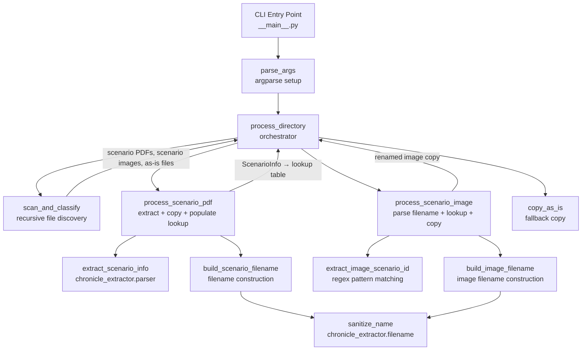

# Design Document: Scenario Renamer

## Overview

The Scenario Renamer is a Python CLI utility that recursively traverses an input directory tree of Pathfinder Society (PFS) scenario PDFs and scenario images (maps, handouts, etc.), copies them to an organized output directory with descriptive filenames based on extracted scenario metadata. Unlike the chronicle extractor (which extracts only the last page), the scenario renamer copies the entire file and names it without the "Chronicle" suffix.

The utility uses a two-pass processing strategy: first it processes all scenario PDFs to extract metadata and build a lookup table mapping (season, scenario) pairs to sanitized names, then it processes scenario images by extracting scenario identifiers from filename patterns (PZOPFS prefix or X-YY season-number) and resolving them against the lookup table. The descriptive suffix after the scenario identifier (e.g., "Maps", "A-Nighttime Ambush", "Map-1") is preserved in the output filename. Files that cannot be attributed to a scenario are copied as-is, preserving their relative path from the input directory.

This is the third utility in the PFS Tools collection. It reuses `ScenarioInfo`, `extract_scenario_info`, `sanitize_name`, `is_scenario_pdf`, and `is_map_pdf` from the `chronicle_extractor` package.

### Key Design Decisions

1. **Two-pass processing** — Scenario PDFs must be processed first to populate the lookup table before scenario images can be renamed. The utility scans the entire input tree, classifies files into scenario PDFs, scenario images, and other files, then processes them in order.
2. **shutil.copy2 for file copying** — Preserves file metadata (timestamps, permissions). No PDF manipulation needed since we're copying the entire file, not extracting pages.
3. **Regex-based filename parsing** — Two regex patterns (PZOPFS prefix and X-YY season-number) extract scenario identifiers from image filenames. The descriptive suffix after the identifier is preserved. Pure functions make these easily testable.
4. **Broad image classification** — Any image file (JPG/PNG) or PDF map file with a PZOPFS or season-number pattern is classified as a scenario image, not just files ending in "Map/Maps". This handles handout images like `PZOPFS0409 A-Nighttime Ambush.jpg` alongside traditional map files.
5. **Relative path preservation for as-is copies** — Unattributable files are copied to the output directory preserving their relative path from the input directory, so no files are lost and the user can find them.
6. **Flat module structure** — The utility is small enough for a single package with focused modules. No nested sub-packages needed.
7. **Pure functions for testable logic** — Filename construction, pattern extraction, and file classification are pure functions enabling thorough property-based testing without PDF fixtures.

## Architecture



### Data Flow

1. User invokes CLI with `--input-dir` and `--output-dir`.
2. `parse_args` validates `--input-dir` exists; creates `--output-dir` if missing.
3. `scan_and_classify` recursively walks the input directory tree, classifying each file as a scenario PDF, scenario image, or as-is file. Returns three lists.
4. **Pass 1 — Scenario PDFs**: For each scenario PDF, open with PyMuPDF, call `extract_scenario_info` with appropriate page texts. If extraction succeeds, copy the file with `shutil.copy2` to the constructed output path and add the (season, scenario) → sanitized_name entry to the lookup table. If extraction fails, copy as-is preserving relative path.
5. **Pass 2 — Scenario Images**: For each scenario image, call `extract_image_scenario_id` to parse the PZOPFS or X-YY pattern from the filename and extract the image suffix. Look up the (season, scenario) pair in the lookup table. If found, copy with the constructed image filename (scenario name + sanitized suffix). If not found or no pattern matched, copy as-is preserving relative path.
6. **As-is files**: Image files without a recognizable scenario pattern are copied as-is preserving relative path. Non-PDF/non-image files are skipped. Directories and symlinks are skipped.
7. Success/skip/warning/error messages are printed to stdout/stderr as appropriate.

### Module Layout

```
scenario_renamer/
├── __init__.py          # Package marker (empty)
├── __main__.py          # CLI entry point: parse_args + main
├── processor.py         # Orchestrator: scan_and_classify, process_directory
├── filename.py          # build_scenario_filename, build_image_filename, subdirectory_for_season
├── image_parser.py      # extract_image_scenario_id, parse_image_suffix, PZOPFS/season-number regexes
├── classifier.py        # classify_file (scenario PDF vs scenario image vs as-is)
```

Project root additions:
```
scenario_renamer/
  README.md              # Utility-specific README
README.md                # Updated top-level README (add utility row)
```

## Components and Interfaces

### `classifier.py` — File Classification

```python
import re
from pathlib import Path

from chronicle_extractor.filters import is_map_pdf

# Supported image extensions (case-insensitive)
IMAGE_EXTENSIONS: set[str] = {".jpg", ".jpeg", ".png"}

# PZOPFS pattern for quick stem check
PZOPFS_PREFIX: re.Pattern[str] = re.compile(r"PZOPFS\d{4}", re.IGNORECASE)

# Season-number pattern for quick stem check
SEASON_NUMBER_PREFIX: re.Pattern[str] = re.compile(r"\d+-\d{2,}")


def has_scenario_pattern(stem: str) -> bool:
    """Check if a filename stem contains a PZOPFS or season-number pattern.

    Args:
        stem: The filename stem (without extension).

    Returns:
        True if the stem contains a recognizable scenario identifier.

    Requirements: scenario-renamer 13.1, 13.3, 13.5
    """

def classify_file(
    path: Path,
    input_dir: Path,
) -> tuple[str, Path]:
    """Classify a file as 'scenario_pdf', 'scenario_image', or 'as_is'.

    Classification logic:
    - PDF files whose stem is a map pattern → 'scenario_image'
    - PDF files whose stem is not a map pattern → 'scenario_pdf'
    - JPG/PNG files with a PZOPFS or season-number pattern → 'scenario_image'
    - JPG/PNG files without a scenario pattern → 'as_is'
    - All other extensions → 'skip'

    Args:
        path: Absolute path to the file.
        input_dir: The root input directory (for relative path computation).

    Returns:
        A tuple of (classification, relative_path) where classification
        is one of 'scenario_pdf', 'scenario_image', 'as_is', or 'skip'.

    Requirements: scenario-renamer 2.1, 2.2, 2.3, 2.4, 2.5
    """
```

### `image_parser.py` — Image Filename Pattern Extraction

```python
import re
from dataclasses import dataclass

# Matches PZOPFS prefix: PZOPFS followed by 4+ digits, optional edition letter
PZOPFS_PATTERN: re.Pattern[str] = re.compile(
    r"PZOPFS(\d{2})(\d{2})\w?", re.IGNORECASE
)

# Matches season-number pattern: X-YY anywhere in the stem
SEASON_NUMBER_PATTERN: re.Pattern[str] = re.compile(
    r"(?:PFS\s*)?(\d+)-(\d{2,})"
)


@dataclass(frozen=True)
class ImageScenarioId:
    """Scenario identifier extracted from an image filename.

    Attributes:
        season: The season number.
        scenario: The zero-padded scenario number string.
        suffix: The descriptive suffix after the scenario identifier
                (e.g., "Maps", "A-Nighttime Ambush", "Map-1").
                Empty string if no suffix.
    """
    season: int
    scenario: str
    suffix: str


def extract_image_scenario_id(stem: str) -> ImageScenarioId | None:
    """Extract the scenario identifier and suffix from an image filename stem.

    Tries the PZOPFS pattern first, then the season-number pattern.
    The suffix is everything after the scenario identifier, stripped
    of leading whitespace and separators.

    Examples:
        "PZOPFS0107E Maps" → ImageScenarioId(1, "07", "Maps")
        "PZOPFS0409 A-Nighttime Ambush" → ImageScenarioId(4, "09", "A-Nighttime Ambush")
        "2-03-Map-1" → ImageScenarioId(2, "03", "Map-1")
        "PFS 2-21 Map 1" → ImageScenarioId(2, "21", "Map 1")

    Args:
        stem: The filename stem (without extension).

    Returns:
        An ImageScenarioId if a pattern matches, or None.

    Requirements: scenario-renamer 13.3, 13.4, 13.5, 13.6, 13.7
    """
```

### `filename.py` — Output Filename Construction

```python
from pathlib import Path

from chronicle_extractor.filename import sanitize_name
from chronicle_extractor.parser import ScenarioInfo, _BOUNTY_SEASON
from scenario_renamer.image_parser import ImageScenarioId


def subdirectory_for_season(season: int) -> str:
    """Return the subdirectory name for a given season number.

    Args:
        season: The season number. 0 for quests, -1 for bounties.

    Returns:
        "Season X" for positive seasons, "Quests" for 0, "Bounties" for -1.

    Requirements: scenario-renamer 6.1, 6.2, 6.3
    """

def build_scenario_filename(info: ScenarioInfo) -> str:
    """Construct the output filename for a scenario PDF (no Chronicle suffix).

    Format varies by type:
    - Scenarios: "{season}-{scenario}-{SanitizedName}.pdf"
    - Quests: "Q{scenario}-{SanitizedName}.pdf"
    - Bounties: "B{scenario}-{SanitizedName}.pdf"

    Args:
        info: The parsed scenario metadata.

    Returns:
        The constructed filename string.

    Requirements: scenario-renamer 5.1, 5.2, 5.3, 5.4
    """

def sanitize_image_suffix(suffix: str) -> str:
    """Sanitize the image suffix for use in filenames.

    Removes spaces and unsafe characters (same rules as sanitize_name)
    while preserving hyphens as word separators.

    Args:
        suffix: The raw image suffix (e.g., "A-Nighttime Ambush", "Maps", "Map 1").

    Returns:
        The sanitized suffix (e.g., "A-NighttimeAmbush", "Maps", "Map1").

    Requirements: scenario-renamer 14.2
    """

def build_image_filename(
    season: int,
    scenario: str,
    sanitized_name: str,
    image_suffix: str,
    extension: str,
) -> str:
    """Construct the output filename for a scenario image.

    Format: "{season}-{scenario}-{SanitizedName}{SanitizedSuffix}.{ext}"

    Examples:
        (1, "07", "FloodedKingsCourt", "Maps", "pdf") → "1-07-FloodedKingsCourtMaps.pdf"
        (4, "09", "PerilousExperiment", "A-NighttimeAmbush", "jpg") → "4-09-PerilousExperimentA-NighttimeAmbush.jpg"

    Args:
        season: The season number.
        scenario: The zero-padded scenario number string.
        sanitized_name: The sanitized scenario name from the lookup table.
        image_suffix: The sanitized image suffix.
        extension: The file extension without dot (e.g., "pdf", "jpg", "png").

    Returns:
        The constructed filename string.

    Requirements: scenario-renamer 14.1, 14.2, 14.3
    """
```

### `processor.py` — Orchestrator

```python
import shutil
import sys
from pathlib import Path

import fitz

from chronicle_extractor.parser import ScenarioInfo, extract_scenario_info
from chronicle_extractor.filename import sanitize_name
from scenario_renamer.classifier import classify_file
from scenario_renamer.filename import (
    build_scenario_filename,
    build_image_filename,
    sanitize_image_suffix,
    subdirectory_for_season,
)
from scenario_renamer.image_parser import extract_image_scenario_id

# Type alias for the scenario lookup table
ScenarioLookup = dict[tuple[int, str], str]


def scan_and_classify(
    input_dir: Path,
) -> tuple[list[Path], list[Path], list[Path]]:
    """Recursively scan the input directory and classify files.

    Walks the directory tree and classifies each regular file as
    a scenario PDF, scenario image, or as-is file.

    Args:
        input_dir: Root directory to scan.

    Returns:
        A tuple of (scenario_pdfs, scenario_images, as_is_files) where
        each is a sorted list of absolute file paths.

    Requirements: scenario-renamer 7.1, 7.2, 15.2
    """

def process_scenario_pdf(
    pdf_path: Path,
    input_dir: Path,
    output_dir: Path,
    lookup: ScenarioLookup,
) -> None:
    """Process a single scenario PDF: extract info, copy, populate lookup.

    Opens the PDF with PyMuPDF, extracts scenario info, copies the
    file to the appropriate output location, and adds the entry to
    the lookup table.

    If extraction fails, copies the file as-is preserving relative path.

    Args:
        pdf_path: Path to the scenario PDF.
        input_dir: Root input directory (for relative path computation).
        output_dir: Base output directory.
        lookup: The scenario lookup table to populate (mutated in place).

    Requirements: scenario-renamer 3.1, 3.2, 3.3, 4.1, 4.2, 4.3, 12.2, 12.3
    """

def process_scenario_image(
    image_path: Path,
    input_dir: Path,
    output_dir: Path,
    lookup: ScenarioLookup,
) -> None:
    """Process a single scenario image: parse filename, lookup, copy.

    Extracts the scenario identifier and suffix from the filename,
    looks up the (season, scenario) pair in the lookup table, and
    copies with the constructed filename including the sanitized suffix.

    If no pattern matches or lookup fails, copies as-is preserving
    relative path.

    Args:
        image_path: Path to the scenario image file.
        input_dir: Root input directory (for relative path computation).
        output_dir: Base output directory.
        lookup: The populated scenario lookup table.

    Requirements: scenario-renamer 13.8, 14.1, 14.4, 14.5
    """

def copy_as_is(
    file_path: Path,
    input_dir: Path,
    output_dir: Path,
) -> Path:
    """Copy a file to the output directory preserving its relative path.

    Args:
        file_path: Absolute path to the source file.
        input_dir: Root input directory.
        output_dir: Base output directory.

    Returns:
        The output path where the file was copied.

    Requirements: scenario-renamer 16.1, 16.2, 16.3, 16.4, 16.5
    """

def process_directory(input_dir: Path, output_dir: Path) -> None:
    """Process all files in the input directory tree.

    Executes the two-pass strategy:
    1. Scan and classify all files.
    2. Process scenario PDFs (building lookup table).
    3. Process scenario images (using lookup table).
    4. Copy as-is files.

    Args:
        input_dir: Root input directory.
        output_dir: Base output directory.

    Requirements: scenario-renamer 15.1, 15.2, 15.3, 12.1
    """
```

### `__main__.py` — CLI Entry Point

```python
import argparse
import sys
from pathlib import Path

from scenario_renamer.processor import process_directory


def parse_args(argv: list[str] | None = None) -> argparse.Namespace:
    """Parse and validate command-line arguments.

    Args:
        argv: Argument list (defaults to sys.argv[1:]).

    Returns:
        Parsed namespace with input_dir and output_dir as Path objects.

    Requirements: scenario-renamer 1.1, 1.2
    """

def main(argv: list[str] | None = None) -> int:
    """Entry point for the scenario renamer CLI.

    Parses arguments, validates input directory, creates output
    directory, and delegates to process_directory.

    Args:
        argv: Argument list (defaults to sys.argv[1:]).

    Returns:
        Exit code: 0 for success, 1 for errors.

    Requirements: scenario-renamer 1.3, 1.4
    """
```

## Data Models

### `ScenarioInfo` (reused from `chronicle_extractor.parser`)

| Field      | Type   | Description                                      |
|------------|--------|--------------------------------------------------|
| `season`   | `int`  | Season number. 0 for quests, -1 for bounties.   |
| `scenario` | `str`  | Zero-padded scenario number (e.g., `"07"`)       |
| `name`     | `str`  | Raw scenario name as extracted from PDF text      |

### `ImageScenarioId` (frozen dataclass)

| Field      | Type   | Description                                      |
|------------|--------|--------------------------------------------------|
| `season`   | `int`  | Season number extracted from filename pattern     |
| `scenario` | `str`  | Zero-padded scenario number string                |
| `suffix`   | `str`  | Descriptive suffix after the identifier (e.g., "Maps", "A-Nighttime Ambush") |

### `ScenarioLookup` (type alias)

```python
ScenarioLookup = dict[tuple[int, str], str]
```

Maps `(season, scenario)` tuples to sanitized scenario names. Built during Pass 1, consumed during Pass 2.

### Constants

| Constant                | Module            | Type          | Description                                              |
|-------------------------|-------------------|---------------|----------------------------------------------------------|
| `PZOPFS_PATTERN`        | `image_parser.py` | `re.Pattern`  | Matches `PZOPFS` prefix with 4+ digits + optional letter |
| `SEASON_NUMBER_PATTERN` | `image_parser.py` | `re.Pattern`  | Matches `X-YY` season-number pattern                     |
| `IMAGE_EXTENSIONS`      | `classifier.py`   | `set[str]`    | Supported image extensions: `.jpg`, `.jpeg`, `.png`      |


## Correctness Properties

*A property is a characteristic or behavior that should hold true across all valid executions of a system — essentially, a formal statement about what the system should do. Properties serve as the bridge between human-readable specifications and machine-verifiable correctness guarantees.*

### Property 1: File classification by extension and pattern

*For any* filename string, `classify_file` should return `'scenario_pdf'` if the extension is `.pdf` (case-insensitive) and the stem is not a map pattern; `'scenario_image'` if the extension is `.pdf` and the stem is a map pattern, or if the extension is `.jpg`/`.jpeg`/`.png` and the stem contains a PZOPFS or season-number pattern; `'as_is'` for `.jpg`/`.jpeg`/`.png` files without a scenario pattern; and `'skip'` for all other extensions.

**Validates: Requirements 2.1, 2.2, 2.4, 2.5**

### Property 2: Subdirectory selection by season number

*For any* positive integer season, `subdirectory_for_season(season)` should return `"Season {season}"`. For season=0, it should return `"Quests"`. For season=-1, it should return `"Bounties"`.

**Validates: Requirements 6.1, 6.2, 6.3**

### Property 3: Scenario filename construction

*For any* valid `ScenarioInfo` with a non-empty name, `build_scenario_filename` should return a string matching: `"{season}-{scenario}-{sanitize_name(name)}.pdf"` for positive seasons, `"Q{scenario}-{sanitize_name(name)}.pdf"` for season=0, and `"B{scenario}-{sanitize_name(name)}.pdf"` for season=-1. The filename should never contain the substring `"Chronicle"`.

**Validates: Requirements 5.1, 5.2, 5.3**

### Property 4: PZOPFS pattern extraction round trip

*For any* two-digit season number (01-99) and two-digit scenario number (00-99), constructing a stem of the form `"PZOPFS{ss}{nn}E Maps"` and calling `extract_image_scenario_id` should return an `ImageScenarioId` with `season` equal to the integer value of `ss`, `scenario` equal to the string `nn`, and `suffix` equal to `"Maps"`.

**Validates: Requirements 13.3, 13.4**

### Property 5: Season-number pattern extraction round trip

*For any* season number (1-9) and two-digit scenario number (00-99), constructing a stem of the form `"{X}-{YY}-Map-1"` and calling `extract_image_scenario_id` should return an `ImageScenarioId` with `season` equal to `X`, `scenario` equal to `YY`, and `suffix` equal to `"Map-1"`.

**Validates: Requirements 13.5, 13.6**

### Property 6: Unrecognized stems return None

*For any* string that does not contain the substring `"PZOPFS"` (case-insensitive) and does not contain a digit-dash-two-digits pattern, `extract_image_scenario_id` should return `None`.

**Validates: Requirements 13.8**

### Property 7: Scenario image detection by pattern

*For any* filename whose stem contains a PZOPFS or season-number pattern and whose extension is `.jpg`, `.jpeg`, or `.png`, `classify_file` should return `'scenario_image'`. For image files whose stems contain no scenario pattern, it should return `'as_is'`.

**Validates: Requirements 2.2, 13.1**

### Property 8: Image filename construction

*For any* valid season number, scenario string, sanitized name, sanitized image suffix, and extension, `build_image_filename` should return a string in the format `"{season}-{scenario}-{sanitized_name}{sanitized_suffix}.{extension}"`.

**Validates: Requirements 14.1, 14.2, 14.3**

### Property 9: Image suffix sanitization

*For any* suffix string, `sanitize_image_suffix` should return a string with no spaces and no unsafe filename characters, while preserving hyphens. The output characters should be a subsequence of the input characters (plus hyphens).

**Validates: Requirements 14.2**

### Property 10: As-is copy preserves relative path

*For any* file path that is a descendant of an input directory, `copy_as_is` should produce an output path equal to `output_dir / relative_path` where `relative_path` is the file's path relative to the input directory.

**Validates: Requirements 16.4**

## Error Handling

| Scenario | Behavior | Output | Exit |
|---|---|---|---|
| `--input-dir` does not exist | Exit immediately | Error message to stderr | Code 1 |
| `--output-dir` does not exist | Create it (including parents) | None | Continues |
| Non-PDF/non-image file in input tree | Skip | Skip message to stderr | Continues |
| Directory/symlink in input tree | Skip | None (silently ignored by walk) | Continues |
| Image file without scenario pattern | Copy as-is | Warning to stderr with filename and destination | Continues |
| No ScenarioInfo extracted from PDF | Copy as-is | Warning to stderr with filename and destination | Continues |
| Image scenario ID not in lookup table | Copy as-is | Warning to stderr with filename and unresolved ID | Continues |
| PyMuPDF read failure on a PDF | Skip file | Error message to stderr | Continues |
| shutil.copy2 failure | Skip file | Error message to stderr | Continues |
| Season subdirectory missing | Create it | None | Continues |

Key principle: the utility is resilient. Only a missing input directory is fatal. All per-file errors are logged and processing continues with remaining files. This ensures a single corrupt PDF or permission error doesn't block processing of the rest. Unattributable files are always copied as-is so no input files are lost.

## Testing Strategy

### Testing Framework

- **pytest** — test runner and assertion framework
- **hypothesis** — property-based testing library for Python

### Dual Testing Approach

**Property-based tests** (hypothesis) verify universal properties across randomly generated inputs:
- Each correctness property above maps to exactly one `@given` test function
- Minimum 100 examples per property (hypothesis default is 100, which satisfies this)
- Each test is tagged with a comment: `# Feature: scenario-renamer, Property N: {title}`

**Unit tests** (pytest) verify specific examples, edge cases, and integration points:
- CLI argument parsing: missing args, non-existent input dir, output dir creation
- File classification: concrete examples including `PZOPFS0409 A-Nighttime Ambush.jpg`, `PZOPFS0107E Maps.pdf`, `2-03-Map-1.jpg`
- Scenario filename construction: known scenarios (e.g., Season 1 Scenario 01, Quest 14, Bounty 1)
- Image pattern extraction: concrete PZOPFS stems (`PZOPFS0107E Maps`, `PZOPFS0409 A-Nighttime Ambush`), season-number stems (`2-03-Map-1`, `PFS 2-21 Map 1`)
- Image suffix sanitization: edge cases like `Maps`, `A-Nighttime Ambush`, `Map 1`, empty suffix
- Lookup table: last-write-wins when duplicate (season, scenario) keys exist
- As-is copy: verify relative path preservation with nested subdirectories
- Integration tests: end-to-end with real PDFs from the Scenarios directory, verifying output filenames match expected patterns
- Error conditions: corrupt PDFs, permission errors, empty directories

### Test File Organization

```
tests/
├── conftest.py                                    # Shared fixtures
├── scenario_renamer/
│   ├── conftest.py                                # Scenario renamer fixtures
│   ├── test_classifier.py                         # Unit tests for classifier.py
│   ├── test_classifier_pbt.py                     # Property tests for classifier.py
│   ├── test_image_parser.py                       # Unit tests for image_parser.py
│   ├── test_image_parser_pbt.py                   # Property tests for image_parser.py
│   ├── test_filename.py                           # Unit tests for filename.py
│   ├── test_filename_pbt.py                       # Property tests for filename.py
│   ├── test_processor.py                          # Unit + integration tests for processor.py
│   ├── test_cli.py                                # CLI integration tests for __main__.py
```

### Property Test to Design Property Mapping

| Test File | Test Function | Design Property |
|---|---|---|
| `test_classifier_pbt.py` | `test_file_classification_by_extension_and_pattern` | Property 1 |
| `test_filename_pbt.py` | `test_subdirectory_selection` | Property 2 |
| `test_filename_pbt.py` | `test_scenario_filename_construction` | Property 3 |
| `test_image_parser_pbt.py` | `test_pzopfs_extraction_round_trip` | Property 4 |
| `test_image_parser_pbt.py` | `test_season_number_extraction_round_trip` | Property 5 |
| `test_image_parser_pbt.py` | `test_unrecognized_stems_return_none` | Property 6 |
| `test_classifier_pbt.py` | `test_scenario_image_detection` | Property 7 |
| `test_filename_pbt.py` | `test_image_filename_construction` | Property 8 |
| `test_filename_pbt.py` | `test_image_suffix_sanitization` | Property 9 |
| `test_processor_pbt.py` | `test_as_is_copy_preserves_relative_path` | Property 10 |

### Property-Based Testing Configuration

- Library: `hypothesis` (Python)
- Each property test uses `@given(...)` decorator with appropriate strategies
- Minimum iterations: 100 (hypothesis default `max_examples=100`)
- Tag format in each test: `# Feature: scenario-renamer, Property N: {title}`
- Each correctness property is implemented by a single `@given` test function
- Custom strategies will generate valid `ScenarioInfo` instances, image filename stems with PZOPFS/season-number patterns and various suffixes, random extensions, and `ImageScenarioId` instances
