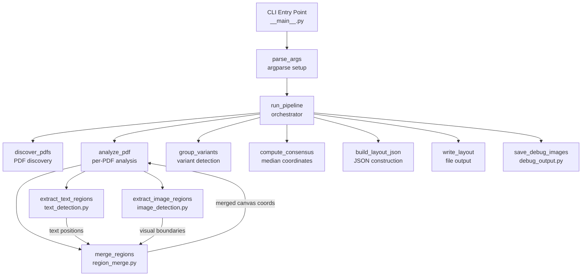
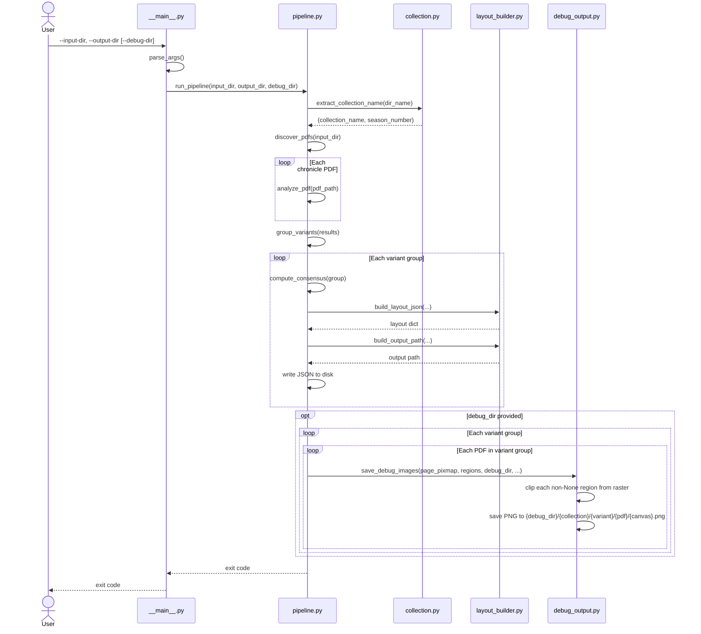
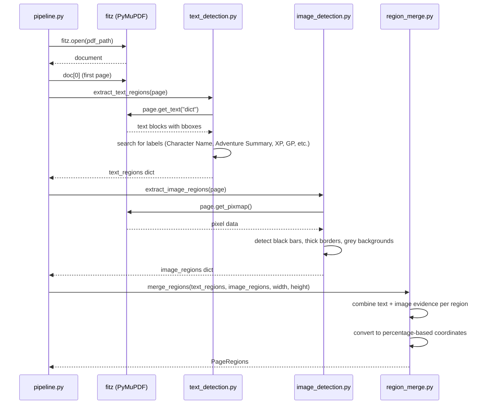
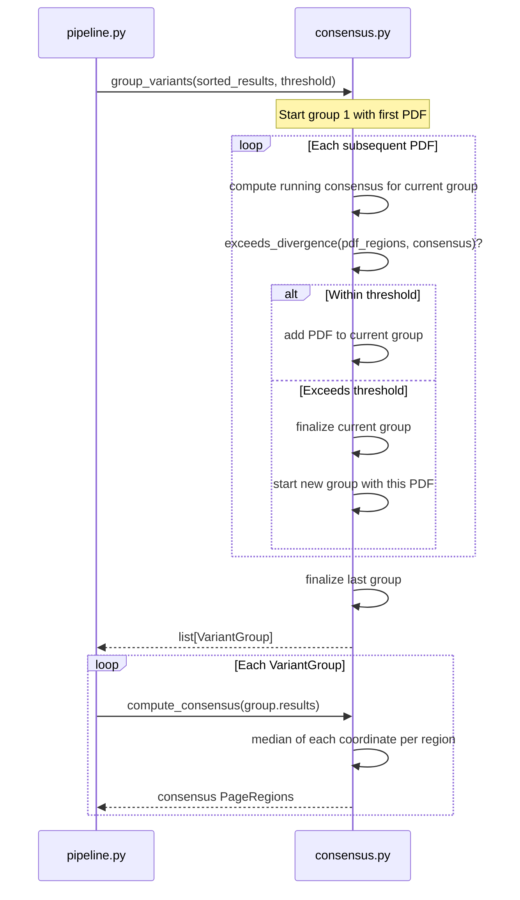

# Design Document: Season Layout Generator

## Overview

The Season Layout Generator is a Python CLI utility that analyzes a directory of single-page chronicle PDF files and produces a season-level layout JSON file defining the canvas regions for that season. It detects eight canvas regions — Player Info, Adventure Summary, Rewards, Items, Notes, Boons, Reputation, and Session Info — using a combination of PDF text extraction (PyMuPDF) and image-based pixel analysis (converting pages to raster images via PyMuPDF, analyzing with numpy/Pillow).

The utility is the second in the PFS Tools collection. It produces only the season-level layout definition; scenario-specific layout files are out of scope. The scope is canvas boundary detection only — no field-level detection within canvases.

### Key Design Decisions

1. **Hybrid detection approach** — Text extraction identifies content-bearing regions (player info fields, "Adventure Summary" text, reward labels, reputation labels). Image analysis detects visual features (black bars, thick borders, grey backgrounds) that define region boundaries. Combining both yields robust detection across all seasons.
2. **PyMuPDF for both text and image** — PyMuPDF handles text extraction (`page.get_text("dict")`) and page-to-image conversion (`page.get_pixmap()`). This avoids adding new dependencies; numpy (already in venv) handles pixel array operations.
3. **Median consensus across PDFs** — Analyzing multiple PDFs per season and taking the median of each coordinate smooths out minor per-scen
nested sub-packages needed.
6. **Pure functions for testable logic** — Collection name extraction, consensus computation, variant grouping, and JSON output construction are pure functions that can be tested without PDF fixtures.

## Architecture



### Data Flow

1. User invokes CLI with `--input-dir`, `--output-dir`, and optionally `--debug-dir`.
2. `parse_args` validates arguments; `run_pipeline` orchestrates the workflow (receiving `debug_dir` as an optional parameter).
3. `discover_pdfs` scans the input directory for `.pdf` files (non-recursive).
4. The collection name is extracted from the directory name (`Season X`, `Quests`, or `Bounties`).
5. For each PDF, `analyze_pdf` opens it with PyMuPDF and:
   - Calls `extract_text_regions` to get text-based region hints (text positions, labels).
   - Calls `extract_image_regions` to get image-based region boundaries (black bars, borders, grey areas).
   - Calls `merge_regions` to combine text and image results into final canvas coordinates.
6. `group_variants` compares each PDF's coordinates against the running consensus, splitting into variant groups when divergence exceeds the threshold.
7. For each variant group, `compute_consensus` takes the median of each coordinate across all PDFs in the group.
8. `build_layout_json` constructs the JSON structure (id, description, parent, canvas).
9. `write_layout` writes the JSON file to the output directory with 4-space indentation.
10. If `debug_dir` is provided, `save_debug_images` clips each detected canvas region from each PDF's raster image and saves it as a PNG under `{debug_dir}/{collection_name}/{variant_name}/{pdf_filename}/{canvas_name}.png`.

### Sequence Diagram: Overall Pipeline



### Sequence Diagram: Single PDF Canvas Detection



### Sequence Diagram: Variant Grouping and Consensus



### Module Layout

```
season_layout_generator/
├── __init__.py              # Package marker (empty)
├── __main__.py              # CLI entry point: parse_args + main
├── pipeline.py              # Orchestrator: run_pipeline, discover_pdfs
├── collection.py            # Collection name extraction from directory name
├── text_detection.py        # Text-based region detection using PyMuPDF
├── image_detection.py       # Image-based region detection using pixel analysis
├── region_merge.py          # Merge text + image results into canvas coordinates
├── consensus.py             # Median consensus computation, variant grouping
├── layout_builder.py        # JSON structure construction
├── models.py                # Data models (dataclasses)
├── debug_output.py          # Debug canvas clipping and PNG output
```

Project root additions:
```
season_layout_generator/
  README.md                  # Utility-specific README
README.md                    # Updated top-level README (add utility row)
```

## Components and Interfaces

### `models.py` — Data Models

```python
from dataclasses import dataclass


@dataclass(frozen=True)
class CanvasCoordinates:
    """Percentage-based coordinates for a canvas region.

    All values are percentages (0-100) relative to the parent canvas.

    Attributes:
        x: Left edge percentage.
        y: Top edge percentage.
        x2: Right edge percentage.
        y2: Bottom edge percentage.
    """
    x: float
    y: float
    x2: float
    y2: float


@dataclass(frozen=True)
class PageRegions:
    """Detected canvas regions for a single chronicle PDF page.

    Each region is optional because detection may fail for individual
    regions on individual PDFs.

    Attributes:
        main: Main content area relative to page.
        player_info: Player info area relative to main.
        summary: Adventure summary area relative to main.
        rewards: Rewards/XP/GP area relative to main.
        items: Items list area relative to main.
        notes: Notes area relative to main.
        boons: Boons area relative to main.
        reputation: Reputation area relative to main (may be absent).
        session_info: Session info area relative to main.
    """
    main: CanvasCoordinates | None = None
    player_info: CanvasCoordinates | None = None
    summary: CanvasCoordinates | None = None
    rewards: CanvasCoordinates | None = None
    items: CanvasCoordinates | None = None
    notes: CanvasCoordinates | None = None
    boons: CanvasCoordinates | None = None
    reputation: CanvasCoordinates | None = None
    session_info: CanvasCoordinates | None = None


@dataclass(frozen=True)
class PdfAnalysisResult:
    """Analysis result for a single chronicle PDF.

    Attributes:
        filename: The PDF filename (not full path).
        regions: Detected canvas regions.
    """
    filename: str
    regions: PageRegions


@dataclass(frozen=True)
class VariantGroup:
    """A group of PDFs sharing the same layout template.

    Attributes:
        results: List of PdfAnalysisResult in this variant group.
        consensus: Consensus PageRegions computed from the group.
        first_scenario: Scenario identifier from the first PDF in the group
            (e.g., "4-09"). Used in description for non-first variants.
    """
    results: list[PdfAnalysisResult]
    consensus: PageRegions
    first_scenario: str
```

### `collection.py` — Collection Name Extraction

```python
import re

SEASON_PATTERN: re.Pattern[str] = re.compile(r"^Season\s+(\d+)$", re.IGNORECASE)

def extract_collection_name(dir_name: str) -> tuple[str, int | None]:
    """Extract the collection name and optional season number from a directory name.

    Args:
        dir_name: The input directory's basename (e.g., "Season 5", "Quests").

    Returns:
        A tuple of (collection_name, season_number).
        For seasons: ("5", 5). For Quests/Bounties: ("Quests", None).

    Raises:
        ValueError: If the directory name doesn't match any known pattern.

    Requirements: season-layout-generator 2.1, 2.2, 2.3, 2.4
    """
```

### `text_detection.py` — Text-Based Region Detection

```python
def extract_text_regions(page: fitz.Page) -> dict[str, CanvasCoordinates | None]:
    """Extract region hints from PDF text content and positions.

    Uses page.get_text("dict") to get text blocks with bounding boxes.
    Identifies regions by searching for characteristic text labels:
    - Player Info: "Character Name", "Organized Play #"
    - Summary: "Adventure Summary"
    - Rewards: "XP", "GP", "Starting XP"
    - Session Info: "Event", "Date", "GM"
    - Notes: "Notes" label or horizontal rule patterns
    - Boons: boon-related text content
    - Reputation: text starting with "Reputation"

    Args:
        page: A PyMuPDF page object.

    Returns:
        Dict mapping region names to detected coordinates (percentage-based
        relative to page dimensions), or None for undetected regions.

    Requirements: season-layout-generator 17.1-17.8
    """
```

### `image_detection.py` — Image-Based Region Detection

```python
import numpy as np

# Threshold for classifying a pixel as "black" (0-255 scale)
BLACK_PIXEL_THRESHOLD: int = 40

# Minimum fraction of a row/column that must be black to count as a "bar"
BLACK_BAR_MIN_FRACTION: float = 0.5

# Threshold for classifying a pixel as "grey background" (0-255 scale)
GREY_LOWER_BOUND: int = 180
GREY_UPPER_BOUND: int = 230

# Minimum height (as fraction of page) for a region to be considered valid
MIN_REGION_HEIGHT_FRACTION: float = 0.02

def extract_image_regions(page: fitz.Page) -> dict[str, CanvasCoordinates | None]:
    """Extract region boundaries from visual features in the page image.

    Converts the page to a raster image via page.get_pixmap(), then
    analyzes pixel data to detect:
    - Black horizontal bars (Summary top edge, Items top edge)
    - Thick black border lines (Rewards boundaries, Items boundaries)
    - Light grey background regions (Session Info)

    Args:
        page: A PyMuPDF page object.

    Returns:
        Dict mapping region names to detected coordinates (percentage-based
        relative to page dimensions), or None for undetected regions.

    Requirements: season-layout-generator 16.1-16.5
    """
```

### `region_merge.py` — Region Merging

```python
def merge_regions(
    text_regions: dict[str, CanvasCoordinates | None],
    image_regions: dict[str, CanvasCoordinates | None],
    page_width: float,
    page_height: float,
) -> PageRegions:
    """Merge text-based and image-based region detections into final coordinates.

    For each region, combines evidence from both sources. Image-based
    boundaries (black bars, borders) are preferred for edge positions,
    while text-based detection confirms region identity and provides
    fallback coordinates.

    Coordinates are converted to percentage-based values relative to
    the main canvas.

    Args:
        text_regions: Regions detected via text extraction.
        image_regions: Regions detected via image analysis.
        page_width: Page width in points.
        page_height: Page height in points.

    Returns:
        Merged PageRegions with percentage-based coordinates.

    Requirements: season-layout-generator 16.5
    """
```

### `consensus.py` — Consensus and Variant Grouping

```python
import statistics

# Maximum percentage-point difference before PDFs are considered different variants
DIVERGENCE_THRESHOLD: float = 5.0

def compute_consensus(results: list[PageRegions]) -> PageRegions:
    """Compute median consensus coordinates from multiple PageRegions.

    For each canvas region, collects all non-None coordinate values
    and takes the median of each (x, y, x2, y2).

    Args:
        results: List of PageRegions from multiple PDFs.

    Returns:
        A PageRegions with median coordinates for each detected region.

    Requirements: season-layout-generator 13.1, 13.2
    """

def exceeds_divergence(
    regions: PageRegions,
    consensus: PageRegions,
    threshold: float = DIVERGENCE_THRESHOLD,
) -> bool:
    """Check if a PDF's regions diverge from the consensus beyond the threshold.

    Compares each coordinate of each region. If any single coordinate
    differs by more than the threshold, returns True.

    Args:
        regions: Regions from a single PDF.
        consensus: Current consensus regions for the variant group.
        threshold: Maximum allowed percentage-point difference.

    Returns:
        True if any coordinate exceeds the threshold.

    Requirements: season-layout-generator 14.1, 14.2
    """

def group_variants(
    results: list[PdfAnalysisResult],
    threshold: float = DIVERGENCE_THRESHOLD,
) -> list[VariantGroup]:
    """Group PDF analysis results into layout variant groups.

    Processes results in order (assumed sorted by filename). The first
    PDF starts the first group. Each subsequent PDF is compared against
    the current group's running consensus. If it diverges beyond the
    threshold, a new group is started.

    Args:
        results: PDF analysis results, sorted by filename.
        threshold: Maximum allowed percentage-point difference.

    Returns:
        List of VariantGroup, each with its own consensus coordinates.

    Requirements: season-layout-generator 14.1, 14.2, 14.3, 14.4, 14.5
    """
```

### `debug_output.py` — Debug Canvas Clipping

```python
from pathlib import Path

import numpy as np
from PIL import Image

from season_layout_generator.models import CanvasCoordinates, PageRegions


def build_debug_image_path(
    debug_dir: Path,
    collection_name: str,
    variant_name: str,
    pdf_filename: str,
    canvas_name: str,
) -> Path:
    """Construct the output path for a debug canvas clip image.

    Args:
        debug_dir: Base debug output directory.
        collection_name: Collection identifier (e.g., "Season 5", "Quests").
        variant_name: Layout variant identifier (e.g., "Season5", "Season4a").
        pdf_filename: Chronicle PDF filename without extension.
        canvas_name: Canvas region name (e.g., "player_info", "summary").

    Returns:
        Path of the form {debug_dir}/{collection_name}/{variant_name}/{pdf_filename}/{canvas_name}.png

    Requirements: season-layout-generator 23.3
    """


def save_debug_images(
    page_pixmap_samples: bytes,
    page_width: int,
    page_height: int,
    regions: PageRegions,
    debug_dir: Path,
    collection_name: str,
    variant_name: str,
    pdf_filename: str,
) -> None:
    """Clip detected canvas regions from a page raster image and save as PNGs.

    For each non-None region in the PageRegions, clips the corresponding
    rectangle from the page raster image and saves it as a PNG file.
    Directories are created as needed. Errors on individual images are
    logged to stderr without interrupting processing.

    Args:
        page_pixmap_samples: Raw pixel data from PyMuPDF page.get_pixmap().samples.
        page_width: Raster image width in pixels.
        page_height: Raster image height in pixels.
        regions: Detected canvas regions for this PDF.
        debug_dir: Base debug output directory.
        collection_name: Collection identifier (e.g., "Season 5", "Quests").
        variant_name: Layout variant identifier (e.g., "Season5", "Season4a").
        pdf_filename: Chronicle PDF filename without extension.

    Requirements: season-layout-generator 23.2, 23.4, 23.5, 23.7
    """
```

### `layout_builder.py` — JSON Construction

```python
def build_layout_json(
    collection_name: str,
    season_number: int | None,
    consensus: PageRegions,
    variant_index: int,
    first_scenario: str,
) -> dict:
    """Construct the season layout JSON structure.

    Builds the complete JSON dict with id, description, parent, and
    canvas fields following the LAYOUT_FORMAT.md specification.

    Args:
        collection_name: The collection identifier ("5", "Quests", etc.).
        season_number: The season number, or None for Quests/Bounties.
        consensus: Consensus PageRegions for this variant.
        variant_index: 0 for first variant, 1+ for subsequent.
        first_scenario: Scenario ID of the first PDF in this variant group.

    Returns:
        Dict ready for json.dumps().

    Requirements: season-layout-generator 15.1-15.8
    """

def build_output_path(
    output_dir: Path,
    collection_name: str,
    season_number: int | None,
    variant_index: int,
) -> Path:
    """Construct the output file path for a layout variant.

    Args:
        output_dir: Base output directory.
        collection_name: The collection identifier.
        season_number: The season number, or None for Quests/Bounties.
        variant_index: 0 for first variant, 1+ for subsequent.

    Returns:
        Full path for the output JSON file.

    Requirements: season-layout-generator 15.9, 15.10, 15.11
    """
```

### `pipeline.py` — Orchestrator

```python
def discover_pdfs(input_dir: Path) -> list[Path]:
    """Find all PDF files in the input directory (non-recursive).

    Args:
        input_dir: Directory to scan.

    Returns:
        Sorted list of PDF file paths.

    Requirements: season-layout-generator 3.1, 3.2, 3.3
    """

def extract_scenario_id(filename: str) -> str:
    """Extract a scenario identifier from a chronicle PDF filename.

    Looks for patterns like "5-08" or "Q14" in the filename.

    Args:
        filename: The PDF filename.

    Returns:
        The scenario identifier string (e.g., "5-08", "Q14").
    """

def run_pipeline(input_dir: Path, output_dir: Path, debug_dir: Path | None = None) -> int:
    """Execute the full season layout generation pipeline.

    Orchestrates: PDF discovery → per-PDF analysis → variant grouping →
    consensus computation → JSON construction → file output.
    When debug_dir is provided, also clips each detected canvas region
    from each PDF's raster image and saves as PNG for visual inspection.

    Args:
        input_dir: Directory containing chronicle PDFs.
        output_dir: Base directory for output layout files.
        debug_dir: Optional directory for saving debug canvas clip images.

    Returns:
        Exit code: 0 for success, 1 for errors.

    Requirements: season-layout-generator 1.1-1.5, 13.3, 13.4, 18.1-18.4, 23.2, 23.4, 23.6
    """
```

### `__main__.py` — CLI Entry Point

```python
def parse_args(argv: list[str] | None = None) -> argparse.Namespace:
    """Parse and validate command-line arguments.

    Args:
        argv: Argument list (defaults to sys.argv[1:]).

    Returns:
        Parsed namespace with input_dir and output_dir as Path objects,
        and debug_dir as Path or None.

    Requirements: season-layout-generator 1.1, 1.2, 23.1
    """

def main(argv: list[str] | None = None) -> int:
    """Entry point for the season layout generator CLI.

    Args:
        argv: Argument list (defaults to sys.argv[1:]).

    Returns:
        Exit code: 0 for success, 1 for errors.

    Requirements: season-layout-generator 1.3, 1.4, 1.5, 23.6
    """
```

## Data Models

### `CanvasCoordinates` (frozen dataclass)

| Field | Type    | Description                                    |
|-------|---------|------------------------------------------------|
| `x`   | `float` | Left edge as percentage (0-100) of parent      |
| `y`   | `float` | Top edge as percentage (0-100) of parent       |
| `x2`  | `float` | Right edge as percentage (0-100) of parent     |
| `y2`  | `float` | Bottom edge as percentage (0-100) of parent    |

### `PageRegions` (frozen dataclass)

| Field         | Type                        | Description                              |
|---------------|-----------------------------|------------------------------------------|
| `main`        | `CanvasCoordinates \| None` | Main content area relative to page       |
| `player_info` | `CanvasCoordinates \| None` | Player info area relative to main        |
| `summary`     | `CanvasCoordinates \| None` | Adventure summary area relative to main  |
| `rewards`     | `CanvasCoordinates \| None` | Rewards area relative to main            |
| `items`       | `CanvasCoordinates \| None` | Items list area relative to main         |
| `notes`       | `CanvasCoordinates \| None` | Notes area relative to main              |
| `boons`       | `CanvasCoordinates \| None` | Boons area relative to main              |
| `reputation`  | `CanvasCoordinates \| None` | Reputation area relative to main (optional) |
| `session_info`| `CanvasCoordinates \| None` | Session info area relative to main       |

### `PdfAnalysisResult` (frozen dataclass)

| Field      | Type          | Description                          |
|------------|---------------|--------------------------------------|
| `filename` | `str`         | PDF filename (basename only)         |
| `regions`  | `PageRegions` | Detected canvas regions for this PDF |

### `VariantGroup` (frozen dataclass)

| Field            | Type                      | Description                                    |
|------------------|---------------------------|------------------------------------------------|
| `results`        | `list[PdfAnalysisResult]` | PDFs in this variant group                     |
| `consensus`      | `PageRegions`             | Median consensus coordinates                   |
| `first_scenario` | `str`                     | Scenario ID of first PDF (e.g., "4-09")        |

### Constants

| Constant                     | Module              | Type    | Description                                              |
|------------------------------|---------------------|---------|----------------------------------------------------------|
| `SEASON_PATTERN`             | `collection.py`     | `re.Pattern` | Regex for `Season X` directory names                |
| `BLACK_PIXEL_THRESHOLD`      | `image_detection.py`| `int`   | Max pixel value (0-255) to classify as black             |
| `BLACK_BAR_MIN_FRACTION`     | `image_detection.py`| `float` | Min fraction of row pixels that must be black for a bar  |
| `GREY_LOWER_BOUND`           | `image_detection.py`| `int`   | Lower bound for grey background detection                |
| `GREY_UPPER_BOUND`           | `image_detection.py`| `int`   | Upper bound for grey background detection                |
| `MIN_REGION_HEIGHT_FRACTION` | `image_detection.py`| `float` | Min region height as fraction of page                    |
| `DIVERGENCE_THRESHOLD`       | `consensus.py`      | `float` | Max percentage-point difference for variant detection    |


## Correctness Properties

*A property is a characteristic or behavior that should hold true across all valid executions of a system — essentially, a formal statement about what the system should do. Properties serve as the bridge between human-readable specifications and machine-verifiable correctness guarantees.*

### Property 1: Season number extraction round trip

*For any* positive integer X, calling `extract_collection_name` with the string `"Season X"` should return `(str(X), X)` — the collection name as a string and the season number as an integer.

**Validates: Requirements 2.1**

### Property 2: Invalid directory names are rejected

*For any* string that does not match `Season X` (where X is a positive integer), `Quests` (case-insensitive), or `Bounties` (case-insensitive), calling `extract_collection_name` should raise a `ValueError`.

**Validates: Requirements 2.4**

### Property 3: PDF discovery filters by extension

*For any* set of filenames in a directory, `discover_pdfs` should return exactly those filenames that end with `.pdf` (case-insensitive) and are regular files, sorted alphabetically.

**Validates: Requirements 3.1**

### Property 4: Canvas coordinates are in valid percentage range

*For any* `PageRegions` produced by the detection pipeline, every non-None `CanvasCoordinates` field should have `x`, `y`, `x2`, `y2` values in the range [0, 100], and `x < x2` and `y < y2`.

**Validates: Requirements 4.2, 5.2, 6.2, 7.2, 8.2, 9.2, 10.2, 11.2, 12.2**

### Property 5: Median consensus computation

*For any* list of `PageRegions` (length ≥ 1), `compute_consensus` should return a `PageRegions` where each coordinate equals the statistical median of the corresponding coordinates across all input `PageRegions` that have that region present.

**Validates: Requirements 13.2**

### Property 6: Variant grouping splits at divergence points

*For any* ordered sequence of `PageRegions` and a divergence threshold, `group_variants` should produce groups where every PDF within a group has all coordinates within the threshold of the group's consensus, and the first PDF of each new group (after the first) has at least one coordinate exceeding the threshold from the previous group's consensus.

**Validates: Requirements 14.1, 14.2**

### Property 7: Variant suffix assignment

*For any* number of variant groups N (1 ≤ N ≤ 26), the first variant should have no suffix, and subsequent variants should receive suffixes `a`, `b`, `c`, ... in order. Specifically, variant at index `i` (0-based) should have suffix `""` if `i == 0`, or `chr(ord('a') + i - 1)` if `i > 0`.

**Validates: Requirements 14.3**

### Property 8: Layout JSON metadata construction

*For any* season number X (positive integer) and variant index i, `build_layout_json` should produce a dict where: the `id` field equals `"pfs2.season{X}"` when `i == 0` or `"pfs2.season{X}{suffix}"` when `i > 0`; the `parent` field equals `"pfs2"`; and the `description` field equals `"Season {X} Base Layout"` when `i == 0` or includes `"(starting {scenario})"` when `i > 0`.

**Validates: Requirements 15.1, 15.2, 15.5, 15.6**

### Property 9: Layout JSON canvas structure

*For any* `PageRegions` with at least `main` present, `build_layout_json` should produce a dict containing a `canvas` key whose value includes a `page` entry with coordinates `(0, 0, 100, 100)`, a `main` entry, and entries for every non-None region in the input `PageRegions`.

**Validates: Requirements 15.8**

### Property 10: Output path construction for seasons

*For any* season number X (positive integer) and variant index i, `build_output_path` should return a path of the form `{output_dir}/Season {X}/Season{X}.json` when `i == 0`, or `{output_dir}/Season {X}/Season{X}{suffix}.json` when `i > 0`, where suffix follows the alphabetical convention.

**Validates: Requirements 15.9**

### Property 11: Debug clipping produces one valid PNG per detected region

*For any* page raster image and `PageRegions` with N non-None region fields, calling `save_debug_images` should produce exactly N PNG files, each with pixel dimensions matching the clipped sub-rectangle of the source image.

**Validates: Requirements 23.2, 23.4**

### Property 12: Debug output path construction

*For any* combination of collection name, variant name, PDF filename, and canvas name, `build_debug_image_path` should return a path of the form `{debug_dir}/{collection_name}/{variant_name}/{pdf_filename}/{canvas_name}.png`.

**Validates: Requirements 23.3**

## Error Handling

| Scenario | Behavior | Output | Exit |
|---|---|---|---|
| `--input-dir` does not exist | Exit immediately | Error message to stderr | Code 1 |
| `--input-dir` contains no PDFs | Exit immediately | Error message to stderr | Code 1 |
| `--output-dir` does not exist | Create it (including parents) | None | Continues |
| Directory name doesn't match known patterns | Exit immediately | Error message to stderr | Code 1 |
| Error reading a single PDF | Skip file | Error message to stderr | Continues |
| Region not detected in a PDF | Record as None | Warning to stderr | Continues |
| Region detected in < half of PDFs | Include if present | Warning to stderr | Continues |
| Reputation canvas absent | Valid result (None) | No warning | Continues |
| Output subdirectory missing | Create it | None | Continues |
| `--debug-dir` not provided | Skip all debug clipping | None | Continues |
| Debug directory does not exist | Create it (including parents) | None | Continues |
| Error saving a debug image | Skip that image | Warning to stderr | Continues |

Key principle: the utility is resilient at the per-file level. Directory-level errors (missing input, no PDFs, bad directory name) are fatal. Per-file errors (corrupt PDF, failed detection) are logged and processing continues. Debug image errors are similarly non-fatal — a failed clip never interrupts the main pipeline. This ensures a single problematic PDF or debug write doesn't block layout generation for the rest of the season.

## Testing Strategy

### Testing Framework

- **pytest** — test runner and assertion framework
- **hypothesis** — property-based testing library for Python

### Dual Testing Approach

**Property-based tests** (hypothesis) verify universal properties across randomly generated inputs:
- Each correctness property above maps to exactly one `@given` test function
- Minimum 100 examples per property (hypothesis default is 100, which satisfies this)
- Each test is tagged with a comment: `# Feature: season-layout-generator, Property N: {title}`

**Unit tests** (pytest) verify specific examples, edge cases, and integration points:
- Collection name extraction: concrete examples for "Season 5", "Quests", "BOUNTIES", invalid names
- CLI argument parsing: missing args, non-existent input dir, output dir creation
- Consensus computation: edge cases with single PDF, all-None regions, mixed presence
- Variant grouping: single variant (no splits), multiple variants, threshold boundary
- Layout JSON: verify structure against LAYOUT_FORMAT.md for seasons and Quests/Bounties
- Output path: verify path format for seasons, Quests, Bounties, with and without suffixes
- Integration tests: end-to-end with real chronicle PDFs from the Chronicles directory
- Error conditions: corrupt PDFs, empty directories, permission errors
- Debug output: verify PNG files are created with correct paths when debug_dir is provided, verify no files created when debug_dir is None, verify error resilience on write failure

**Validation against reference layouts**:
- The existing `../pfs-chronicle-generator/layouts/pf2/` directory contains hand-crafted layouts for Seasons 5, 6, and 7
- Integration tests should compare generated canvas coordinates against these reference layouts to validate detection accuracy
- Only Seasons 5-7 should be used for comparison (Seasons 1-4 have different format structures)
- Comparison should allow a tolerance (e.g., ±2 percentage points) since the reference layouts were manually created

### Test File Organization

```
tests/
├── conftest.py                                        # Shared fixtures
├── season_layout_generator/
│   ├── conftest.py                                    # Shared fixtures for this utility
│   ├── test_collection.py                             # Unit tests for collection.py
│   ├── test_collection_pbt.py                         # Property tests for collection.py
│   ├── test_consensus.py                              # Unit tests for consensus.py
│   ├── test_consensus_pbt.py                          # Property tests for consensus.py
│   ├── test_layout_builder.py                         # Unit tests for layout_builder.py
│   ├── test_layout_builder_pbt.py                     # Property tests for layout_builder.py
│   ├── test_pipeline.py                               # Unit tests for pipeline.py
│   ├── test_pipeline_pbt.py                           # Property tests for pipeline.py
│   ├── test_cli.py                                    # CLI integration tests
│   ├── test_detection_integration.py                  # Integration tests with real PDFs
│   ├── test_debug_output.py                           # Unit tests for debug_output.py
│   ├── test_debug_output_pbt.py                       # Property tests for debug_output.py
```

### Property Test to Design Property Mapping

| Test File | Test Function | Design Property |
|---|---|---|
| `test_collection_pbt.py` | `test_season_number_round_trip` | Property 1 |
| `test_collection_pbt.py` | `test_invalid_names_rejected` | Property 2 |
| `test_pipeline_pbt.py` | `test_pdf_discovery_filters_by_extension` | Property 3 |
| `test_consensus_pbt.py` | `test_coordinates_in_valid_range` | Property 4 |
| `test_consensus_pbt.py` | `test_median_consensus` | Property 5 |
| `test_consensus_pbt.py` | `test_variant_grouping_splits_at_divergence` | Property 6 |
| `test_layout_builder_pbt.py` | `test_variant_suffix_assignment` | Property 7 |
| `test_layout_builder_pbt.py` | `test_layout_json_metadata` | Property 8 |
| `test_layout_builder_pbt.py` | `test_layout_json_canvas_structure` | Property 9 |
| `test_layout_builder_pbt.py` | `test_output_path_construction` | Property 10 |
| `test_debug_output_pbt.py` | `test_debug_clipping_produces_pngs` | Property 11 |
| `test_debug_output_pbt.py` | `test_debug_output_path_construction` | Property 12 |

### Property-Based Testing Configuration

- Library: `hypothesis` (Python)
- Each property test uses `@given(...)` decorator with appropriate strategies
- Minimum iterations: 100 (hypothesis default `max_examples=100`)
- Tag format in each test: `# Feature: season-layout-generator, Property N: {title}`
- Each correctness property is implemented by a single `@given` test function
- Custom strategies will generate valid `CanvasCoordinates`, `PageRegions`, `PdfAnalysisResult` instances, season numbers, collection names, variant indices, and page raster images (for debug clipping tests)
